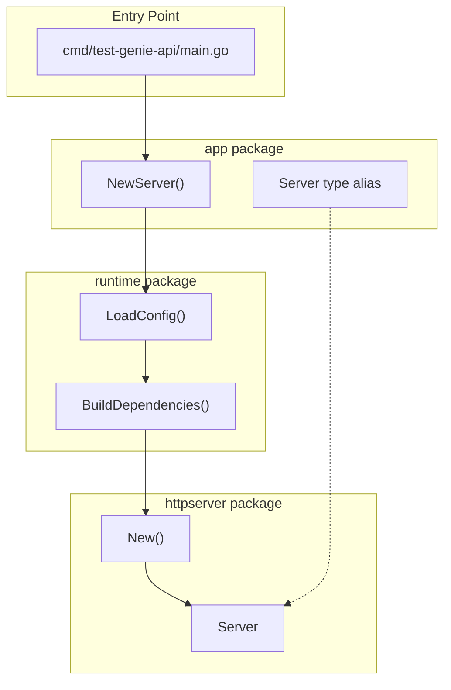
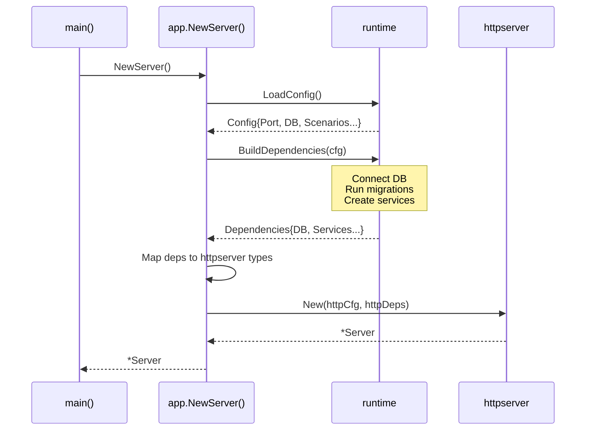

# App

The app package is the composition root that wires together runtime configuration, dependencies, and the HTTP transport layer. It provides a single entry point for creating a fully-configured server.

## Architecture



## NewServer

The `NewServer()` function orchestrates application startup:

```go
import "test-genie/internal/app"

func main() {
    server, err := app.NewServer()
    if err != nil {
        log.Fatalf("failed to create server: %v", err)
    }

    if err := server.Start(); err != nil {
        log.Fatalf("server error: %v", err)
    }
}
```

### What NewServer Does

1. **Loads configuration** via `runtime.LoadConfig()`
   - Reads environment variables
   - Sets defaults for development

2. **Builds dependencies** via `runtime.BuildDependencies(cfg)`
   - Connects to PostgreSQL
   - Runs schema migrations
   - Creates service instances

3. **Creates HTTP server** via `httpserver.New(httpCfg, httpDeps)`
   - Configures routes and middleware
   - Wires handler dependencies

## Dependency Flow



## Type Alias

The package exports `Server` as a type alias to avoid leaking httpserver internals:

```go
// Callers use app.Server without importing httpserver
type Server = httpserver.Server
```

## Configuration Mapping

NewServer translates runtime dependencies to HTTP server dependencies:

| Runtime | HTTP Server |
|---------|-------------|
| `cfg.Port` | `httpCfg.Port` |
| `deps.DB` | `httpDeps.DB` |
| `deps.SuiteRequests` | `httpDeps.SuiteQueue` |
| `deps.ExecutionHistory` | `httpDeps.Executions` |
| `deps.ExecutionService` | `httpDeps.ExecutionSvc` |
| `deps.ScenarioService` | `httpDeps.Scenarios` |
| `deps.PhaseCatalog` | `httpDeps.PhaseCatalog` |

## Directory Structure

```
app/
├── app.go              # NewServer(), Server type alias
├── httpserver/         # HTTP transport layer
│   └── README.md       # Endpoints, handlers, middleware
└── runtime/            # Configuration and bootstrap
    └── README.md       # Environment variables, migrations
```

## Where to Look

| Task | Location |
|------|----------|
| Application entry point | `app.go` → `NewServer()` |
| Environment configuration | `runtime/` → `LoadConfig()` |
| Database setup | `runtime/` → `BuildDependencies()` |
| HTTP routes and handlers | `httpserver/` → `New()` |
| Add new dependency | Wire in `app.go`, add to both runtime and httpserver |

## Related Documentation

- [Runtime README](runtime/README.md) — Configuration and bootstrap
- [HTTP Server README](httpserver/README.md) — Endpoints and handlers
- [API README](../../README.md) — Overall architecture
