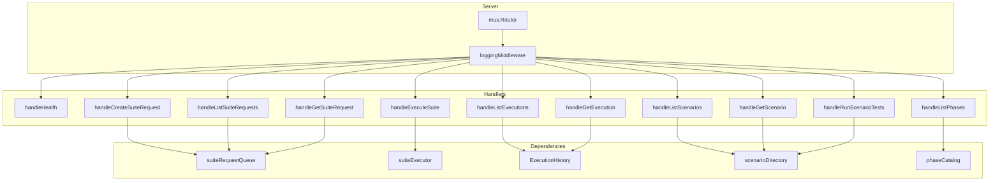

# HTTP Server

The HTTP transport layer exposes Test Genie functionality via REST endpoints. Built on [gorilla/mux](https://github.com/gorilla/mux) with intentional seams for testability.

## Architecture



## Server Setup

The server is created via dependency injection:

```go
cfg := httpserver.Config{
    Port:        "8200",
    ServiceName: "Test Genie API",
}

deps := httpserver.Dependencies{
    DB:           db,
    SuiteQueue:   suiteRequestService,
    Executions:   executionHistoryService,
    ExecutionSvc: suiteExecutionService,
    Scenarios:    scenarioService,
    PhaseCatalog: orchestrator,
}

server, err := httpserver.New(cfg, deps)
server.Start() // Blocks until SIGINT/SIGTERM
```

## Endpoints

### Health

| Method | Path | Description |
|--------|------|-------------|
| `GET` | `/health` | Infrastructure health (root) |
| `GET` | `/api/v1/health` | API health (versioned) |

**Response:**
```json
{
  "status": "healthy",
  "service": "Test Genie API",
  "operations": {
    "queue": {
      "total": 5,
      "queued": 2,
      "running": 1,
      "completed": 2,
      "failed": 0
    },
    "lastExecution": {
      "scenarioName": "test-genie",
      "success": true,
      "completedAt": "2025-12-01T10:30:00Z"
    }
  }
}
```

### Suite Requests

| Method | Path | Description |
|--------|------|-------------|
| `POST` | `/api/v1/suite-requests` | Queue a generation request |
| `GET` | `/api/v1/suite-requests` | List recent requests |
| `GET` | `/api/v1/suite-requests/{id}` | Get request by ID |

**POST /api/v1/suite-requests**

```json
{
  "scenarioName": "ecosystem-manager",
  "requestedTypes": ["unit", "integration"],
  "coverageTarget": 95,
  "priority": "high",
  "notes": "Pre-release validation"
}
```

**Response:**
```json
{
  "id": "550e8400-e29b-41d4-a716-446655440000",
  "scenarioName": "ecosystem-manager",
  "requestedTypes": ["unit", "integration"],
  "coverageTarget": 95,
  "priority": "high",
  "status": "queued",
  "createdAt": "2025-12-01T10:00:00Z",
  "estimatedQueueTimeSeconds": 155
}
```

### Executions

| Method | Path | Description |
|--------|------|-------------|
| `POST` | `/api/v1/executions` | Execute a test suite |
| `GET` | `/api/v1/executions` | List execution history |
| `GET` | `/api/v1/executions/{id}` | Get execution by ID |

**POST /api/v1/executions**

```json
{
  "scenarioName": "test-genie",
  "preset": "comprehensive",
  "suiteRequestId": "550e8400-e29b-41d4-a716-446655440000",
  "failFast": true
}
```

Or with explicit phases:

```json
{
  "scenarioName": "test-genie",
  "phases": ["structure", "unit", "integration"],
  "skip": ["performance"],
  "failFast": false
}
```

**Response:**
```json
{
  "executionId": "660e8400-e29b-41d4-a716-446655440001",
  "suiteRequestId": "550e8400-e29b-41d4-a716-446655440000",
  "scenarioName": "test-genie",
  "startedAt": "2025-12-01T10:05:00Z",
  "completedAt": "2025-12-01T10:08:30Z",
  "success": true,
  "preset": "comprehensive",
  "phases": [
    {
      "name": "structure",
      "status": "passed",
      "durationSeconds": 5,
      "logPath": "scenarios/test-genie/test/artifacts/...",
      "observations": ["directories validated: 6", "files validated: 7"]
    }
  ],
  "phaseSummary": {
    "total": 7,
    "passed": 7,
    "failed": 0,
    "durationSeconds": 210,
    "observationCount": 12
  }
}
```

**GET /api/v1/executions**

Query parameters:
- `scenario` — Filter by scenario name
- `limit` — Max results (default 50)
- `offset` — Pagination offset

### Phases

| Method | Path | Description |
|--------|------|-------------|
| `GET` | `/api/v1/phases` | List registered phases |

**Response:**
```json
{
  "phases": [
    {
      "name": "structure",
      "optional": false,
      "description": "Validates scenario layout, manifests, and JSON health.",
      "source": "native",
      "defaultTimeoutSeconds": 900
    },
    {
      "name": "performance",
      "optional": true,
      "description": "Builds the Go API and enforces baseline duration budgets.",
      "source": "native",
      "defaultTimeoutSeconds": 900
    }
  ]
}
```

### Scenarios

| Method | Path | Description |
|--------|------|-------------|
| `GET` | `/api/v1/scenarios` | List available scenarios |
| `GET` | `/api/v1/scenarios/{name}` | Get scenario metadata |
| `POST` | `/api/v1/scenarios/{name}/run-tests` | Trigger local test runner |

## Handler Patterns

### Request Parsing

```go
func (s *Server) handleCreateSuiteRequest(w http.ResponseWriter, r *http.Request) {
    defer r.Body.Close()

    var payload QueueSuiteRequestInput
    if err := json.NewDecoder(r.Body).Decode(&payload); err != nil {
        s.writeError(w, http.StatusBadRequest, "invalid JSON payload")
        return
    }

    // Validate and process...
}
```

### Error Handling

```go
// Validation errors → 400
var vErr shared.ValidationError
if errors.As(err, &vErr) {
    s.writeError(w, http.StatusBadRequest, vErr.Error())
    return
}

// Not found → 404
if errors.Is(err, sql.ErrNoRows) {
    s.writeError(w, http.StatusNotFound, "resource not found")
    return
}

// Everything else → 500
s.log("operation failed", map[string]interface{}{"error": err.Error()})
s.writeError(w, http.StatusInternalServerError, "operation failed")
```

### Response Helpers

```go
// JSON success response
s.writeJSON(w, http.StatusOK, result)

// JSON error response
s.writeError(w, http.StatusBadRequest, "scenarioName is required")
```

## Dependency Interfaces

The server depends on interfaces, not concrete types:

```go
type suiteRequestQueue interface {
    Queue(ctx context.Context, payload queue.QueueSuiteRequestInput) (*queue.SuiteRequest, error)
    List(ctx context.Context, limit int) ([]queue.SuiteRequest, error)
    Get(ctx context.Context, id uuid.UUID) (*queue.SuiteRequest, error)
    StatusSnapshot(ctx context.Context) (queue.SuiteRequestSnapshot, error)
}

type suiteExecutor interface {
    Execute(ctx context.Context, input execution.SuiteExecutionInput) (*orchestrator.SuiteExecutionResult, error)
}

type scenarioDirectory interface {
    ListSummaries(ctx context.Context) ([]scenarios.ScenarioSummary, error)
    GetSummary(ctx context.Context, name string) (*scenarios.ScenarioSummary, error)
    RunScenarioTests(ctx context.Context, name string, preferred string) (*scenarios.TestingCommand, *scenarios.TestingRunnerResult, error)
}

type phaseCatalog interface {
    DescribePhases() []phases.Descriptor
}
```

This enables unit testing with mock implementations.

## Middleware

### Logging

Every request is logged:

```go
func (s *Server) loggingMiddleware(next http.Handler) http.Handler {
    return http.HandlerFunc(func(w http.ResponseWriter, r *http.Request) {
        start := time.Now()
        next.ServeHTTP(w, r)
        s.logger.Printf("[%s] %s %s", r.Method, r.RequestURI, time.Since(start))
    })
}
```

### Recovery

Panics are caught via `handlers.RecoveryHandler()` from gorilla/handlers.

## Graceful Shutdown

The server listens for `SIGINT`/`SIGTERM` and gracefully shuts down with a 10-second timeout:

```go
quit := make(chan os.Signal, 1)
signal.Notify(quit, syscall.SIGINT, syscall.SIGTERM)

select {
case <-quit:
case err := <-errCh:
    return fmt.Errorf("server startup failed: %w", err)
}

ctx, cancel := context.WithTimeout(context.Background(), 10*time.Second)
defer cancel()
httpServer.Shutdown(ctx)
```

## Directory Structure

```
httpserver/
├── server.go                 # Server setup, routing, middleware
├── response.go               # writeJSON, writeError helpers
│
├── health_handlers.go        # /health endpoint
├── suite_handlers.go         # /suite-requests endpoints
├── execution_handlers.go     # /executions endpoints
├── scenario_handlers.go      # /scenarios endpoints
├── phase_handlers.go         # /phases endpoint
│
└── *_test.go                 # Handler tests
```

## Related Documentation

- [API README](../../../README.md) — Full endpoint reference
- [Orchestrator README](../../orchestrator/README.md) — Execution logic
- [Execution README](../../execution/README.md) — State management
