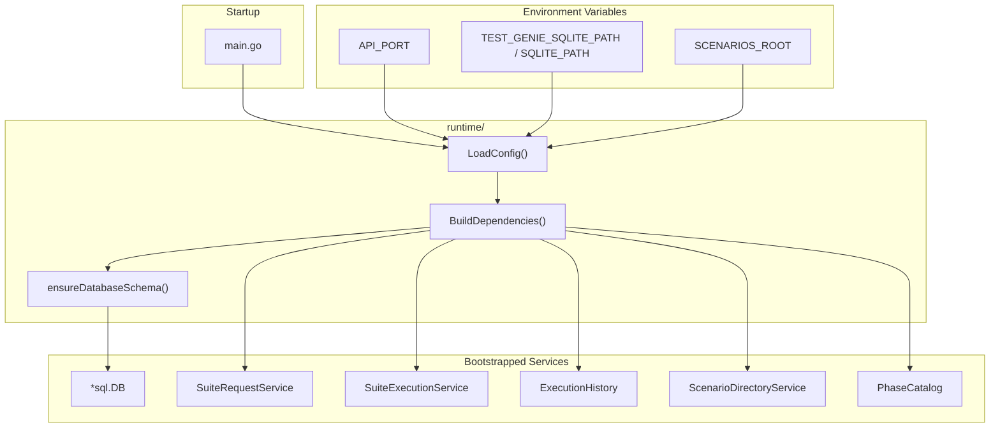
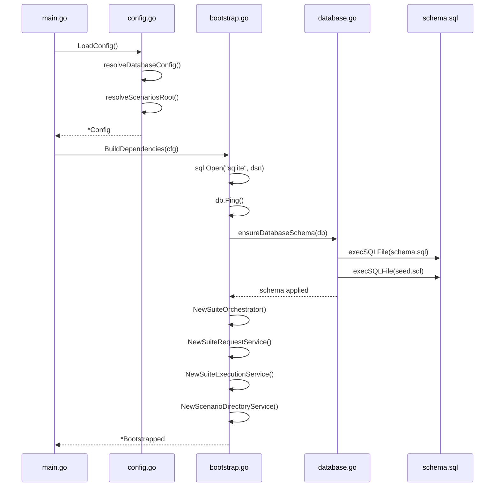
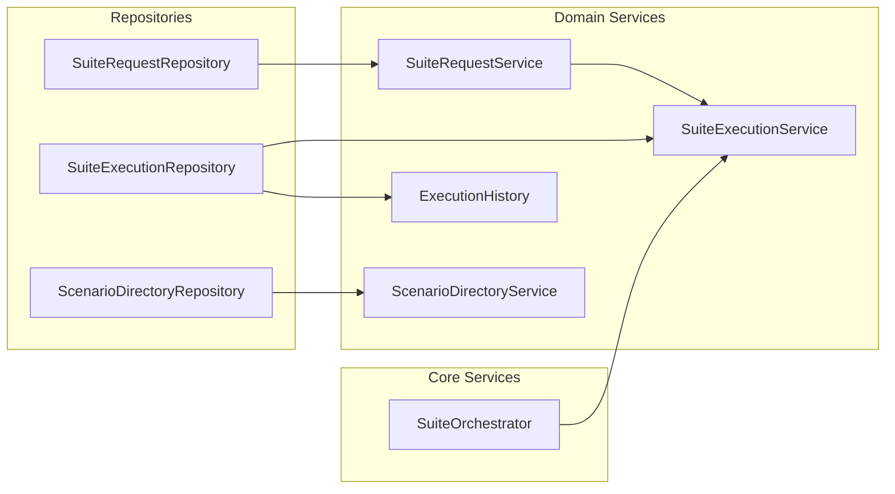

# Runtime

Application bootstrap and configuration. This package loads environment variables, establishes database connections, applies schema migrations, and wires up all service dependencies for the HTTP server.

## Architecture


```mermaid
flowchart TB
    subgraph Entry["Startup"]
        main["main.go"]
    end

    subgraph Runtime["runtime/"]
        config["LoadConfig()"]
        bootstrap["BuildDependencies()"]
        database["ensureDatabaseSchema()"]
    end

    subgraph Environment["Environment Variables"]
        port["API_PORT"]
        sqlitePath["TEST_GENIE_SQLITE_PATH / SQLITE_PATH"]
        scenarios["SCENARIOS_ROOT"]
    end

    subgraph Dependencies["Bootstrapped Services"]
        db["*sql.DB"]
        queue["SuiteRequestService"]
        exec["SuiteExecutionService"]
        history["ExecutionHistory"]
        scenario["ScenarioDirectoryService"]
        catalog["PhaseCatalog"]
    end

    main --> config
    port --> config
    sqlitePath --> config
    scenarios --> config

    config --> bootstrap
    bootstrap --> database
    database --> db

    bootstrap --> queue
    bootstrap --> exec
    bootstrap --> history
    bootstrap --> scenario
    bootstrap --> catalog
```

## Directory Structure

```
runtime/
├── config.go        # Environment variable parsing
├── config_test.go
├── bootstrap.go     # Dependency injection
├── bootstrap_test.go
├── database.go      # Schema migrations
└── database_test.go
```

## Startup Sequence


```mermaid
sequenceDiagram
    participant Main as main.go
    participant Config as config.go
    participant Bootstrap as bootstrap.go
    participant DB as database.go
    participant Schema as schema.sql

    Main->>Config: LoadConfig()
    Config->>Config: resolveDatabaseConfig()
    Config->>Config: resolveScenariosRoot()
    Config-->>Main: *Config

    Main->>Bootstrap: BuildDependencies(cfg)

    Bootstrap->>Bootstrap: sql.Open("sqlite", dsn)
    Bootstrap->>Bootstrap: db.Ping()
    Bootstrap->>DB: ensureDatabaseSchema(db)
    DB->>Schema: execSQLFile(schema.sql)
    DB->>Schema: execSQLFile(seed.sql)
    DB-->>Bootstrap: schema applied

    Bootstrap->>Bootstrap: NewSuiteOrchestrator()
    Bootstrap->>Bootstrap: NewSuiteRequestService()
    Bootstrap->>Bootstrap: NewSuiteExecutionService()
    Bootstrap->>Bootstrap: NewScenarioDirectoryService()

    Bootstrap-->>Main: *Bootstrapped
```

## Configuration

### Environment Variables

| Variable | Required | Description | Source |
|----------|----------|-------------|--------|
| `API_PORT` | Yes | HTTP listen port | Lifecycle |
| `TEST_GENIE_SQLITE_PATH` | No | Scenario-local SQLite file override | Lifecycle |
| `SQLITE_PATH` / `SQLITE_DB` | No | Generic SQLite path fallback | Lifecycle / tooling |
| `SCENARIO_DATA_DIR` | No | Default root for embedded state | Lifecycle |
| `SCENARIOS_ROOT` | No | Path to scenarios directory | Lifecycle |

### SQLite Resolution

`LoadConfig()` resolves the embedded SQLite database in this order:

1. `TEST_GENIE_SQLITE_PATH`
2. `SQLITE_PATH`
3. `SQLITE_DB`
4. `${SCENARIO_DATA_DIR}/test-genie.db`
5. `${SQLITE_DATABASE_PATH}/test-genie.db`
6. `<scenario>/data/test-genie.db`

### Scenarios Root Resolution

```go
// Priority 1: Use SCENARIOS_ROOT if set
if SCENARIOS_ROOT != "" {
    return filepath.Abs(SCENARIOS_ROOT)
}

// Priority 2: Derive from working directory
// Assumes CWD is scenarios/<name>/api
// Returns: scenarios/
return filepath.Dir(filepath.Dir(cwd))
```

## Key Types

### Config

Runtime parameters loaded from environment:

```go
type Config struct {
    Port          string // HTTP listen port
    DatabasePath  string // Absolute SQLite file path
    DatabaseDSN   string // SQLite DSN with WAL/busy-timeout pragmas
    ScenariosRoot string // Absolute path to scenarios/
}
```

### Bootstrapped

Container for all wired dependencies:

```go
type Bootstrapped struct {
    DB               *sql.DB
    SuiteRequests    *queue.SuiteRequestService
    ExecutionRepo    *execution.SuiteExecutionRepository
    ExecutionHistory execution.ExecutionHistory
    ExecutionService *execution.SuiteExecutionService
    ScenarioService  *scenarios.ScenarioDirectoryService
    PhaseCatalog     phaseCatalogProvider
}
```

## Database Schema Management

The `ensureDatabaseSchema()` function applies SQL files from the initialization directory:

```
scenarios/test-genie/
├── initialization/
│   └── sqlite/
│       ├── schema.sql   # Table definitions (required)
│       └── seed.sql     # Initial data (optional)
```

### SQL Execution

1. Reads file content
2. Strips comments (`--` lines) and empty lines
3. Splits on `;` delimiter
4. Executes each statement sequentially

## Dependency Graph


```mermaid
flowchart LR
    subgraph Core["Core Services"]
        orchestrator["SuiteOrchestrator"]
    end

    subgraph Repositories["Repositories"]
        suiteRepo["SuiteRequestRepository"]
        execRepo["SuiteExecutionRepository"]
        scenarioRepo["ScenarioDirectoryRepository"]
    end

    subgraph Services["Domain Services"]
        suiteService["SuiteRequestService"]
        execService["SuiteExecutionService"]
        scenarioService["ScenarioDirectoryService"]
        historyService["ExecutionHistory"]
    end

    suiteRepo --> suiteService
    execRepo --> execService
    execRepo --> historyService
    scenarioRepo --> scenarioService

    orchestrator --> execService
    suiteService --> execService
```

## Error Handling

All startup errors are fatal—the API will not start with misconfigured dependencies:

| Error | Cause | Resolution |
|-------|-------|------------|
| `API_PORT is required` | Missing env var | Run via lifecycle system |
| `sqlite configuration failed` | Missing DB path envs and fallback path creation failed | Check lifecycle exports or local filesystem permissions |
| `failed to connect to database` | File/path/open issue | Verify SQLite path permissions |
| `failed to apply database schema` | Schema error | Check initialization/*.sql |
| `failed to initialize orchestrator` | Bad scenarios path | Verify SCENARIOS_ROOT |

## Where to Look

| I want to... | Look in... |
|--------------|------------|
| Add a new env variable | `config.go` → `LoadConfig()` |
| Change DB connection pooling | `bootstrap.go` → `sql.Open()` |
| Add a new service dependency | `bootstrap.go` → `BuildDependencies()` |
| Modify schema migration | `database.go` → `ensureDatabaseSchema()` |
| Add a new SQL file | `initialization/sqlite/` |

## Related Documentation

- [API README](../../../README.md) — Overall architecture
- [HTTP Server README](../httpserver/README.md) — How Bootstrapped is consumed
- [Orchestrator README](../../orchestrator/README.md) — SuiteOrchestrator details
