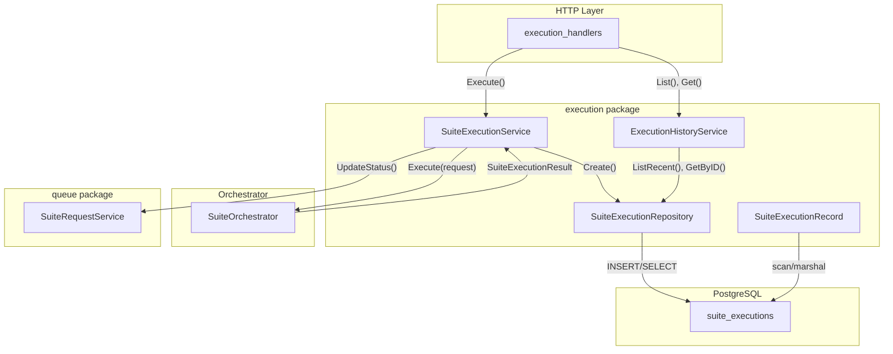
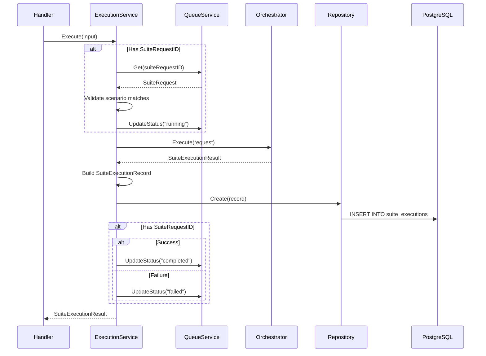
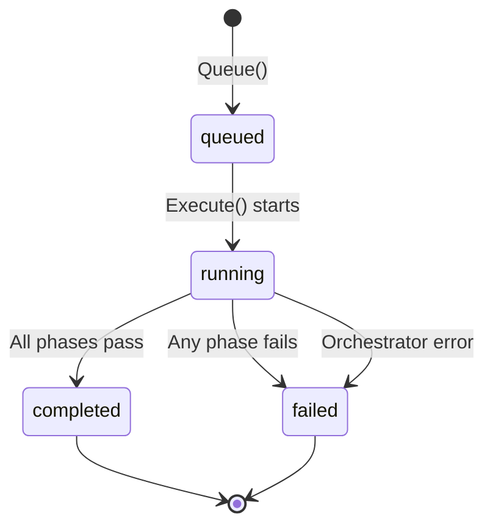

# Execution

The execution package coordinates test suite runs, persists results, and provides historical access. It bridges the HTTP layer, orchestrator, and queue systems.

## Architecture



## Key Types

### SuiteExecutionService

Coordinates execution flow:

```go
type SuiteExecutionService struct {
    engine        suiteExecutionEngine    // Orchestrator
    executions    *SuiteExecutionRepository
    suiteRequests suiteRequestManager     // Queue service
}
```

### SuiteExecutionInput

Input for execution:

```go
type SuiteExecutionInput struct {
    Request        orchestrator.SuiteExecutionRequest
    SuiteRequestID *uuid.UUID  // Optional link to queued request
}
```

### SuiteExecutionRecord

Persisted execution data:

```go
type SuiteExecutionRecord struct {
    ID             uuid.UUID
    SuiteRequestID *uuid.UUID
    ScenarioName   string
    PresetUsed     string
    Success        bool
    Phases         []phases.ExecutionResult
    StartedAt      time.Time
    CompletedAt    time.Time
}
```

### ExecutionHistory

Read-only interface for HTTP handlers:

```go
type ExecutionHistory interface {
    List(ctx context.Context, scenario string, limit int, offset int) ([]orchestrator.SuiteExecutionResult, error)
    Get(ctx context.Context, id uuid.UUID) (*orchestrator.SuiteExecutionResult, error)
    Latest(ctx context.Context) (*orchestrator.SuiteExecutionResult, error)
}
```

## Execution Flow



## State Transitions

When execution is linked to a suite request:



## Database Schema

```sql
CREATE TABLE suite_executions (
    id              UUID PRIMARY KEY,
    suite_request_id UUID REFERENCES suite_requests(id),
    scenario_name   TEXT NOT NULL,
    preset_used     TEXT,
    success         BOOLEAN NOT NULL,
    phases          JSONB NOT NULL,
    started_at      TIMESTAMPTZ NOT NULL,
    completed_at    TIMESTAMPTZ NOT NULL
);

CREATE INDEX idx_suite_executions_scenario ON suite_executions(scenario_name);
CREATE INDEX idx_suite_executions_completed ON suite_executions(completed_at DESC);
```

## Repository Methods

### Create

```go
func (r *SuiteExecutionRepository) Create(ctx context.Context, record *SuiteExecutionRecord) error
```

Inserts a new execution record. Phases are JSON-encoded.

### ListRecent

```go
func (r *SuiteExecutionRepository) ListRecent(ctx context.Context, scenario string, limit int, offset int) ([]SuiteExecutionRecord, error)
```

Returns paginated results ordered by `completed_at DESC`. Optional `scenario` filter.

### GetByID

```go
func (r *SuiteExecutionRepository) GetByID(ctx context.Context, id uuid.UUID) (*SuiteExecutionRecord, error)
```

Loads a single record by UUID.

### Latest

```go
func (r *SuiteExecutionRepository) Latest(ctx context.Context) (*SuiteExecutionRecord, error)
```

Returns the most recently completed execution (any scenario).

## Error Handling

### ErrSuiteRequestNotFound

Returned when `SuiteRequestID` doesn't exist:

```go
var ErrSuiteRequestNotFound = errors.New("suite request not found")
```

HTTP layer maps this to `404 Not Found`.

### Failure Recovery

If orchestrator fails after marking request as "running", the service marks it as "failed":

```go
func (s *SuiteExecutionService) markSuiteFailed(ctx context.Context, suiteID *uuid.UUID) {
    if suiteID == nil || s.suiteRequests == nil {
        return
    }
    _ = s.suiteRequests.UpdateStatus(ctx, *suiteID, queue.StatusFailed)
}
```

## Record Conversion

`SuiteExecutionRecord` converts to orchestrator result for API responses:

```go
func (r SuiteExecutionRecord) ToExecutionResult() *orchestrator.SuiteExecutionResult {
    result := &orchestrator.SuiteExecutionResult{
        ExecutionID:  r.ID,
        ScenarioName: r.ScenarioName,
        StartedAt:    r.StartedAt,
        CompletedAt:  r.CompletedAt,
        Success:      r.Success,
        PresetUsed:   r.PresetUsed,
    }
    if r.SuiteRequestID != nil {
        result.SuiteRequestID = r.SuiteRequestID
    }
    result.Phases = r.Phases
    result.PhaseSummary = orchestrator.SummarizePhases(result.Phases)
    return result
}
```

## Limits

| Constant | Value | Purpose |
|----------|-------|---------|
| `MaxExecutionHistory` | 50 | Default/max results per list query |

## Directory Structure

```
execution/
├── service.go      # SuiteExecutionService - coordination logic
├── repository.go   # SuiteExecutionRepository - PostgreSQL persistence
├── history.go      # ExecutionHistoryService - read-only access
├── record.go       # SuiteExecutionRecord type + conversion
│
└── *_test.go       # Unit tests
```

## Usage Example

```go
// Create service
svc := execution.NewSuiteExecutionService(orchestrator, repo, queueService)

// Execute with queue linkage
result, err := svc.Execute(ctx, execution.SuiteExecutionInput{
    Request: orchestrator.SuiteExecutionRequest{
        ScenarioName: "test-genie",
        Preset:       "comprehensive",
        FailFast:     true,
    },
    SuiteRequestID: &requestID,
})

// Query history
history := execution.NewExecutionHistoryService(repo)
results, err := history.List(ctx, "test-genie", 10, 0)
latest, err := history.Latest(ctx)
```

## Related Documentation

- [API README](../../README.md) — HTTP endpoints
- [Orchestrator README](../orchestrator/README.md) — Execution engine
- [HTTP Server README](../app/httpserver/README.md) — Handler layer
