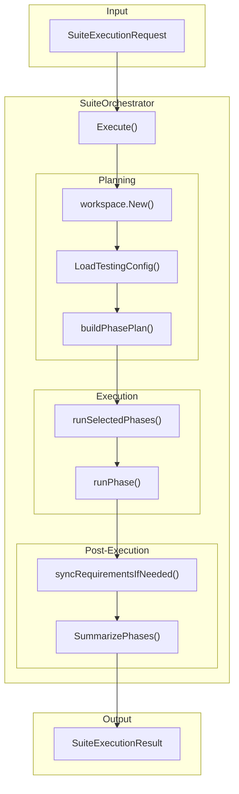
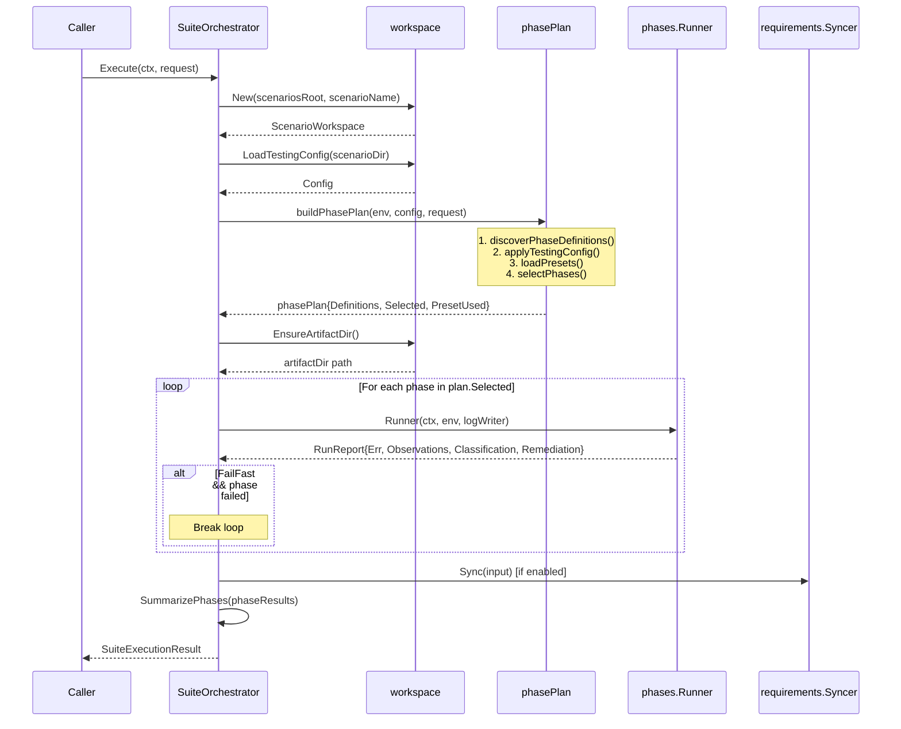

# Orchestrator

The orchestrator is the core business logic of Test Genie. It plans and executes test phases against scenarios, producing structured results with per-phase logs, observations, and failure classifications.

## Architecture



## Key Types

### SuiteOrchestrator

The main entry point. Holds:
- `scenariosRoot` — Path to the `scenarios/` directory
- `projectRoot` — Repository root (parent of scenariosRoot)
- `phaseTimeout` — Default timeout for phase runners (15 min)
- `catalog` — Registry of built-in Go phases
- `requirements` — Syncer for pushing results to requirements modules

### SuiteExecutionRequest

Input for a single execution:

```go
type SuiteExecutionRequest struct {
    ScenarioName string   // Required: target scenario
    Preset       string   // Optional: "quick", "smoke", "comprehensive"
    Phases       []string // Optional: explicit phase list (overrides preset)
    Skip         []string // Optional: phases to exclude
    FailFast     bool     // Stop on first failure
}
```

### SuiteExecutionResult

Output of an execution:

```go
type SuiteExecutionResult struct {
    ExecutionID    uuid.UUID              // Assigned after persistence
    SuiteRequestID *uuid.UUID             // Linked queue request (if any)
    ScenarioName   string
    StartedAt      time.Time
    CompletedAt    time.Time
    Success        bool                   // All phases passed
    PresetUsed     string
    Phases         []PhaseExecutionResult // Per-phase outcomes
    PhaseSummary   PhaseSummary           // Aggregated telemetry
}
```

## Execution Flow



## Phase Planning

Phase selection follows this precedence:

1. **Explicit phases** — If `request.Phases` is provided, use those
2. **Preset** — If `request.Preset` is provided, expand to its phase list
3. **All phases** — If neither, run all discovered phases

Phase discovery merges:
- **Catalog phases** — Go-native runners from `phases.NewDefaultCatalog()`
- **Script phases** — `test/phases/test-*.sh` files in the scenario

After selection, `request.Skip` filters out unwanted phases.

### Presets

Default presets (can be overridden in `.vrooli/testing.json`):

| Preset | Phases |
|--------|--------|
| `quick` | structure, unit |
| `smoke` | structure, integration |
| `comprehensive` | structure, dependencies, unit, integration, playbooks, business, performance |

## Configuration

The orchestrator reads `.vrooli/testing.json` from each scenario:

```json
{
  "phases": {
    "performance": {
      "enabled": false,
      "timeout": "5m"
    }
  },
  "presets": {
    "ci": ["structure", "unit", "integration"]
  },
  "structure": {
    "validateServiceName": true,
    "validateJSONFiles": true,
    "additionalDirs": ["migrations"],
    "excludedFiles": ["cli/deprecated"]
  }
}
```

## Artifacts

Each phase writes logs to:

```
scenarios/<name>/coverage/logs/<run-id>/<phase>.log
```

The latest run also updates `scenarios/<name>/coverage/latest/manifest.json` and per-phase log pointers for quick access. Log paths are returned in `PhaseExecutionResult.LogPath` for debugging.

## Directory Structure

```
orchestrator/
├── suite_execution.go       # Main Execute() logic
├── suite_execution_test.go  # Orchestrator tests
├── phase_plan.go            # Phase planning & selection
├── requirements_decision.go # Sync gating logic
│
├── phases/                  # Phase implementations
│   └── README.md            # Phase contracts
│
├── workspace/               # Filesystem discovery
│   ├── workspace.go         # ScenarioWorkspace type
│   ├── testing_config.go    # .vrooli/testing.json parser
│   ├── manifest_loader.go   # service.json parser
│   └── fs.go                # File helpers
│
└── requirements/            # Post-execution syncing
    └── requirements_syncer.go
```

## Related Documentation

- [Phases README](phases/README.md) — Phase catalog & implementations
- [API README](../../README.md) — HTTP layer & endpoints
- [Execution README](../execution/README.md) — State persistence
