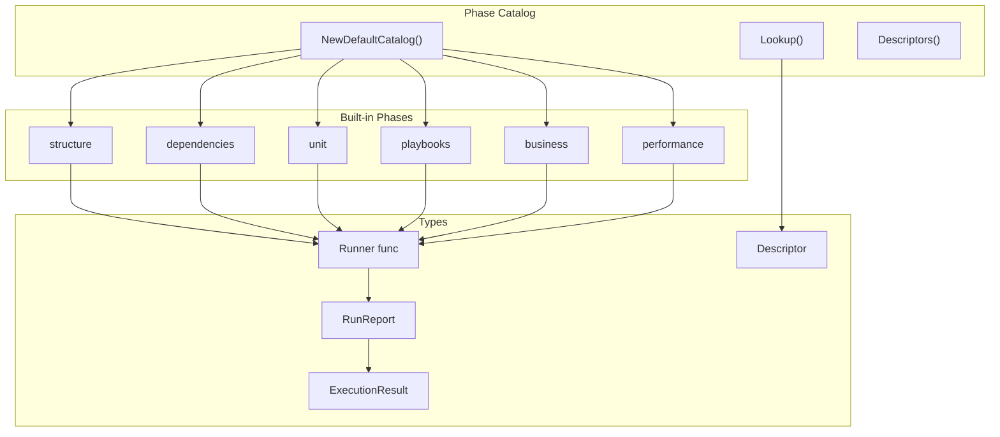
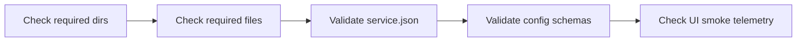

# Phases

Phases are the atomic units of test validation in Test Genie. Each phase performs a specific type of validation and reports structured results back to the orchestrator.

## Architecture


```mermaid
flowchart TB
    subgraph Catalog["Phase Catalog"]
        reg["NewDefaultCatalog()"]
        lookup["Lookup()"]
        descriptors["Descriptors()"]
    end

    subgraph Phases["Built-in Phases"]
        structure["structure"]
        deps["dependencies"]
        unit["unit"]
        playbooks["playbooks"]
        business["business"]
        performance["performance"]
    end

    subgraph Types
        runner["Runner func"]
        report["RunReport"]
        result["ExecutionResult"]
        descriptor["Descriptor"]
    end

    reg --> structure
    reg --> deps
    reg --> unit
    reg --> playbooks
    reg --> business
    reg --> performance

    structure --> runner
    deps --> runner
    unit --> runner
    playbooks --> runner
    business --> runner
    performance --> runner

    runner --> report
    report --> result
    lookup --> descriptor
```

## Phase Catalog

The catalog (`catalog.go`) is a registry of available phases. It's initialized with built-in Go phases and supports runtime lookup.

```go
catalog := phases.NewDefaultCatalog(15 * time.Minute)

// Lookup a phase
spec, ok := catalog.Lookup("unit")

// Get all phases for API responses
descriptors := catalog.Descriptors()

// Get phase registration order
order, ok := catalog.Order(phases.Unit)
```

## Runner Contract

Every phase implements the `Runner` function signature:

```go
type Runner func(ctx context.Context, env workspace.Environment, logWriter io.Writer) RunReport
```

| Parameter | Purpose |
|-----------|---------|
| `ctx` | Context with timeout; check `ctx.Err()` for cancellation |
| `env` | Scenario paths: `ScenarioDir`, `TestDir`, `AppRoot` |
| `logWriter` | Write phase logs here (persisted to artifacts) |

### RunReport

```go
type RunReport struct {
    Err                   error    // nil = passed, non-nil = failed
    Observations          []string // Informational notes for humans
    FailureClassification string   // Category: misconfiguration, missing_dependency, timeout, system
    Remediation           string   // Suggested fix for the failure
}
```

### ExecutionResult

The orchestrator wraps `RunReport` into:

```go
type ExecutionResult struct {
    Name            string   // Phase name (e.g., "unit")
    Status          string   // "passed" or "failed"
    DurationSeconds int
    LogPath         string   // Relative path to log file
    Error           string   // Error message if failed
    Classification  string   // Failure category
    Remediation     string   // Fix suggestion
    Observations    []string // Phase notes
}
```

## Built-in Phases

### structure

**File:** `phase_structure.go`

Validates scenario layout without running any tests:


```mermaid
flowchart LR
    A[Check required dirs] --> B[Check required files]
    B --> C[Validate service.json]
    C --> D[Validate config schemas]
    D --> E[Check UI smoke telemetry]
```

| Check | Details |
|-------|---------|
| Required directories | `api/`, `cli/`, `docs/`, `requirements/`, `test/`, `ui/` |
| Required files | `README.md`, `PRD.md`, `Makefile`, `.vrooli/service.json`, `.vrooli/testing.json`, `cli/<scenario>` |
| Manifest validation | `service.name` matches scenario, health checks defined |
| Schema validation | `.vrooli/` config files validated against JSON schemas |

### dependencies

**File:** `phase_validationprovider.go`

Delegates dependency validation to Scenario Dependency Analyzer:

- Calls `scenario-validation/v1.ScenarioValidationService.ValidateScenario` on `scenario-dependency-analyzer`
- Maps SDA assessment findings into `FINDING_SOURCE_DEPENDENCY`
- Does not run native dependency checks or call SDA drift separately
- Fails when SDA returns `ERROR` / `BLOCKER` dependency health findings or when the producer is unavailable

### unit

**File:** `phase_validationprovider.go`

Delegates test execution, coverage analysis, test architecture, and test-quality
diagnostics to Unit Health:

- Calls `scenario-validation/v1.ScenarioValidationService.ValidateScenario` on `unit-health`
- Sets `include_execution=true` so the provider actually runs the discovered tests
- Uses a long provider timeout because test execution can be slow
- Maps coverage-dimension assessment findings into `FINDING_SOURCE_COVERAGE`

### playbooks

**File:** `phase_playbooks.go`

Executes Vrooli Ascension workflows declared in `bas/`:

- Reads `registry.json` for workflow definitions
- Invokes BAS runner for each workflow
- Validates end-to-end UI flows

### business

**File:** `phase_business.go`

Audits requirements modules:

- Scans `requirements/` for module definitions
- Validates operational targets are mapped
- Ensures coverage tracking is up to date

### performance

**File:** `phase_performance.go`

**Optional phase** — skipped by default unless explicitly included.

- Builds the Go API binary
- Measures build duration against budget
- Runs benchmark tests if available

## Failure Classifications

| Class | Meaning | Example |
|-------|---------|---------|
| `misconfiguration` | User-fixable config error | Missing `service.json`, invalid JSON |
| `missing_dependency` | Required tool not installed | `go` command not found |
| `timeout` | Phase exceeded time limit | Long-running test suite |
| `system` | Unexpected runtime error | File permission issue |

## Adding a New Phase

1. **Create the runner function** in a new file `phase_<name>.go`:

```go
func runMyPhase(ctx context.Context, env workspace.Environment, logWriter io.Writer) RunReport {
    if err := ctx.Err(); err != nil {
        return RunReport{Err: err, FailureClassification: FailureClassSystem}
    }

    // Your validation logic here
    logPhaseStep(logWriter, "doing something useful")

    if somethingFailed {
        return RunReport{
            Err:                   fmt.Errorf("validation failed: %s", reason),
            FailureClassification: FailureClassMisconfiguration,
            Remediation:           "Fix the issue by doing X",
        }
    }

    return RunReport{
        Observations: []string{"validated 42 things"},
    }
}
```

2. **Register in the catalog** (`catalog.go`):

```go
register(Spec{
    Name:        MyPhase,  // Add constant to types.go
    Runner:      runMyPhase,
    Description: "Validates something important.",
    Optional:    false,    // true if not in default presets
})
```

3. **Add the phase name constant** (`types.go`):

```go
const (
    // ... existing phases
    MyPhase Name = "myphase"
)
```

4. **Update presets** if needed (in `suite_execution.go` or scenario's `testing.json`)

## Helper Functions

Common utilities in `phase_helpers.go`:

| Function | Purpose |
|----------|---------|
| `logPhaseStep(w, fmt, args...)` | Write timestamped log entry |
| `logPhaseSuccess(w, fmt, args...)` | Write success entry |
| `EnsureCommandAvailable(cmd)` | Check if command exists in PATH |
| `phaseCommandExecutor(ctx, dir, w, cmd, args...)` | Run command with output to log |
| `phaseCommandCapture(ctx, dir, w, cmd, args...)` | Run command and capture output |
| `wrapLogSansANSI(w)` | Strip ANSI escapes before persisting logs |
| `OverrideCommandLookup/Executor/Capture(...)` | Test seams for command-driven phases |

## Directory Structure

```
phases/
├── catalog.go              # Phase registry
├── types.go                # Name, Runner, RunReport, ExecutionResult
│
├── phase_structure.go      # Structure validation
├── phase_validationprovider.go # Shared health-provider delegation
├── phase_playbooks.go      # BAS workflow execution
├── phase_business.go       # Requirements auditing
├── phase_performance.go    # Performance benchmarks
│
├── phase_helpers.go        # Shared utilities
├── structure_expectations.go # Structure config parsing
├── scenario_status.go      # Status fetching helpers
│
└── *_test.go               # Phase tests
```

## Related Documentation

- [Orchestrator README](../README.md) — Suite execution flow
- [API README](../../../README.md) — HTTP endpoints
