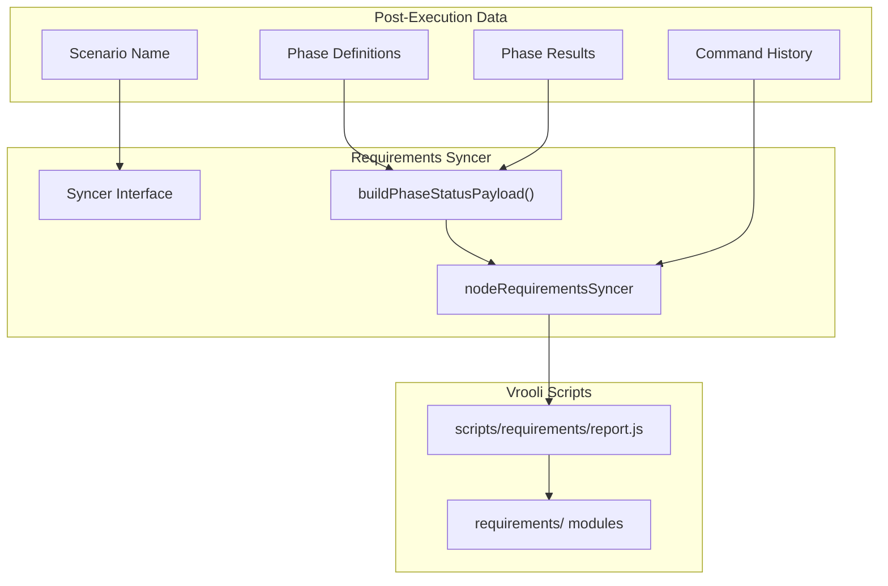
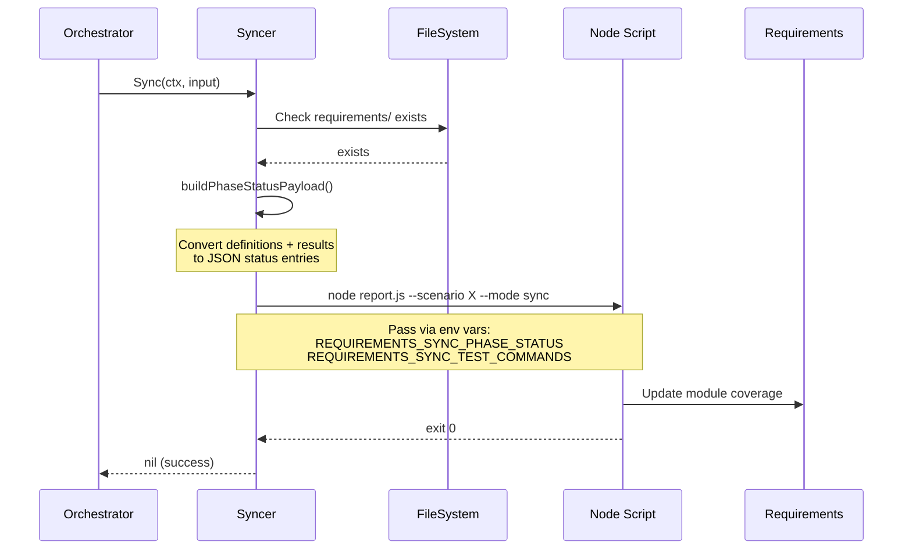

# Requirements

The requirements package synchronizes test execution results back to scenario requirements modules. After a test suite completes, phase results are reported to the requirements tracking system for coverage analysis and deployment gating.

## Architecture



## Syncer Interface

The package defines a `Syncer` interface for pluggable sync implementations:

```go
type Syncer interface {
    Sync(ctx context.Context, input SyncInput) error
}

type SyncInput struct {
    ScenarioName     string
    ScenarioDir      string
    PhaseDefinitions []phases.Definition
    PhaseResults     []phases.ExecutionResult
    CommandHistory   []string
}
```

## Node Syncer

The default implementation (`nodeRequirementsSyncer`) invokes the Vrooli requirements reporting script:

```go
syncer := requirements.NewNodeSyncer("/path/to/vrooli")
if syncer == nil {
    // Script not found — syncing disabled
}

err := syncer.Sync(ctx, requirements.SyncInput{
    ScenarioName:     "my-scenario",
    ScenarioDir:      "/path/to/scenarios/my-scenario",
    PhaseDefinitions: defs,
    PhaseResults:     results,
    CommandHistory:   []string{"suite my-scenario"},
})
```

### How It Works

1. **Validates environment**: Checks that `requirements/` directory exists in the scenario
2. **Builds payload**: Converts phase definitions and results into JSON status entries
3. **Invokes script**: Runs `node scripts/requirements/report.js --scenario <name> --mode sync`
4. **Passes data**: Phase status and command history are passed via environment variables

### Environment Variables

| Variable | Content |
|----------|---------|
| `REQUIREMENTS_SYNC_PHASE_STATUS` | JSON array of phase status entries |
| `REQUIREMENTS_SYNC_TEST_COMMANDS` | JSON array of executed commands |

## Phase Status Payload

The `buildPhaseStatusPayload()` function transforms execution data into a structured format:

```go
type phaseStatusEntry struct {
    Phase    string `json:"phase"`    // e.g., "unit"
    Status   string `json:"status"`   // "passed", "failed", "not_run", "unknown"
    Optional bool   `json:"optional"` // Whether phase was optional
    Recorded bool   `json:"recorded"` // Whether result was captured
}
```

### Status Values

| Status | Meaning |
|--------|---------|
| `passed` | Phase completed successfully |
| `failed` | Phase encountered errors |
| `not_run` | Phase was in plan but not executed |
| `unknown` | Result status was empty |

## Data Flow



## Usage in Orchestrator

The syncer is invoked after suite execution completes:

```go
// After all phases finish
if syncer != nil && shouldSync {
    input := requirements.SyncInput{
        ScenarioName:     workspace.Name,
        ScenarioDir:      workspace.ScenarioDir,
        PhaseDefinitions: plan.Definitions(),
        PhaseResults:     executionResults,
        CommandHistory:   commandHistory,
    }
    if err := syncer.Sync(ctx, input); err != nil {
        // Log warning but don't fail suite
    }
}
```

## Prerequisites

For syncing to work:

1. **Node.js available**: `node` command must be in PATH
2. **Script exists**: `scripts/requirements/report.js` must exist in Vrooli root
3. **Requirements directory**: Scenario must have `requirements/` folder

If any prerequisite is missing, syncing is silently skipped (not an error).

## Directory Structure

```
requirements/
├── requirements_syncer.go       # Syncer interface and nodeRequirementsSyncer
└── requirements_syncer_test.go  # Unit tests
```

## Where to Look

| Task | Location |
|------|----------|
| Create a syncer instance | `requirements_syncer.go` → `NewNodeSyncer()` |
| Sync results after execution | `requirements_syncer.go` → `Sync()` |
| Understand payload format | `requirements_syncer.go` → `buildPhaseStatusPayload()` |
| Customize sync behavior | Scenario's `.vrooli/testing.json` → `requirements.sync` |

## Related Documentation

- [Orchestrator README](../README.md) — When syncing is triggered
- [Phases README](../phases/README.md) — Phase definitions and results
- [Workspace README](../workspace/README.md) — Configuration for `requirements.sync`
