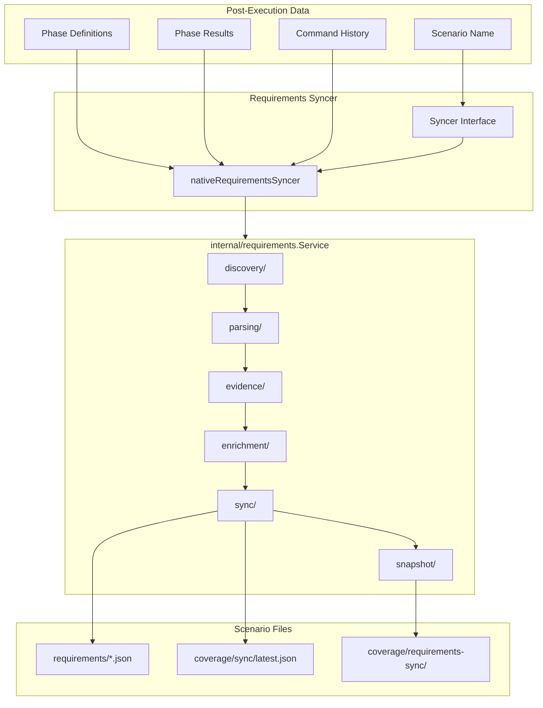

# Requirements

The requirements package synchronizes test execution results back to scenario requirements modules. After a test suite completes, phase results are reported to the requirements tracking system for coverage analysis and deployment gating.

## Architecture



## Syncer Interface

The package defines a `Syncer` interface for pluggable sync implementations:

```go
type Syncer interface {
    Sync(ctx context.Context, input SyncInput) error
}

type SyncInput struct {
    ScenarioName     string
    ScenarioDir      string
    PhaseDefinitions []phases.Definition
    PhaseResults     []phases.ExecutionResult
    CommandHistory   []string
}
```

## Native Go Syncer (Default)

The default implementation (`nativeRequirementsSyncer`) uses the native Go requirements service:

```go
syncer := requirements.NewSyncer(projectRoot)

err := syncer.Sync(ctx, requirements.SyncInput{
    ScenarioName:     "my-scenario",
    ScenarioDir:      "/path/to/scenarios/my-scenario",
    PhaseDefinitions: defs,
    PhaseResults:     results,
    CommandHistory:   []string{"suite my-scenario"},
})
```

### How It Works

The native syncer delegates to `internal/requirements.Service`, which executes a 7-stage pipeline:

1. **Discovery**: Finds all requirement files in `requirements/` (respects `index.json` imports)
2. **Parsing**: Parses JSON files, normalizes fields (`validation` → `validations`)
3. **Evidence Loading**: Loads test evidence from multiple sources:
   - Phase execution results (passed as input)
   - `coverage/phase-results/*.json`
   - `ui/coverage/vitest-requirements.json`
   - `coverage/manual-validations/log.jsonl`
4. **Enrichment**: Matches validations to evidence, aggregates statuses, resolves hierarchy
5. **Sync**: Updates requirement files with live statuses
6. **Snapshot**: Writes coverage snapshot to `coverage/requirements-sync/latest.json`
7. **Metadata**: Writes sync metadata to `coverage/sync/latest.json`

### Environment Variables

| Variable | Effect |
|----------|--------|
| `REQUIREMENTS_SYNC_NODE=true` | Force legacy Node.js syncer (if script exists) |
| `TESTING_REQUIREMENTS_SYNC=false` | Disable sync entirely |
| `TESTING_REQUIREMENTS_SYNC_FORCE=true` | Force sync even if required phases are missing |

## Sync Pipeline Details

### Discovery

The discovery stage finds requirement files:
- Scans `requirements/` directory recursively
- Respects `index.json` import declarations
- Handles circular dependency detection

### Evidence Sources

Evidence is loaded from multiple sources and merged:

| Source | Path | Content |
|--------|------|---------|
| Phase Results | Input parameter | Execution status per phase |
| Phase Files | `coverage/phase-results/*.json` | Detailed phase execution data |
| Vitest | `ui/coverage/vitest-requirements.json` | Frontend test results |
| Manual | `coverage/manual-validations/log.jsonl` | Manual validation records |

### Status Derivation

Validation statuses are derived using this priority:
1. Direct evidence match (test file → validation)
2. Phase-level rollup (phase passed → validations passed)
3. Parent/child hierarchy aggregation

### File Updates

When syncing writes files:
- Only modules with changes are written
- `_metadata.last_validated_at` is updated
- Statuses are attached to validations
- Orphaned validations can be pruned (configurable)

## Usage in Orchestrator

The syncer is invoked after suite execution completes:

```go
// After all phases finish
if syncer != nil && shouldSync {
    input := requirements.SyncInput{
        ScenarioName:     workspace.Name,
        ScenarioDir:      workspace.ScenarioDir,
        PhaseDefinitions: plan.Definitions(),
        PhaseResults:     executionResults,
        CommandHistory:   commandHistory,
    }
    if err := syncer.Sync(ctx, input); err != nil {
        // Log warning but don't fail suite
    }
}
```

## Sync Gating

The orchestrator gates sync execution based on phase coverage. Sync is blocked if:

- Phase plan is unavailable
- No phases were selected
- No phase results were recorded
- `requirements.sync` is disabled in `.vrooli/testing.json`
- `TESTING_REQUIREMENTS_SYNC` env var is false
- Required (non-optional) phases are missing or skipped

Use `TESTING_REQUIREMENTS_SYNC_FORCE=true` to bypass gating.

## Prerequisites

For syncing to work:

1. **Requirements directory**: Scenario must have `requirements/` folder
2. **Valid requirement files**: JSON files with proper structure

No external dependencies (Node.js, etc.) are required.

## Directory Structure

```
requirements/
├── requirements_syncer.go       # Syncer interface, native and node implementations
└── requirements_syncer_test.go  # Unit tests
```

The core implementation lives in `internal/requirements/`:

```
internal/requirements/
├── service.go          # Pipeline orchestration
├── io.go               # Filesystem abstraction
├── discovery/          # File discovery
├── parsing/            # JSON parsing
├── evidence/           # Evidence loading
├── enrichment/         # Status enrichment
├── sync/               # File synchronization
├── reporting/          # Output generation
├── validation/         # Structure validation
├── snapshot/           # Snapshot generation
└── types/              # Shared types
```

## Where to Look

| Task | Location |
|------|----------|
| Create a syncer instance | `requirements_syncer.go` → `NewSyncer()` |
| Sync results after execution | `requirements_syncer.go` → `Sync()` |
| Understand sync pipeline | `internal/requirements/service.go` → `Sync()` |
| Customize sync behavior | Scenario's `.vrooli/testing.json` → `requirements.sync` |
| Debug sync issues | Check `coverage/sync/latest.json` for metadata |

## Related Documentation

- [Orchestrator README](../README.md) — When syncing is triggered
- [Phases README](../phases/README.md) — Phase definitions and results
- [Workspace README](../workspace/README.md) — Configuration for `requirements.sync`
