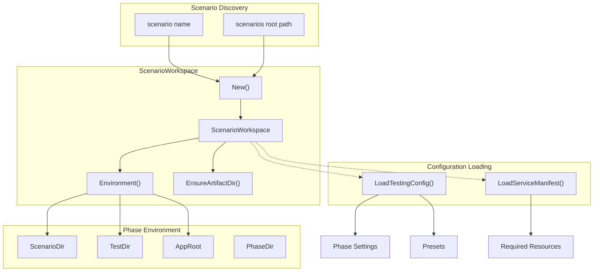
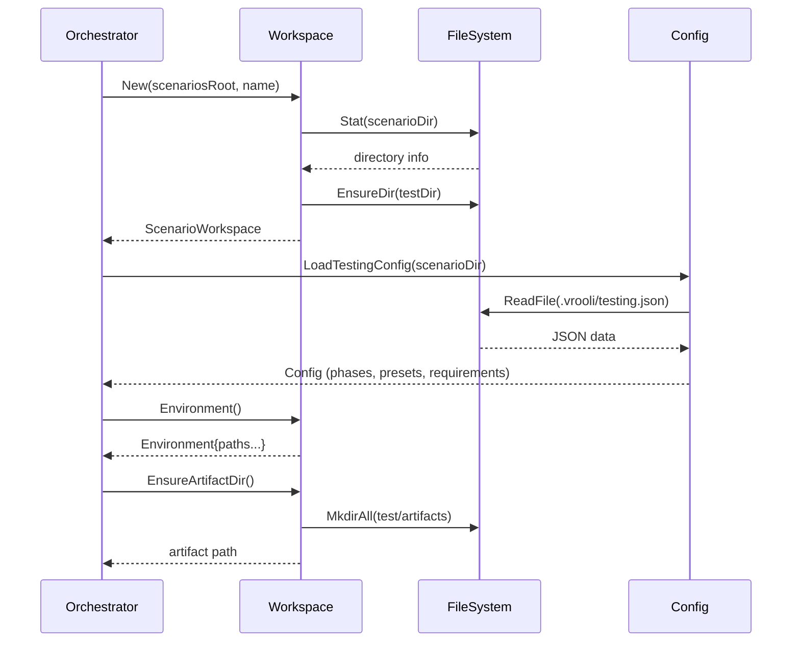

# Workspace

The workspace package provides filesystem discovery and configuration loading for scenarios. It establishes the canonical paths and settings that phase runners use to validate and test scenarios.

## Architecture



## ScenarioWorkspace

The `ScenarioWorkspace` type (`workspace.go`) captures canonical paths for a scenario, eliminating repeated path derivation throughout the orchestrator.

```go
workspace, err := workspace.New("/path/to/scenarios", "my-scenario")
if err != nil {
    // Handle validation error (scenario not found, invalid name, etc.)
}

// Access paths
fmt.Println(workspace.ScenarioDir)  // /path/to/scenarios/my-scenario
fmt.Println(workspace.TestDir)      // /path/to/scenarios/my-scenario/test
fmt.Println(workspace.PhaseDir)     // /path/to/scenarios/my-scenario/test/phases
fmt.Println(workspace.AppRoot)      // /path/to/scenarios (Vrooli root)
```

### Validation Rules

| Rule | Error |
|------|-------|
| Empty scenario name | `scenarioName is required` |
| Invalid characters | `scenarioName may only contain letters, numbers, hyphens, or underscores` |
| Scenario not found | `scenario 'X' was not found under Y` |
| Path is not a directory | `scenario path is not a directory: X` |

### Environment

The `Environment` type exposes paths to phase runners without coupling them to the full workspace:

```go
env := workspace.Environment()

// Phase runners receive this:
type Environment struct {
    ScenarioName string  // "my-scenario"
    ScenarioDir  string  // Full path to scenario
    TestDir      string  // Full path to test directory
    AppRoot      string  // Vrooli repository root
}
```

### Artifact Directory

Test artifacts (logs, reports) are lazily created:

```go
artifactDir, err := workspace.EnsureArtifactDir()
// Creates: <scenario>/test/artifacts/
```

## Testing Configuration

The `LoadTestingConfig()` function (`testing_config.go`) parses `.vrooli/testing.json` to customize phase behavior per scenario.

```go
config, err := workspace.LoadTestingConfig("/path/to/scenario")
if err != nil {
    // Parse error
}
if config == nil {
    // No testing.json or empty config — use defaults
}
```

### Config Structure

```go
type Config struct {
    Phases       map[string]PhaseSettings  // Per-phase overrides
    Presets      map[string][]string       // Named phase groups
    Requirements RequirementSettings       // Sync behavior
}

type PhaseSettings struct {
    Enabled *bool          // Override default enabled state
    Timeout time.Duration  // Override default timeout
}

type RequirementSettings struct {
    Enforce *bool  // Require passing tests for deployment
    Sync    *bool  // Auto-sync results to requirements modules
}
```

### Example testing.json

```json
{
  "phases": {
    "unit": { "enabled": true, "timeout": "5m" },
    "performance": { "enabled": false }
  },
  "presets": {
    "quick": ["structure", "unit"],
    "full": ["structure", "dependencies", "unit", "integration", "business"]
  },
  "requirements": {
    "enforce": true,
    "sync": true
  }
}
```

### Timeout Parsing

Timeouts support flexible formats:

| Format | Duration |
|--------|----------|
| `"30"` or `"30s"` | 30 seconds |
| `"5m"` | 5 minutes |
| `"1h"` | 1 hour |

## Service Manifest

The `LoadServiceManifest()` function (`manifest_loader.go`) parses `.vrooli/service.json` to extract service metadata and resource dependencies.

```go
manifest, err := workspace.LoadServiceManifest("/path/to/scenario/.vrooli/service.json")
if err != nil {
    // File not found or parse error
}

// Get required resources
resources := manifest.RequiredResources()  // ["postgres", "redis"]
```

### Manifest Structure

```go
type ServiceManifest struct {
    Service struct {
        Name string  // Expected to match scenario directory name
    }
    Lifecycle struct {
        Health struct {
            Checks []json.RawMessage  // Health check definitions
        }
    }
    Dependencies struct {
        Resources map[string]struct {
            Required bool
            Enabled  bool
            Type     string
        }
    }
}
```

## File System Helpers

Utility functions in `fs.go` for path validation:

| Function | Purpose |
|----------|---------|
| `EnsureDir(path)` | Verify path exists and is a directory |
| `EnsureFile(path)` | Verify path exists and is a file |

```go
if err := workspace.EnsureDir("/path/to/dir"); err != nil {
    // "required directory missing: /path/to/dir"
}

if err := workspace.EnsureFile("/path/to/file"); err != nil {
    // "required file missing: /path/to/file"
}
```

## Data Flow



## Directory Structure

```
workspace/
├── workspace.go        # ScenarioWorkspace, Environment, New()
├── testing_config.go   # LoadTestingConfig(), Config types
├── manifest_loader.go  # LoadServiceManifest(), ServiceManifest
├── fs.go               # EnsureDir(), EnsureFile()
└── *_test.go           # Unit tests
```

## Where to Look

| Task | File |
|------|------|
| Create workspace for a scenario | `workspace.go` → `New()` |
| Get paths for phase runners | `workspace.go` → `Environment()` |
| Load phase settings/presets | `testing_config.go` → `LoadTestingConfig()` |
| Check resource dependencies | `manifest_loader.go` → `LoadServiceManifest()` |
| Validate directory/file existence | `fs.go` |

## Related Documentation

- [Orchestrator README](../README.md) — How workspace feeds into suite execution
- [Phases README](../phases/README.md) — How phases use Environment
- [API README](../../../README.md) — Overall API architecture
