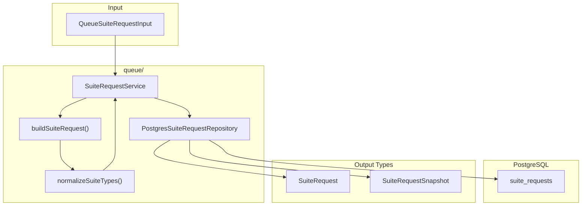
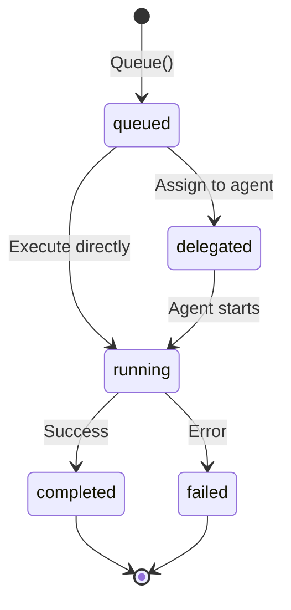

# Queue

Suite request queue management. This package handles the lifecycle of test generation requests from creation through delegation and completion, providing telemetry snapshots for monitoring queue health.

## Architecture



## Directory Structure

```
queue/
├── request.go       # Service + domain types + validation
├── request_test.go
└── repository.go    # PostgreSQL persistence
```

## Request Lifecycle



### Status Values

| Status | Description |
|--------|-------------|
| `queued` | Waiting for processing |
| `delegated` | Assigned to downstream agent |
| `running` | Execution in progress |
| `completed` | Finished successfully |
| `failed` | Finished with error |

## Key Types

### SuiteRequest

Represents a queued generation job:

```go
type SuiteRequest struct {
    ID                 uuid.UUID  // Unique identifier
    ScenarioName       string     // Target scenario
    RequestedTypes     []string   // Test types to generate
    CoverageTarget     int        // Target coverage (1-100)
    Priority           string     // Queue ordering
    Status             string     // Lifecycle state
    Notes              string     // Optional context
    DelegationIssueID  *string    // GitHub issue (if delegated)
    CreatedAt          time.Time
    UpdatedAt          time.Time
    EstimatedQueueTime int        // Seconds (heuristic)
}
```

### QueueSuiteRequestInput

Payload for creating a new request:

```go
type QueueSuiteRequestInput struct {
    ScenarioName   string   // Required
    RequestedTypes []string // Optional (defaults: unit, integration)
    CoverageTarget int      // Optional (default: 95)
    Priority       string   // Optional (default: normal)
    Notes          string   // Optional
}
```

### SuiteRequestSnapshot

Aggregated queue health for telemetry:

```go
type SuiteRequestSnapshot struct {
    Total          int        // All requests
    Queued         int        // Waiting
    Delegated      int        // Assigned to agents
    Running        int        // In progress
    Completed      int        // Done successfully
    Failed         int        // Done with error
    OldestQueuedAt *time.Time // Queue age indicator
}
```

## Validation Rules

### Request Types

Allowed values: `unit`, `integration`, `performance`, `vault`, `regression`

Default: `["unit", "integration"]`

### Priority Levels

| Priority | Description |
|----------|-------------|
| `low` | Background processing |
| `normal` | Standard queue order (default) |
| `high` | Prioritized processing |
| `urgent` | Immediate attention |

### Coverage Target

- Range: 1-100
- Default: 95

## Queue Time Estimation

The `estimateQueueSeconds()` heuristic calculates expected wait time:

```go
estimatedSeconds = (typeCount * 30) + coverageTarget
```

Example: 2 types at 95% coverage = 60 + 95 = 155 seconds

## Service Operations

```go
// Create a new request
svc.Queue(ctx, QueueSuiteRequestInput{
    ScenarioName:   "my-scenario",
    RequestedTypes: []string{"unit", "integration"},
    CoverageTarget: 90,
    Priority:       "high",
})

// List recent requests (max 50)
requests, _ := svc.List(ctx, 25)

// Get by ID
request, _ := svc.Get(ctx, requestID)

// Transition state (used by execution service)
svc.UpdateStatus(ctx, requestID, "running")

// Health snapshot for monitoring
snapshot, _ := svc.StatusSnapshot(ctx)
```

## Database Schema

The `suite_requests` table stores all queue entries:

| Column | Type | Description |
|--------|------|-------------|
| `id` | UUID | Primary key |
| `scenario_name` | TEXT | Target scenario |
| `requested_types` | TEXT[] | Test types array |
| `coverage_target` | INT | Target percentage |
| `priority` | TEXT | Queue ordering |
| `status` | TEXT | Lifecycle state |
| `notes` | TEXT | Optional context |
| `delegation_issue_id` | TEXT | GitHub issue ID |
| `created_at` | TIMESTAMP | Creation time |
| `updated_at` | TIMESTAMP | Last modification |

## Where to Look

| I want to... | Look in... |
|--------------|------------|
| Add validation rules | `request.go` → `buildSuiteRequest()` |
| Add new request types | `request.go` → `allowedSuiteTypes` |
| Change queue ordering | `repository.go` → `List()` query |
| Modify status transitions | `request.go` → `UpdateStatus()` |
| Add telemetry metrics | `repository.go` → `StatusSnapshot()` |

## Related Documentation

- [API README](../../README.md) — HTTP layer & endpoints
- [Execution README](../execution/README.md) — How requests become executions
- [HTTP Server README](../app/httpserver/README.md) — Suite request handlers
