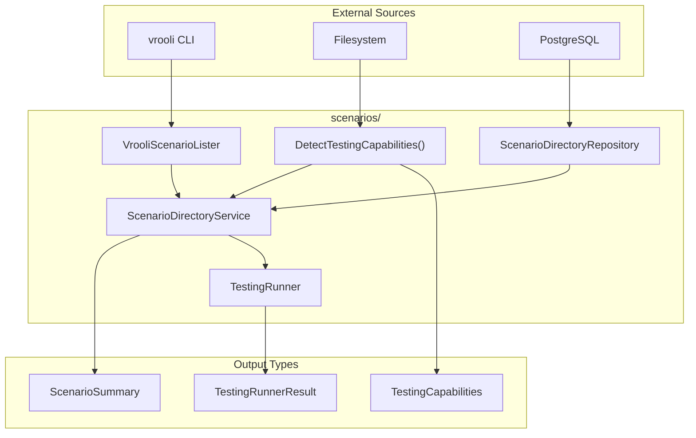
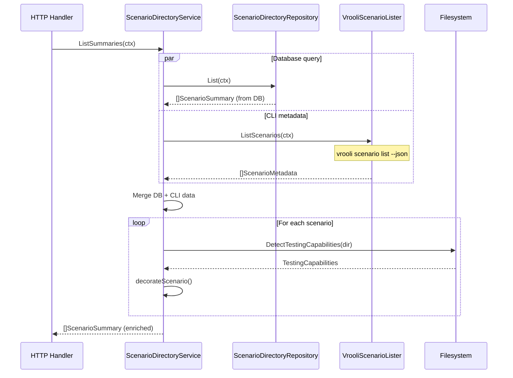

# Scenarios

Scenario discovery and metadata aggregation. This package indexes scenarios from the filesystem, merges CLI metadata with database statistics, and provides a unified view of the scenario catalog with testing capabilities.

## Architecture



## Directory Structure

```
scenarios/
├── scenario_directory_service.go      # Orchestrates catalog lookups
├── scenario_directory_service_test.go
├── scenario_directory_repository.go   # PostgreSQL persistence
├── scenario_directory_repository_test.go
├── scenario_lister.go                 # Vrooli CLI integration
├── testing_capabilities.go            # Filesystem detection
├── testing_capabilities_test.go
├── testing_runner.go                  # Command execution
└── testing_runner_test.go
```

## Key Types

### ScenarioSummary

Aggregates queue and execution telemetry for a single scenario:

```go
type ScenarioSummary struct {
    ScenarioName        string                 // Scenario identifier
    ScenarioDescription string                 // From CLI metadata
    ScenarioStatus      string                 // From CLI metadata
    ScenarioTags        []string               // From CLI metadata
    PendingRequests     int                    // Queued/delegated count
    TotalRequests       int                    // All-time requests
    TotalExecutions     int                    // All-time executions
    LastExecutionAt     *time.Time             // Most recent run
    LastExecutionSuccess *bool                 // Pass/fail status
    Testing             *TestingCapabilities   // Detected test runners
    // ... additional execution metadata
}
```

### TestingCapabilities

Describes available test entrypoints for a scenario:

```go
type TestingCapabilities struct {
    HasTests  bool             // Any test method available
    Phased    bool             // Has test/run-tests.sh
    Lifecycle bool             // Has lifecycle.test in service.json
    Legacy    bool             // Has scenario-test.yaml
    Preferred string           // Recommended test type
    Commands  []TestingCommand // Executable commands
}
```

### TestingCommand

Captures how to run a specific test mode:

```go
type TestingCommand struct {
    Type        string   // "phased", "lifecycle", or "legacy"
    Command     []string // Executable + args
    WorkingDir  string   // Execution directory
    Description string   // Human-readable explanation
}
```

## Data Flow



## Testing Capability Detection

The `DetectTestingCapabilities()` function inspects a scenario directory for test entrypoints:

| Check | File/Condition | Type |
|-------|----------------|------|
| Phased | `test/run-tests.sh` is executable | `phased` |
| Lifecycle | `service.json` has `lifecycle.test` | `lifecycle` |
| Legacy | `scenario-test.yaml` exists | `legacy` |

Priority order: phased > lifecycle > legacy

## Running Scenario Tests

The service can execute scenario-local tests via `RunScenarioTests()`:

```go
cmd, result, err := scenarioSvc.RunScenarioTests(ctx, "my-scenario", "phased")
// cmd contains the command that was executed
// result contains the log path
```

The runner:
1. Validates scenario directory exists
2. Detects available testing capabilities
3. Selects command (preferred type or fallback)
4. Executes with 10-minute timeout
5. Captures output to timestamped log file

## Where to Look

| I want to... | Look in... |
|--------------|------------|
| Query scenario catalog | `scenario_directory_service.go` |
| Understand DB queries | `scenario_directory_repository.go` |
| Add CLI metadata fields | `scenario_lister.go` |
| Modify test detection | `testing_capabilities.go` |
| Change test execution | `testing_runner.go` |

## Related Documentation

- [API README](../../README.md) — HTTP layer & endpoints
- [Execution README](../execution/README.md) — Execution state management
- [Queue README](../queue/README.md) — Suite request lifecycle
