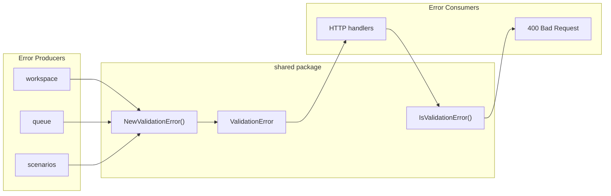
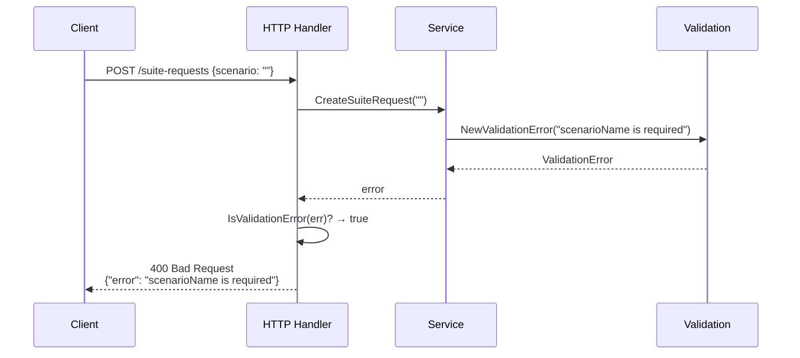

# Shared

The shared package provides cross-cutting utilities used throughout the Test Genie API. Currently focused on validation error handling.

## Architecture



## ValidationError

The `ValidationError` type distinguishes user-fixable input errors from internal system errors. HTTP handlers use this to determine appropriate response codes.

### Creating Validation Errors

```go
import "test-genie/internal/shared"

// In domain logic (workspace, queue, etc.)
if name == "" {
    return nil, shared.NewValidationError("scenarioName is required")
}

if !isValidFormat(input) {
    return nil, shared.NewValidationError("invalid format: expected X, got Y")
}
```

### Checking for Validation Errors

```go
// In HTTP handlers
result, err := service.DoSomething(input)
if err != nil {
    if shared.IsValidationError(err) {
        // User's fault — return 400
        http.Error(w, err.Error(), http.StatusBadRequest)
        return
    }
    // Our fault — return 500
    http.Error(w, "internal error", http.StatusInternalServerError)
    return
}
```

## API Reference

| Function | Purpose |
|----------|---------|
| `NewValidationError(message string) error` | Create a validation error with the given message |
| `IsValidationError(err error) bool` | Check if an error is a validation error (uses `errors.As`) |

## Usage Guidelines

### When to Use ValidationError

- Missing required fields
- Invalid field formats (bad regex, wrong type)
- Business rule violations (name too long, invalid characters)
- Resource not found due to user-provided identifier

### When NOT to Use ValidationError

- Database connection failures
- File system errors
- External service timeouts
- Internal programming errors

## Error Flow Example



## Directory Structure

```
shared/
├── validation.go       # ValidationError type and helpers
└── validation_test.go  # Unit tests
```

## Where to Look

| Task | Location |
|------|----------|
| Create a user-facing error | `validation.go` → `NewValidationError()` |
| Check error type in handler | `validation.go` → `IsValidationError()` |
| Add new shared utilities | Create new file in `shared/` |

## Related Documentation

- [HTTP Server README](../app/httpserver/README.md) — Error response handling
- [Workspace README](../orchestrator/workspace/README.md) — Example validation usage
- [Queue README](../queue/README.md) — Request validation
