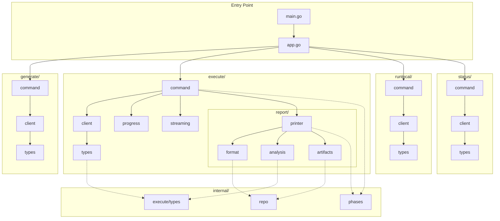

# Test Genie CLI

A command-line interface for AI-driven test suite generation and execution. The CLI follows **screaming architecture** principles—the directory structure immediately communicates what the application does.

## Architecture



## Directory Structure

```
cli/
├── main.go                      # Entry point
├── app.go                       # App struct & command registration
│
├── generate/                    # DOMAIN: Test Suite Generation
│   ├── command.go              # Generate command implementation
│   ├── client.go               # API client for suite requests
│   └── types.go                # Request/Response types
│
├── execute/                     # DOMAIN: Test Suite Execution
│   ├── command.go              # Execute command implementation
│   ├── client.go               # API client for executions
│   ├── types.go                # Execution types & args
│   ├── progress.go             # Real-time progress ticker
│   ├── streaming.go            # Live log streaming
│   │
│   └── report/                 # Sub-domain: Execution Reporting
│       ├── printer.go          # Report orchestrator
│       ├── format.go           # Formatting utilities
│       ├── analysis.go         # Failure analysis heuristics
│       └── artifacts.go        # Artifact discovery
│
├── runlocal/                    # DOMAIN: Local Test Running
│   ├── command.go              # Run-tests command
│   ├── client.go               # API client
│   └── types.go                # Request/Response types
│
├── status/                      # DOMAIN: Health & Status
│   ├── command.go              # Status command
│   ├── client.go               # Health API client
│   └── types.go                # Health response types
│
└── internal/                    # Shared internals
    ├── execute/types.go        # Shared execution types
    ├── phases/phases.go        # Phase normalization
    └── repo/detect.go          # Repository detection
```

## Commands

### Generate Test Suites

Queue AI-driven test suite generation for a scenario:

```bash
test-genie generate <scenario> [options]

Options:
  --types      Comma-separated test types (unit,integration,e2e,business,performance)
  --coverage   Target coverage percentage (1-100)
  --priority   Priority level (low|normal|high|urgent)
  --notes      Notes for the generation request
  --notes-file Path to notes file
  --json       Output as JSON
```

### Execute Test Suites

Run test suites with phased execution:

```bash
test-genie execute <scenario> [phases...] [options]

Options:
  --preset      Preset name (e.g., quick, full)
  --phases      Comma-separated phases to run
  --skip        Comma-separated phases to skip
  --request-id  Link to a suite request
  --fail-fast   Stop on first failure
  --stream      Stream live phase logs
  --json        Output as JSON

Phases:
  structure, dependencies, unit, integration, business, performance
```

### Run Local Tests

Trigger scenario-local test runners:

```bash
test-genie run-tests <scenario> [options]

Options:
  --type  Test runner type (e.g., phased)
  --json  Output as JSON
```

### Check Status

View Test Genie health and queue status:

```bash
test-genie status
```

## Design Principles

### Screaming Architecture

The top-level directories communicate business capabilities, not technical concerns:

| Directory | Business Capability |
|-----------|---------------------|
| `generate/` | Queue AI test generation |
| `execute/` | Run test suites with phases |
| `runlocal/` | Trigger local test runners |
| `status/` | Monitor system health |

### Domain Cohesion

Each domain package contains everything it needs:
- **types.go** - Request/response structures
- **client.go** - API communication
- **command.go** - CLI implementation

### Shared Internals

Common utilities live in `internal/` to prevent duplication:
- **repo/** - Repository root detection
- **phases/** - Phase normalization and descriptors
- **execute/** - Shared execution types (to avoid import cycles)

## Building

```bash
cd scenarios/test-genie/cli
go build -o test-genie .
```

## Testing

```bash
go test ./...
```

## Configuration

Configure the CLI using the `configure` command:

```bash
test-genie configure api_base http://localhost:8080
test-genie configure token <your-token>
```

Or via environment variables:
- `TEST_GENIE_API_BASE` - API base URL
- `TEST_GENIE_API_TOKEN` - Authentication token
- `TEST_GENIE_CONFIG_DIR` - Config directory
