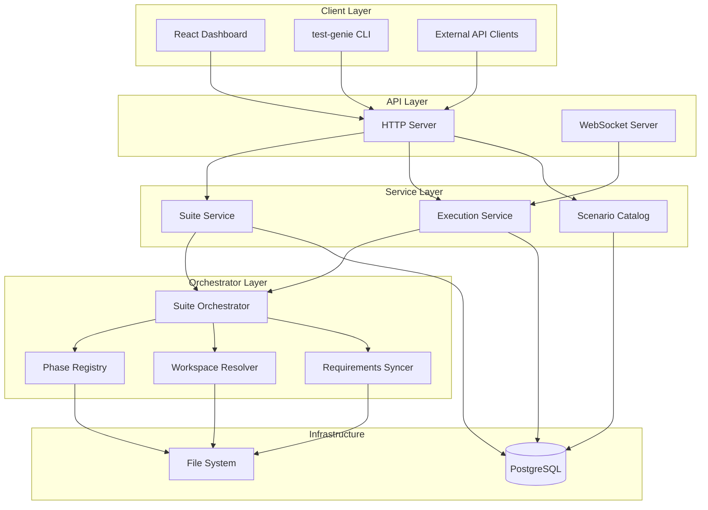
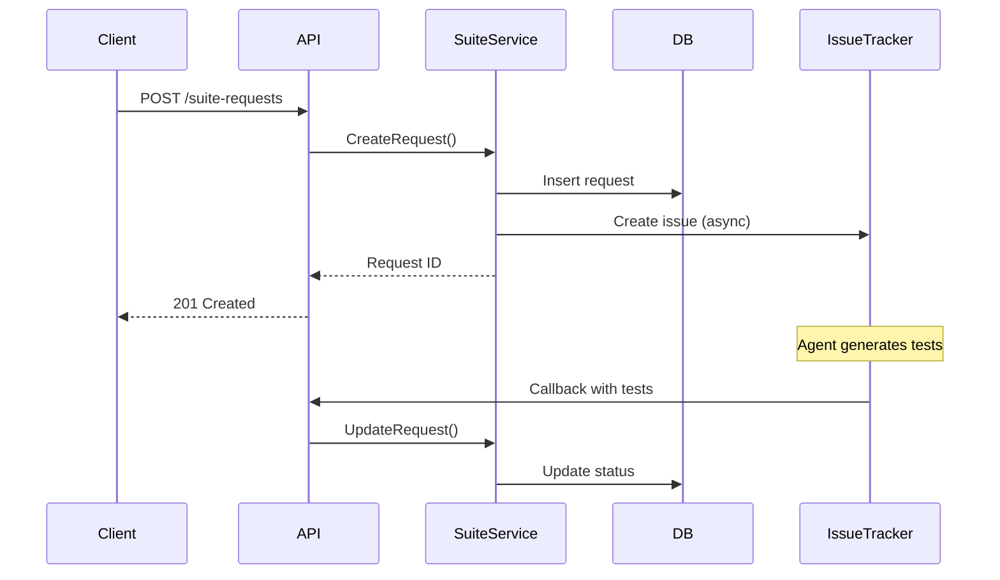
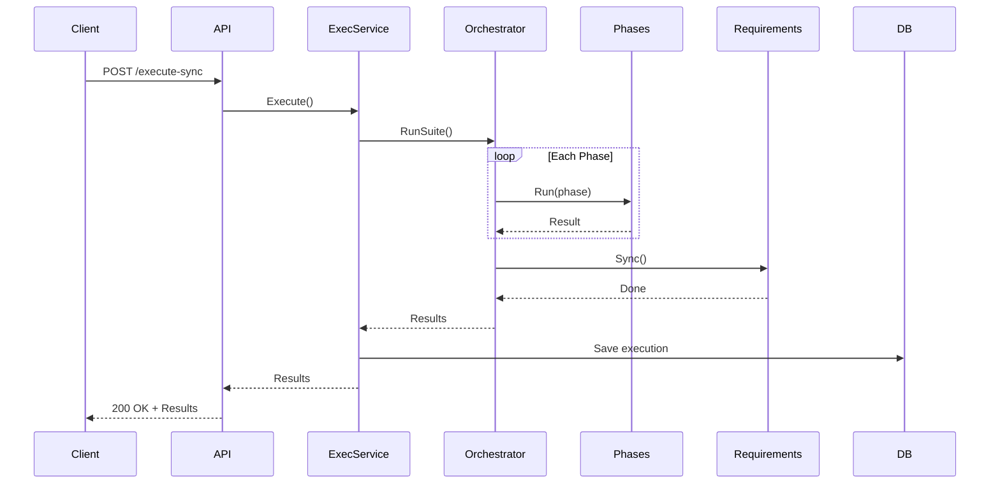

# Test Genie Architecture

## Overview

Test Genie is a Go-native testing orchestration platform. The architecture follows **screaming architecture** principles where package names reveal domain intent.

## System Architecture



## Package Structure

```
scenarios/test-genie/api/
├── cmd/
│   └── api/                    # Entry point
│       └── main.go
├── internal/
│   ├── app/                    # Application bootstrap
│   │   ├── config.go           # Configuration loading
│   │   ├── database.go         # Database connection
│   │   ├── dependencies.go     # Dependency injection
│   │   ├── httpserver/         # HTTP transport
│   │   │   ├── routes.go
│   │   │   └── handlers.go
│   │   └── runtime/            # Runtime management
│   │       └── runtime.go
│   ├── suite/                  # Suite domain
│   │   ├── request.go          # Suite request types
│   │   ├── execution.go        # Execution tracking
│   │   └── service.go          # Suite service
│   ├── orchestrator/           # Test orchestration
│   │   ├── orchestrator.go     # Main orchestrator
│   │   ├── phases/             # Phase definitions
│   │   │   ├── registry.go
│   │   │   ├── structure.go
│   │   │   ├── dependencies.go
│   │   │   ├── unit.go
│   │   │   ├── integration.go
│   │   │   ├── business.go
│   │   │   └── performance.go
│   │   ├── workspace/          # Workspace resolution
│   │   │   └── workspace.go
│   │   └── requirements/       # Requirements sync
│   │       └── syncer.go
│   └── scenarios/              # Scenario catalog
│       └── catalog.go
└── migrations/                 # Database migrations
    └── *.sql
```

## Key Components

### HTTP Server (`internal/app/httpserver`)

Handles REST API requests and WebSocket connections.

- **Routes**: Defines API endpoints
- **Handlers**: Request/response handling
- **Middleware**: Logging, error handling

### Suite Service (`internal/suite`)

Manages suite requests and executions.

- **Request handling**: Queue suite generation requests
- **Execution tracking**: Track test execution history
- **Status management**: Update request/execution status

### Orchestrator (`internal/orchestrator`)

Core test execution engine.

- **Phase registry**: Defines available test phases
- **Execution**: Runs phases in sequence
- **Workspace**: Resolves scenario paths and artifacts
- **Requirements sync**: Updates requirement files after tests

### Phase System (`internal/orchestrator/phases`)

Each phase is a Go-native implementation:

| Phase | File | Description |
|-------|------|-------------|
| Structure | `structure.go` | File/config validation |
| Dependencies | `dependencies.go` | Dependency checks |
| Unit | `unit.go` | Unit test execution |
| Integration | `integration.go` | API/UI testing |
| Business | `business.go` | Workflow validation |
| Performance | `performance.go` | Benchmarks |

## Data Flow

### Suite Request Flow



### Execution Flow



## Configuration

### Environment Variables

| Variable | Description | Default |
|----------|-------------|---------|
| `PORT` | API server port | `8200` |
| `POSTGRES_HOST` | Database host | `localhost` |
| `POSTGRES_PORT` | Database port | `5432` |
| `POSTGRES_DB` | Database name | `test_genie` |

### Testing Configuration (`.vrooli/testing.json`)

```json
{
  "phases": {
    "unit": { "timeout": 60, "enabled": true },
    "performance": { "enabled": false }
  },
  "requirements": {
    "sync": true
  },
  "presets": {
    "default": "comprehensive"
  }
}
```

## Design Principles

### 1. Screaming Architecture

Package names reveal intent:
- `suite/` - Suite management domain
- `orchestrator/` - Test orchestration
- `phases/` - Phase implementations

### 2. Dependency Injection

All major components receive dependencies through constructors:

```go
func NewSuiteService(db *sql.DB, orchestrator Orchestrator) *SuiteService {
    return &SuiteService{db: db, orchestrator: orchestrator}
}
```

### 3. Interface Seams

Components communicate through interfaces for testability:

```go
type Orchestrator interface {
    RunSuite(ctx context.Context, scenario string, opts Options) (*Result, error)
}
```

## See Also

- [Phases Overview](../phases/README.md) - Phase definitions
- [API Endpoints](../reference/api-endpoints.md) - REST API reference
- [SEAMS](../SEAMS.md) - Architectural boundaries and extension points
