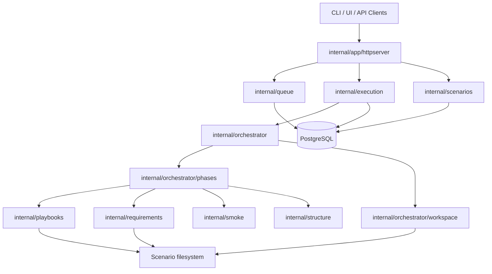

# Test Genie Architecture

Test Genie is a Go-native test orchestration scenario. The codebase follows screaming architecture at the package boundary: queueing, execution, playbooks, scenarios, requirements, and transport all live in packages named after the domain capability they own.

## Runtime Shape


```mermaid
flowchart TB
    cli["CLI / UI / API Clients"] --> http["internal/app/httpserver"]
    http --> queue["internal/queue"]
    http --> execution["internal/execution"]
    http --> scenarios["internal/scenarios"]

    execution --> orchestrator["internal/orchestrator"]
    orchestrator --> phases["internal/orchestrator/phases"]
    orchestrator --> workspace["internal/orchestrator/workspace"]
    phases --> playbooks["internal/playbooks"]
    phases --> requirements["internal/requirements"]
    phases --> smoke["internal/smoke"]
    phases --> structure["internal/structure"]

    queue --> postgres[(PostgreSQL)]
    execution --> postgres
    scenarios --> postgres
    playbooks --> fs["Scenario filesystem"]
    workspace --> fs
    requirements --> fs
```

## Package Responsibilities

| Package | Responsibility | Notes |
|--------|----------------|-------|
| `internal/app/runtime` | Lifecycle-provided config and bootstrap | Reads ports, DB URLs, scenario roots |
| `internal/app/httpserver` | HTTP transport and payload shaping | No domain policy beyond request/response mapping |
| `internal/queue` | Suite request lifecycle and queue telemetry | Owns stale-queue policy |
| `internal/execution` | Execution records plus queue/execution coordination | Keeps queue state and persisted execution history consistent |
| `internal/orchestrator` | Phase planning, execution, artifacts, presets | Central coordinator for phased runs |
| `internal/orchestrator/phases` | Phase-specific orchestration adapters | Structure, lint, playbooks, business, performance, etc. |
| `internal/playbooks` | BAS registry loading, execution, seeding, isolation | Owns BAS-specific contracts and artifacting |
| `internal/scenarios` | Scenario summaries and local test-run adapters | Bridges scenario metadata into API/CLI surfaces |
| `internal/requirements` | Requirement parsing, reporting, sync, evidence | Independent of any single phase |
| `cli/*` | User-facing commands by domain capability | Shared internals stay under `cli/internal/*` |

## Current High-Value Boundaries

### Queue vs transport

The queue package decides what counts as active work. Transport surfaces only render the snapshot. This matters because stale queued rows are a persistence concern, not a CLI formatting concern.

### Execution vs orchestration

`internal/execution` owns persistence and queue transitions. `internal/orchestrator` owns running phases. Keeping those responsibilities separate makes it possible to stream, persist, or replay orchestration outcomes without coupling them to HTTP handlers.

### Playbooks registry vs playbooks phase

The registry builder and loader normalize BAS metadata into a stable manifest. The playbooks phase consumes that manifest and should not guess from raw workflow JSON at execution time. Recent observer-mode fixes rely on that boundary.

### CLI clients vs response parsing

CLI command packages own command UX. Shared response-decoding behavior lives in `cli/internal/apijson`, so transport failures like empty bodies are diagnosed consistently across commands.

### Scenario summaries vs raw queue rows

Scenario catalog summaries intentionally project queue and execution history into operator-facing telemetry. They should reuse the same queue staleness policy as queue health so one scenario does not look "pending" in one view and idle in another.

## CLI Shape

The CLI mirrors the domain packages:

```text
cli/
├── execute/
├── generate/
├── playbooksseed/
├── runlocal/
├── status/
└── internal/
    ├── apijson/   # shared API response parsing
    ├── execute/
    ├── phases/
    ├── registry/
    └── repo/
```

`cli/internal/registry` is intentionally a thin wrapper over the shared API registry builder so the CLI and API do not drift on manifest shape.

## Configuration Surfaces

The most important operator-facing levers are:

| Lever | Scope | Purpose |
|------|-------|---------|
| `TEST_GENIE_EXECUTION_TIMEOUT` | CLI | Extend blocking execution timeout for long suites |
| `TEST_GENIE_PLAYBOOKS_RETAIN` | Playbooks phase | Keep temporary Postgres/Redis isolation alive for debugging |
| `TEST_GENIE_QUEUE_STALE_AFTER` | Queue/scenario summaries | Define when queued or delegated requests become stale telemetry |
| `TEST_GENIE_SKIP_PLAYBOOKS` | Playbooks phase | Hard-disable the phase for debugging or constrained environments |

See [Tunable Levers](../configuration/tunable-levers.md) for the full reference.
