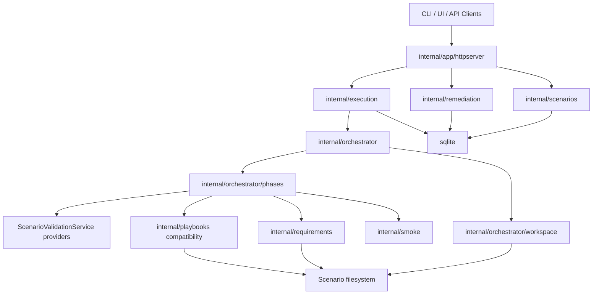

# Test Genie Architecture

Test Genie is a Go-native test orchestration scenario. The codebase follows screaming architecture at the package boundary: execution, findings-first remediation, provider-backed phases, workflow seed compatibility, scenarios, requirements, and transport all live in packages named after the domain capability they own.

## Runtime Shape


```mermaid
flowchart TB
    cli["CLI / UI / API Clients"] --> http["internal/app/httpserver"]
    http --> execution["internal/execution"]
    http --> remediation["internal/remediation"]
    http --> scenarios["internal/scenarios"]

    execution --> orchestrator["internal/orchestrator"]
    orchestrator --> phases["internal/orchestrator/phases"]
    orchestrator --> workspace["internal/orchestrator/workspace"]
    phases --> providers["ScenarioValidationService providers"]
    phases --> playbooks["internal/playbooks compatibility"]
    phases --> requirements["internal/requirements"]
    phases --> smoke["internal/smoke"]

    execution --> sqlite
    remediation --> sqlite
    scenarios --> sqlite
    playbooks --> fs["Scenario filesystem"]
    workspace --> fs
    requirements --> fs
```

## Package Responsibilities

| Package | Responsibility | Notes |
|--------|----------------|-------|
| `internal/app/runtime` | Lifecycle-provided config and bootstrap | Reads ports, SQLite paths, scenario roots |
| `internal/app/httpserver` | HTTP transport and payload shaping | No domain policy beyond request/response mapping |
| `internal/remediation` | Immutable source evidence, durable job lifecycle, stable-ID verification delta | Agent Manager policy remains external |
| `internal/execution` | Execution records and persisted execution history | Server-owned runs are the verification authority |
| `internal/orchestrator` | Phase planning, execution, artifacts, presets | Central coordinator for phased runs |
| `internal/orchestrator/phases` | Phase-specific orchestration adapters | Structure, quality, workflow, business, performance, etc. |
| `internal/playbooks` | Legacy BAS registry, seed, and artifact compatibility | Workflow validation/execution is delegated to workflow-health |
| `internal/orchestrator/phases/dbdetect` | Evidence-based DB detection (postgres/redis/sqlite) for workflow seed isolation | Declarative profile table + collectors + resolver; no silent fallback, no `service.json` schema changes |
| `internal/scenarios` | Scenario summaries and local test-run adapters | Bridges scenario metadata into API/CLI surfaces |
| `internal/requirements` | Requirement parsing, reporting, sync, evidence | Independent of any single phase |
| `internal/app/httpserver` requirements handlers | Requirement view projection | Loads cached requirement snapshots, enriches them from source modules, and attaches sync metadata |
| `cli/*` | User-facing commands by domain capability | Shared internals stay under `cli/internal/*` |

## Current High-Value Boundaries

### Remediation vs Agent Manager

Test Genie owns the evidence envelope, lifecycle, and verification result.
Agent Manager owns role resolution, sandboxing, and runtime policy. The
remediation adapter passes only task identity, selected evidence, and a portable
role reference.

### Execution vs orchestration

`internal/execution` owns persistence. `internal/orchestrator` owns running phases. Keeping those responsibilities separate makes it possible to stream, persist, or replay orchestration outcomes without coupling them to HTTP handlers.

### Execution bootstrap vs phase execution

`SuiteOrchestrator.Execute*` now shares one bootstrap/finalization path before branching into streaming vs non-streaming execution. Runtime URL detection, testing-config loading, plan creation, artifact directories, and completion bookkeeping happen once so the two execution surfaces cannot drift on setup or result-shaping policy.

Preparation evidence keeps the phase loop honest: `phase_execution` is the
wall time from the first scheduling decision through the last admitted phase,
while `phase_scheduling` records admission overhead, batch count, and the
largest admitted batch. Provider readiness remains a separate preflight stage.
Fleet parallelism calculations should use the sum of phase durations divided by
`phase_execution`, not total run wall time; the latter also includes readiness,
target startup, and other work the phase scheduler cannot overlap.

### Workflow assets vs delegated workflow phase

`workflow-health` owns BAS catalog scanning, maturity, safe execution, and findings. Test Genie keeps legacy registry and seed helpers for compatibility, but the catalog phase is `workflow` and it consumes provider output through `ScenarioValidationService` rather than running BAS workflows natively.

### CLI clients vs response parsing

CLI command packages own command UX. Shared response-decoding behavior lives in `cli/internal/apijson`, so transport failures like empty bodies are diagnosed consistently across commands.

### Scenario summaries vs immutable evidence

Scenario catalog summaries identify the latest completed execution. Remediation
always reloads that execution's persisted descriptor snapshot and findings
artifact; it never infers work from dashboard counters.

### Requirements snapshots vs requirement sources

The requirements HTTP surface treats cached `coverage/requirements-sync/latest.json` files as summary data, not as the only source of truth. Module requirements are reloaded from `requirements/` so the UI receives current per-requirement detail while keeping cached summary counts and sync metadata.

### Live provider catalog vs historical run truth

Provider descriptors are live planning input only. Once a phase plan is built,
the orchestrator atomically writes a schema-versioned descriptor snapshot under
the run artifact root before execution starts. The compact run index stores only
its schema version and digest; terminal `WaitRun`, `GetRun`, restart hydration,
and `CompareRuns` load the heavy snapshot by run ID. This keeps labels, provider
ownership, ordering, policy, declared evidence kinds, and target applicability
stable even when the installed provider catalog later changes. Missing, corrupt,
or future-version snapshots remain explicit degraded/not-comparable evidence.

### Run bytes vs public artifact references

The artifact catalog inventories files already owned by a run; it is not a blob
store. Private catalog entries may locate bytes under the run root or its
run-scoped log root, while RunsService projections expose only an opaque ID,
kind, media metadata, producer metadata, relationships, and an authorized
access path. Opaque IDs are salted by run ID and the byte route resolves only a
verified entry from that run's digest-checked catalog. Legacy runs are scanned
read-only and labeled degraded. Evidence kinds remain open and descriptor-owned,
so consumers filter by kind rather than phase identity.

## CLI Shape

The CLI mirrors the domain packages:

```text
cli/
├── execute/
├── generate/
├── playbooksseed/
├── runlocal/
├── status/
└── internal/
    ├── apijson/   # shared API response parsing
    ├── execute/
    ├── phases/
    ├── registry/
    └── repo/
```

`cli/internal/registry` is intentionally a thin wrapper over the shared API registry builder so the CLI and API do not drift on manifest shape.

## Configuration Surfaces

The most important operator-facing levers are:

| Lever | Scope | Purpose |
|------|-------|---------|
| `TEST_GENIE_EXECUTION_TIMEOUT` | CLI | Extend blocking execution timeout for long suites |
| `TEST_GENIE_PLAYBOOKS_RETAIN` | Playbooks phase | Keep temporary isolated Postgres/Redis/SQLite resources alive for debugging |
| `TEST_GENIE_SKIP_PLAYBOOKS` | Playbooks phase | Hard-disable the phase for debugging or constrained environments |

See [Tunable Levers](../configuration/tunable-levers.md) for the full reference.
