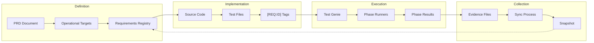

# Requirement Flow Architecture

**Status**: Active
**Last Updated**: 2025-12-02

---

## Overview

This document describes the end-to-end flow from PRD requirements to automated validation evidence. It shows how Test Genie bridges the gap between product specifications and technical proof of implementation.



---

## Stage 1: Definition

### PRD to Operational Targets

The Product Requirements Document (PRD) defines:
- **Capabilities**: High-level features the scenario must deliver
- **Operational Targets (OT)**: Measurable milestones with priority

```markdown
## Operational Targets

### OT-P0-001: Visual Workflow Builder
Users can create, edit, and save browser automation workflows visually.
**Success Criteria**: Workflows persist and reload correctly.

### OT-P0-002: Workflow Execution
Users can run saved workflows against target websites.
**Success Criteria**: Execution completes with telemetry logged.
```

### Operational Targets to Requirements

Each operational target maps to one or more technical requirements:

```json
{
  "id": "BAS-WORKFLOW-PERSIST-CRUD",
  "title": "Workflows persist nodes, edges, and metadata",
  "prd_ref": "OT-P0-001",
  "status": "in_progress",
  "validation": []
}
```

**Key points:**
- `prd_ref` links back to the PRD operational target
- Criticality (P0/P1/P2) derived from the OT reference
- Multiple requirements can share the same `prd_ref`

---

## Stage 2: Implementation

### Requirements Drive Code

Developers implement features based on requirement specifications:

```go
// api/workflow_service.go
// Implements BAS-WORKFLOW-PERSIST-CRUD

func (s *WorkflowService) Create(ctx context.Context, req *CreateWorkflowRequest) (*Workflow, error) {
    // Validate nodes and edges
    if err := s.compiler.Validate(req.Nodes, req.Edges); err != nil {
        return nil, fmt.Errorf("validation failed: %w", err)
    }

    // Persist to database
    workflow, err := s.repo.Insert(ctx, req)
    if err != nil {
        return nil, fmt.Errorf("insert failed: %w", err)
    }

    return workflow, nil
}
```

### Tests Tag Requirements

Tests use `[REQ:ID]` tags to link to requirements:

```go
// api/workflow_service_test.go

func TestWorkflowService_Create(t *testing.T) {
    t.Run("creates workflow with valid nodes [REQ:BAS-WORKFLOW-PERSIST-CRUD]", func(t *testing.T) {
        service := NewWorkflowService(testDB)

        workflow, err := service.Create(ctx, &CreateWorkflowRequest{
            Name: "Test Workflow",
            Nodes: []Node{{ID: "start", Type: "navigate"}},
            Edges: []Edge{{From: "start", To: "end"}},
        })

        require.NoError(t, err)
        assert.NotEmpty(t, workflow.ID)
    })
}
```

**Tag placement:**
- Go: In `t.Run()` description or test function comment
- Vitest: In `it()` or `test()` description
- BATS: In `@test` description

---

## Stage 3: Execution

### Test Genie Orchestration

Test Genie executes tests via the orchestrator:

```bash
# Execute comprehensive tests
test-genie execute browser-automation-studio --preset comprehensive
```

### Phase Runners

Each phase runner executes tests and collects evidence:

```
Phase: unit
├── Go tests: api/**/*_test.go
│   ├── Extract [REQ:ID] tags from output
│   └── Collect coverage data
├── Vitest tests: ui/src/**/*.test.tsx
│   ├── Parse vitest-requirements.json
│   └── Collect coverage data
└── Output: coverage/phase-results/unit.json
```

### Phase Result Format

```json
{
  "phase": "unit",
  "status": "passed",
  "duration_ms": 12500,
  "requirements": [
    {
      "id": "BAS-WORKFLOW-PERSIST-CRUD",
      "status": "passed",
      "evidence": "TestWorkflowService_Create passed (12 assertions)",
      "test_file": "api/workflow_service_test.go",
      "test_name": "TestWorkflowService_Create/creates_workflow_with_valid_nodes"
    }
  ],
  "coverage": {
    "go": { "percentage": 78.5, "packages": 12 },
    "vitest": { "percentage": 82.3, "files": 45 }
  }
}
```

---

## Stage 4: Collection

### Evidence Aggregation

After all phases complete, evidence is aggregated:

```
coverage/
├── phase-results/
│   ├── structure.json
│   ├── dependencies.json
│   ├── unit.json
│   ├── integration.json
│   ├── business.json
│   └── performance.json
├── vitest-requirements.json
└── go-coverage.out
```

### Sync Process

The sync process updates requirement files:

```bash
# Automatic after test execution
# Or manual trigger:
test-genie sync browser-automation-studio
```

**Sync logic:**
1. Load all phase results
2. Match `[REQ:ID]` tags to requirements
3. Update validation entries with evidence
4. Update requirement status based on test results

### Status Derivation

```
Requirement Status = f(validation results)

If ALL validations pass → status = "complete"
If ANY validation fails → status = "in_progress"
If NO validations exist → status = "pending" (unchanged)
```

---

## Stage 5: Reporting

### Snapshot Generation

The sync process generates a snapshot for reporting:

```json
{
  "generated_at": "2025-12-02T14:30:00Z",
  "scenario": "browser-automation-studio",
  "summary": {
    "total": 63,
    "complete": 45,
    "in_progress": 12,
    "pending": 6,
    "pass_rate": 0.714
  },
  "requirements": {
    "BAS-WORKFLOW-PERSIST-CRUD": {
      "id": "BAS-WORKFLOW-PERSIST-CRUD",
      "status": "complete",
      "prd_ref": "OT-P0-001",
      "validation": [
        {
          "type": "test",
          "ref": "api/workflow_service_test.go",
          "status": "implemented",
          "last_test_run": "2025-12-02T14:30:00Z",
          "test_names": ["TestWorkflowService_Create/creates_workflow_with_valid_nodes"]
        }
      ]
    }
  }
}
```

### Dashboard Visualization

The Test Genie dashboard displays:
- Overall pass rate by scenario
- Requirements grouped by operational target
- Phase-by-phase results
- Coverage trends over time

---

## Complete Flow Example

### Step-by-Step Walkthrough

**1. PRD defines capability:**
```markdown
### OT-P0-001: Visual Workflow Builder
Users can create, edit, and save browser automation workflows.
```

**2. Requirement created:**
```json
{
  "id": "BAS-WORKFLOW-PERSIST-CRUD",
  "title": "Workflows persist nodes, edges, and metadata",
  "prd_ref": "OT-P0-001",
  "status": "pending"
}
```

**3. Developer implements feature and writes test:**
```go
func TestWorkflowService_Create(t *testing.T) {
    t.Run("creates workflow [REQ:BAS-WORKFLOW-PERSIST-CRUD]", func(t *testing.T) {
        // Test implementation
    })
}
```

**4. Test Genie executes:**
```bash
test-genie execute browser-automation-studio --preset comprehensive
```

**5. Phase runner captures evidence:**
```
[PASS] TestWorkflowService_Create/creates_workflow (0.05s)
  → Extracted: [REQ:BAS-WORKFLOW-PERSIST-CRUD]
```

**6. Sync updates requirement:**
```json
{
  "id": "BAS-WORKFLOW-PERSIST-CRUD",
  "status": "complete",
  "validation": [
    {
      "type": "test",
      "ref": "api/workflow_service_test.go",
      "status": "implemented",
      "notes": "Auto-synced from unit phase"
    }
  ]
}
```

**7. Dashboard shows progress:**
```
OT-P0-001: Visual Workflow Builder
├── BAS-WORKFLOW-PERSIST-CRUD ✅ (1/1 validations)
├── BAS-WORKFLOW-DEMO-SEED    ⏳ (0/1 validations)
└── Progress: 50% (1/2 requirements)
```

---

## Key Design Principles

### 1. Traceability

Every test result traces back to:
- The specific test file and function
- The requirement it validates
- The operational target it supports
- The PRD capability it proves

### 2. Automation

The flow is fully automated:
- `[REQ:ID]` extraction from test output
- Validation entry creation
- Status derivation
- Snapshot generation

### 3. Separation of Concerns

- **Requirement files**: Semantic state (human-authored)
- **Sync metadata**: Ephemeral test data (auto-generated)
- **Phase results**: Evidence (auto-generated)

### 4. Incremental Progress

Requirements can accumulate validations over time:
- Add API test → validation entry added
- Add UI test → second validation entry added
- Add E2E test → third validation entry added

---

## See Also

- [Phased Testing Guide](../guides/phased-testing.md) - How phases execute
- [Requirements Sync Guide](../phases/business/requirements-sync.md) - How sync works
- [Requirement Schema Reference](../reference/requirement-schema.md) - JSON schema
- [Architecture](architecture.md) - Go orchestrator design
