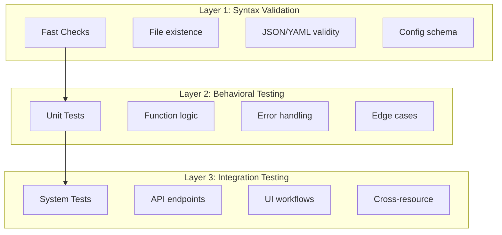
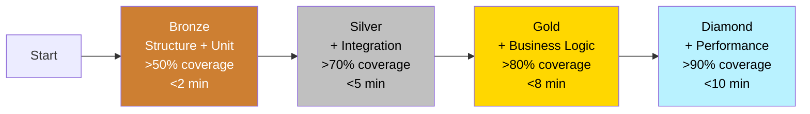

# Testing Strategy

**Status**: Active
**Last Updated**: 2025-12-02

---

## Overview

This document describes the three-layer validation strategy for testing Vrooli scenarios and resources. The strategy ensures comprehensive coverage while maintaining fast feedback cycles.

---

## Three-Layer Validation System



---

## Layer 1: Syntax Validation

**Purpose**: Catch configuration and structural errors immediately.

**Timing**: < 1 second

**Coverage**: 100% of config files

### What It Validates

| Check | Description | Example |
|-------|-------------|---------|
| File existence | Required files present | `service.json`, `package.json` |
| Schema compliance | Config matches schema | Valid `service.json` fields |
| Required fields | Mandatory fields present | `name`, `version` in service.json |

### Implementation

```bash
# Structure phase runs syntax validation
test-genie execute my-scenario --phases structure
```

**Phase output:**
```json
{
  "phase": "structure",
  "checks": [
    {"name": "service.json exists", "status": "passed"},
    {"name": "service.json valid JSON", "status": "passed"},
    {"name": "service.json matches schema", "status": "passed"}
  ]
}
```

### Benefits

- **Instant feedback**: Errors caught in seconds
- **No runtime needed**: No scenario startup required
- **Clear errors**: Specific validation messages

---

## Layer 2: Behavioral Testing

**Purpose**: Validate business logic and component behavior.

**Timing**: < 30 seconds (unit phase)

**Coverage**: Core functionality (target: 80%+)

### What It Validates

| Check | Description | Example |
|-------|-------------|---------|
| Function logic | Correct computation | Workflow compiler orders nodes |
| Error handling | Graceful failures | Invalid input returns error |
| Edge cases | Boundary conditions | Empty input, max values |
| Type safety | Proper types | Go tests catch type errors |

### Implementation Patterns

**Go unit tests:**
```go
func TestWorkflowCompiler_Order(t *testing.T) {
    t.Run("orders nodes topologically [REQ:BAS-COMPILER-ORDER]", func(t *testing.T) {
        compiler := NewCompiler()

        nodes := []Node{
            {ID: "c", DependsOn: []string{"b"}},
            {ID: "a", DependsOn: []string{}},
            {ID: "b", DependsOn: []string{"a"}},
        }

        ordered, err := compiler.Order(nodes)

        require.NoError(t, err)
        assert.Equal(t, []string{"a", "b", "c"}, extractIDs(ordered))
    })

    t.Run("detects cycles [REQ:BAS-COMPILER-CYCLE]", func(t *testing.T) {
        compiler := NewCompiler()

        nodes := []Node{
            {ID: "a", DependsOn: []string{"b"}},
            {ID: "b", DependsOn: []string{"a"}},
        }

        _, err := compiler.Order(nodes)

        require.Error(t, err)
        assert.Contains(t, err.Error(), "cycle detected")
    })
}
```

**Vitest unit tests:**
```typescript
describe('WorkflowStore [REQ:BAS-WORKFLOW-STATE]', () => {
  it('initializes with empty workflow', () => {
    const store = useWorkflowStore();

    expect(store.nodes).toEqual([]);
    expect(store.edges).toEqual([]);
  });

  it('adds node correctly', () => {
    const store = useWorkflowStore();

    store.addNode({ id: 'node-1', type: 'navigate' });

    expect(store.nodes).toHaveLength(1);
    expect(store.nodes[0].id).toBe('node-1');
  });
});
```

### Benefits

- **Fast execution**: Mocked dependencies
- **Isolated testing**: Each function tested independently
- **High signal**: Specific failure locations

---

## Layer 3: Integration Testing

**Purpose**: Validate end-to-end system behavior.

**Timing**: < 5 minutes

**Coverage**: Cross-resource scenarios

### What It Validates

| Check | Description | Example |
|-------|-------------|---------|
| API endpoints | HTTP responses correct | POST /projects returns 201 |
| Database integration | Data persists correctly | Project saved to Postgres |
| UI workflows | User flows complete | Create project via form |
| Cross-scenario | Inter-scenario communication | BAS executes Browserless |

### Implementation Patterns

**API integration tests:**
```go
func TestProjectsAPI_Integration(t *testing.T) {
    // Requires running scenario
    if testing.Short() {
        t.Skip("Skipping integration test in short mode")
    }

    t.Run("creates and retrieves project [REQ:BAS-PROJECT-CRUD]", func(t *testing.T) {
        client := NewTestClient(apiURL)

        // Create project
        project, err := client.CreateProject(&CreateProjectRequest{
            Name: "Integration Test Project",
        })
        require.NoError(t, err)
        assert.NotEmpty(t, project.ID)

        // Retrieve project
        retrieved, err := client.GetProject(project.ID)
        require.NoError(t, err)
        assert.Equal(t, project.Name, retrieved.Name)

        // Cleanup
        err = client.DeleteProject(project.ID)
        require.NoError(t, err)
    })
}
```

**BAS workflow tests:**
```json
{
  "name": "create-project-e2e",
  "requirements": ["BAS-PROJECT-CREATE-E2E"],
  "steps": [
    {
      "action": "navigate",
      "url": "http://localhost:3000"
    },
    {
      "action": "click",
      "selector": "[data-testid='create-project-btn']"
    },
    {
      "action": "type",
      "selector": "[data-testid='project-name-input']",
      "text": "E2E Test Project"
    },
    {
      "action": "click",
      "selector": "[data-testid='submit-btn']"
    },
    {
      "action": "waitFor",
      "selector": "[data-testid='project-card']",
      "timeout": 5000
    },
    {
      "action": "assertText",
      "selector": "[data-testid='project-card'] h3",
      "text": "E2E Test Project"
    }
  ]
}
```

### Benefits

- **Real environment**: Tests actual system behavior
- **End-to-end coverage**: Validates complete flows
- **Confidence**: Catches integration issues

---

## Layer Interaction

### Progressive Validation

Tests progress through layers with increasing scope:

```
Layer 1 (Syntax)     ─── Fast gate ───▶ Catch config errors early
        │
        ▼
Layer 2 (Behavioral) ─── Logic gate ──▶ Ensure functions work
        │
        ▼
Layer 3 (Integration) ─── System gate ─▶ Validate full system
```

### Phase Mapping

| Layer | Test Genie Phase | Typical Time |
|-------|------------------|--------------|
| Layer 1 | Structure | < 15s |
| Layer 2 | Unit | < 60s |
| Layer 3 | Integration, Business | < 180s |

### Preset Selection

Choose preset based on feedback speed needed:

| Preset | Layers | Use Case |
|--------|--------|----------|
| Quick | 1, 2 | During development |
| Smoke | 1, 2, partial 3 | Pre-commit |
| Comprehensive | 1, 2, 3 | CI/CD pipeline |

---

## Coverage Requirements

### By Criticality

| Requirement Criticality | Minimum Layers | Example |
|------------------------|----------------|---------|
| P0 (Critical) | 2 automated | API + E2E |
| P1 (Important) | 2 automated | API + UI |
| P2 (Nice-to-have) | 1 automated | API only |

### By Component

| Component | Layer 1 | Layer 2 | Layer 3 |
|-----------|---------|---------|---------|
| API | Config validation | Go unit tests | Integration tests |
| UI | Package.json valid | Vitest tests | BAS workflows |
| CLI | service.json valid | BATS tests | Integration tests |

---

## Implementing the Strategy

### Step 1: Structure Phase

Ensure all required files exist and are valid:

```bash
# Run structure validation
test-genie execute my-scenario --phases structure
```

### Step 2: Unit Tests

Add unit tests for all business logic:

```bash
# Run unit tests
test-genie execute my-scenario --phases unit
```

**Target coverage:**
- Go: 80%+ via `go test -cover`
- Vitest: 80%+ via `c8` coverage

### Step 3: Integration Tests

Add integration tests for critical paths:

```bash
# Run integration tests (requires running scenario)
test-genie execute my-scenario --phases integration
```

### Step 4: Business Validation

Add BAS workflows for user journeys:

```bash
# Run business tests
test-genie execute my-scenario --phases business
```

---

## Anti-Patterns to Avoid

### Only Integration Tests

**Problem**: Slow feedback, hard to debug failures.

```
❌ All tests hit real database
❌ 5+ minutes to run
❌ Flaky due to external dependencies
```

**Solution**: Add unit tests for logic, reserve integration for flows.

### Only Unit Tests

**Problem**: Miss integration issues.

```
❌ Functions work in isolation
❌ System fails when combined
❌ No confidence in deployment
```

**Solution**: Add integration tests for critical paths.

### Skipping Syntax Validation

**Problem**: Runtime errors from bad config.

```
❌ Scenario fails to start
❌ Cryptic error messages
❌ Time wasted debugging config
```

**Solution**: Always validate config in structure phase.

---

## Testing Maturity Levels

Scenarios progress through maturity levels as testing coverage increases:



| Level | Coverage | Features | Time | Description |
|-------|----------|----------|------|-------------|
| **Bronze** | >50% | Structure + Unit tests | <2 min | Basic validation, core functions tested |
| **Silver** | >70% | + Integration tests | <5 min | API endpoints validated, resource integration |
| **Gold** | >80% | + Business logic tests | <8 min | User workflows tested, requirement coverage |
| **Diamond** | >90% | + Performance tests | <10 min | Full coverage, benchmarks, load testing |

### Maturity Progression

1. **Bronze** (Minimum viable testing)
   - All structure validation passes
   - Core business functions have unit tests
   - Basic coverage thresholds met

2. **Silver** (Production-ready)
   - Integration tests for API endpoints
   - Resource connectivity validated
   - Error paths tested

3. **Gold** (Customer-facing)
   - Business workflows tested end-to-end
   - UI automation for critical paths
   - Requirement traceability complete

4. **Diamond** (Enterprise-grade)
   - Performance benchmarks established
   - Load testing for scale validation
   - Comprehensive edge case coverage

---

## See Also

- [Phased Testing Guide](../guides/phased-testing.md) - How phases execute
- [Scenario Unit Testing](../phases/unit/scenario-unit-testing.md) - Layer 2 implementation
- [UI Automation with BAS](../phases/playbooks/ui-automation-with-bas.md) - Layer 3 implementation
- [Validation Best Practices](../guides/validation-best-practices.md) - Multi-layer requirements
- [Presets Reference](../reference/presets.md) - Quick/Smoke/Comprehensive definitions
