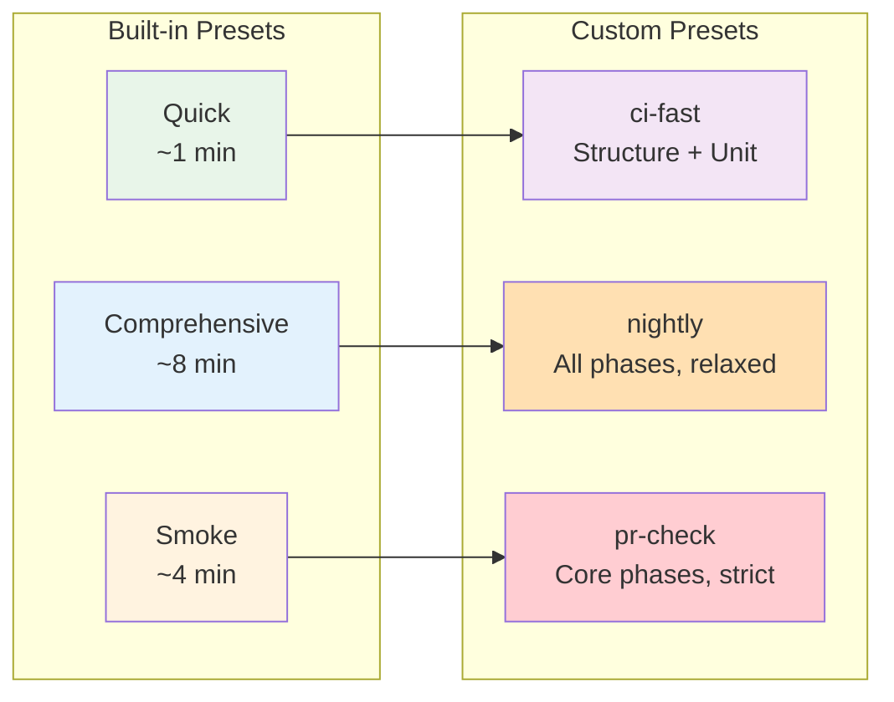

# Custom Presets Guide

This guide explains how to create and use custom test presets in Test Genie for tailored testing workflows.

## Overview

Test Genie includes three built-in presets (Quick, Smoke, Comprehensive), but you can define custom presets for specific use cases:

- **CI/CD pipelines** with different testing stages
- **Feature development** focusing on specific phases
- **Nightly builds** with extended timeouts
- **Pre-release validation** with strict requirements



## Configuration Location

Custom presets are defined in `.vrooli/testing.json` within each scenario:

```
scenarios/my-scenario/
├── .vrooli/
│   ├── service.json      # Scenario metadata
│   └── testing.json      # Test configuration (includes presets)
├── api/
└── ui/
```

## Basic Preset Structure

```json
{
  "presets": {
    "preset-name": {
      "phases": ["phase1", "phase2"],
      "timeout": 300,
      "failFast": true
    }
  }
}
```

### Required Fields

| Field | Type | Description |
|-------|------|-------------|
| `phases` | `string[]` | Phases to execute in order |

### Optional Fields

| Field | Type | Default | Description |
|-------|------|---------|-------------|
| `timeout` | `number` | 300 | Total timeout in seconds |
| `failFast` | `boolean` | true | Stop on first phase failure |
| `syncRequirements` | `boolean` | false | Sync requirements after execution |
| `description` | `string` | - | Human-readable description |

## Available Phases

Include any combination of these phases:

| Phase ID | Requires Runtime | Typical Duration |
|----------|------------------|------------------|
| `structure` | No | 15s |
| `dependencies` | No | 30s |
| `unit` | No | 60s |
| `integration` | Yes | 120s |
| `e2e` | Yes | 120s |
| `business` | Yes | 180s |
| `performance` | Yes | 60s |

**Note**: Phases execute in the order listed in the array.

## Example Presets

### CI Fast Check

Minimal validation for every commit:

```json
{
  "presets": {
    "ci-fast": {
      "description": "Quick validation for CI commits",
      "phases": ["structure", "unit"],
      "timeout": 120,
      "failFast": true
    }
  }
}
```

Usage:
```bash
test-genie execute my-scenario --preset ci-fast
```

### PR Validation

Balanced checks before merging:

```json
{
  "presets": {
    "pr-check": {
      "description": "Pre-merge validation",
      "phases": ["structure", "dependencies", "unit", "integration"],
      "timeout": 300,
      "failFast": true,
      "syncRequirements": false
    }
  }
}
```

### Nightly Build

Comprehensive testing with extended timeouts:

```json
{
  "presets": {
    "nightly": {
      "description": "Full nightly validation with sync",
      "phases": ["structure", "dependencies", "unit", "integration", "e2e", "business", "performance"],
      "timeout": 3600,
      "failFast": false,
      "syncRequirements": true
    }
  }
}
```

### Unit-Only

Focus on unit tests during development:

```json
{
  "presets": {
    "units": {
      "description": "Unit tests only for TDD workflow",
      "phases": ["unit"],
      "timeout": 120,
      "failFast": true
    }
  }
}
```

### Integration Focus

Test API and integration without full E2E:

```json
{
  "presets": {
    "api-check": {
      "description": "API-focused validation",
      "phases": ["structure", "unit", "integration"],
      "timeout": 240,
      "failFast": true
    }
  }
}
```

### E2E Focus

Browser automation testing only:

```json
{
  "presets": {
    "e2e-only": {
      "description": "Browser automation tests",
      "phases": ["e2e"],
      "timeout": 300,
      "failFast": true
    }
  }
}
```

### Release Candidate

Strict validation before release:

```json
{
  "presets": {
    "release": {
      "description": "Release candidate validation",
      "phases": ["structure", "dependencies", "unit", "integration", "e2e", "business", "performance"],
      "timeout": 1800,
      "failFast": true,
      "syncRequirements": true
    }
  }
}
```

## Complete Configuration Example

A full `.vrooli/testing.json` with multiple presets:

```json
{
  "_metadata": {
    "description": "Test configuration for my-scenario",
    "version": "1.0"
  },
  "phases": {
    "unit": {
      "timeout": 120,
      "coverageWarn": 80,
      "coverageError": 70
    },
    "integration": {
      "timeout": 180
    },
    "performance": {
      "enabled": true,
      "goBuildMaxSeconds": 90,
      "uiBuildMaxSeconds": 180
    }
  },
  "presets": {
    "default": "smoke",
    "ci-fast": {
      "description": "Quick CI check",
      "phases": ["structure", "unit"],
      "timeout": 120,
      "failFast": true
    },
    "pr-check": {
      "description": "PR validation",
      "phases": ["structure", "dependencies", "unit", "integration"],
      "timeout": 300,
      "failFast": true
    },
    "nightly": {
      "description": "Full nightly run",
      "phases": ["structure", "dependencies", "unit", "integration", "e2e", "business", "performance"],
      "timeout": 3600,
      "failFast": false,
      "syncRequirements": true
    }
  },
  "requirements": {
    "sync": true,
    "syncOnSuccess": true
  }
}
```

## Setting a Default Preset

Specify which preset runs when none is provided:

```json
{
  "presets": {
    "default": "smoke"
  }
}
```

Now `test-genie execute my-scenario` uses the smoke preset.

You can also point to a custom preset:

```json
{
  "presets": {
    "default": "ci-fast",
    "ci-fast": {
      "phases": ["structure", "unit"],
      "timeout": 120
    }
  }
}
```

## Using Custom Presets

### CLI

```bash
# Use a custom preset
test-genie execute my-scenario --preset ci-fast

# Override failFast
test-genie execute my-scenario --preset nightly --fail-fast

# Override timeout
test-genie execute my-scenario --preset ci-fast --timeout 180s
```

### REST API

```bash
API_PORT=$(vrooli scenario port test-genie API_PORT)

curl -X POST "http://localhost:${API_PORT}/api/v1/test-suite/my-scenario/execute-sync" \
  -H "Content-Type: application/json" \
  -d '{
    "preset": "ci-fast",
    "failFast": true
  }'
```

### Dashboard

1. Navigate to **Runs** > Select scenario
2. In the **Overview** tab, find the Run Tests form
3. Select your custom preset from the dropdown
4. Click **Execute**

**Note**: Custom presets appear in the dropdown after the configuration is saved.

## CI/CD Integration Patterns

### GitHub Actions - Multi-Stage

```yaml
name: Test Pipeline

on:
  push:
    branches: [main]
  pull_request:
    branches: [main]

jobs:
  quick-check:
    runs-on: ubuntu-latest
    steps:
      - uses: actions/checkout@v4
      - name: Setup
        run: ./scripts/manage.sh setup --yes yes --resources none
      - name: Quick tests
        run: test-genie execute my-scenario --preset ci-fast

  full-validation:
    needs: quick-check
    runs-on: ubuntu-latest
    steps:
      - uses: actions/checkout@v4
      - name: Setup
        run: ./scripts/manage.sh setup --yes yes
      - name: Start scenario
        run: vrooli scenario start my-scenario
      - name: Full tests
        run: test-genie execute my-scenario --preset pr-check
```

### GitLab CI - Parallel Stages

```yaml
stages:
  - quick
  - full
  - nightly

quick-tests:
  stage: quick
  script:
    - test-genie execute my-scenario --preset ci-fast
  rules:
    - if: $CI_PIPELINE_SOURCE == "merge_request_event"

full-tests:
  stage: full
  script:
    - vrooli scenario start my-scenario
    - test-genie execute my-scenario --preset pr-check
  rules:
    - if: $CI_COMMIT_BRANCH == "main"

nightly-tests:
  stage: nightly
  script:
    - vrooli scenario start my-scenario
    - test-genie execute my-scenario --preset nightly
  rules:
    - if: $CI_PIPELINE_SOURCE == "schedule"
```

## Per-Phase Configuration

Override settings for specific phases within presets:

```json
{
  "phases": {
    "unit": {
      "timeout": 180,
      "coverageWarn": 85,
      "coverageError": 75
    },
    "integration": {
      "timeout": 240
    },
    "e2e": {
      "timeout": 300
    },
    "performance": {
      "enabled": true,
      "goBuildMaxSeconds": 120,
      "uiBuildMaxSeconds": 300
    }
  },
  "presets": {
    "ci-fast": {
      "phases": ["structure", "unit"],
      "timeout": 120
    }
  }
}
```

Phase-level settings apply regardless of which preset is used.

## Validation

### Check Configuration Syntax

```bash
# Validate JSON syntax
jq empty .vrooli/testing.json && echo "Valid JSON"

# View parsed configuration
jq . .vrooli/testing.json
```

### List Available Presets

```bash
# View all presets (built-in + custom)
test-genie presets list --scenario my-scenario
```

### Test a Preset

```bash
# Dry run to see what would execute
test-genie execute my-scenario --preset ci-fast --dry-run
```

## Troubleshooting

### Preset Not Found

```
Error: preset "my-preset" not defined
```

**Solution**: Check spelling and ensure preset is in `.vrooli/testing.json`:

```bash
jq '.presets | keys' .vrooli/testing.json
```

### Invalid Phase in Preset

```
Error: unknown phase "unittest" in preset "ci-fast"
```

**Solution**: Use valid phase IDs. Run:

```bash
test-genie phases list
```

### Timeout Exceeded

```
Error: preset timeout exceeded (took 350s, limit 300s)
```

**Solution**: Increase the preset timeout:

```json
{
  "presets": {
    "pr-check": {
      "timeout": 600
    }
  }
}
```

### Phases Skipped Unexpectedly

If runtime phases are skipped:

1. Ensure scenario is running: `vrooli scenario status my-scenario`
2. Start the scenario: `vrooli scenario start my-scenario`
3. Runtime phases require the scenario to be active

## Best Practices

### 1. Name Presets Clearly

Use descriptive, hyphenated names:
- `ci-fast` (good)
- `pr-validation` (good)
- `test1` (avoid)

### 2. Document Purpose

Always include a description:

```json
{
  "presets": {
    "api-regression": {
      "description": "API regression tests for hotfix branches"
    }
  }
}
```

### 3. Match CI Stages

Align preset names with CI terminology:

| Preset | CI Stage |
|--------|----------|
| `ci-fast` | Every commit |
| `pr-check` | Pull request |
| `staging` | Staging deploy |
| `release` | Production release |

### 4. Consider Fail-Fast Strategy

- **Development**: `failFast: true` for quick feedback
- **Nightly/Full**: `failFast: false` to collect all failures

### 5. Use Appropriate Timeouts

| Preset Type | Recommended Timeout |
|-------------|---------------------|
| Quick check | 2-3 minutes |
| PR validation | 5-10 minutes |
| Full suite | 15-30 minutes |
| Nightly | 30-60 minutes |

## See Also

### Related Guides
- [Phased Testing](phased-testing.md) - Understanding phases
- [Sync Execution](sync-execution.md) - API-based execution
- [Performance Testing](performance-testing.md) - Performance phase details

### Reference
- [Presets Reference](../reference/presets.md) - Built-in preset definitions
- [Phases Overview](../phases/README.md) - All phase specifications
- [CLI Commands](../reference/cli-commands.md) - CLI usage

### Concepts
- [Architecture](../concepts/architecture.md) - Go orchestrator design
- [Strategy](../concepts/strategy.md) - Testing strategy
