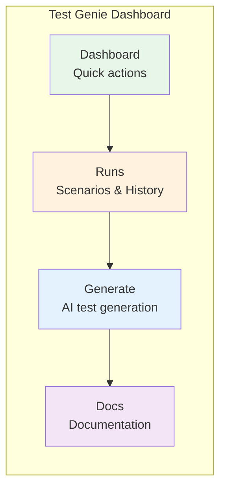
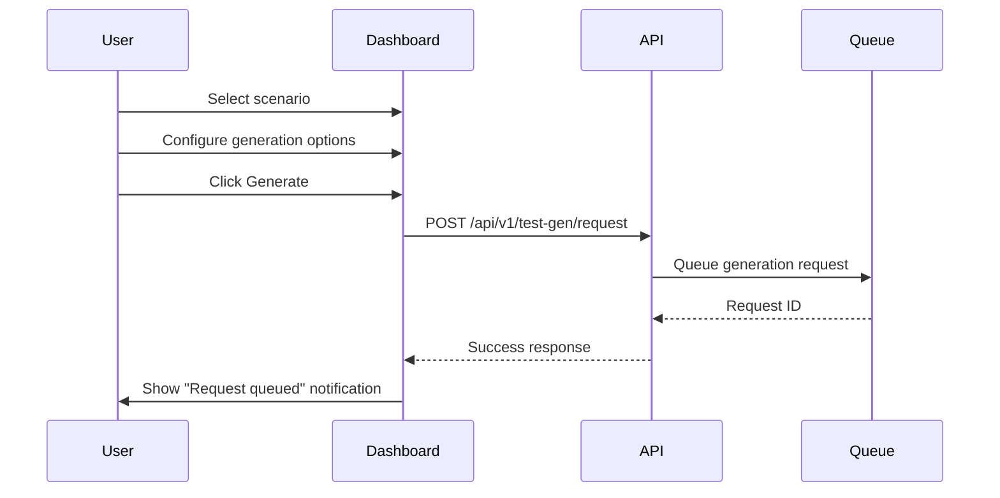

# Dashboard Guide

This guide explains Test Genie's web dashboard, including navigation, viewing test results, managing scenarios, and interpreting metrics.

## Overview

Test Genie provides a React-based dashboard for visual test management. The dashboard offers four main sections:

| Tab | Purpose |
|-----|---------|
| **Dashboard** | Quick actions, health overview, guided workflows |
| **Runs** | Scenario browsing, test execution, history |
| **Generate** | AI-powered test generation |
| **Docs** | Built-in documentation browser |



## Accessing the Dashboard

### Start Test Genie

```bash
# Using Makefile (recommended)
cd scenarios/test-genie && make start

# Or using vrooli CLI
vrooli scenario start test-genie
```

### Open in Browser

```bash
# Get the UI port
UI_PORT=$(vrooli scenario port test-genie UI_PORT)

# Open dashboard
open "http://localhost:${UI_PORT}"
```

By default, the dashboard runs on port **3411**.

## Dashboard Tab

The Dashboard tab provides at-a-glance health status and quick actions.

### Continue Section

Shows contextual action cards based on current state:

| State | Card Shown | Action |
|-------|------------|--------|
| Failed tests exist | "Resume Debugging" | Opens failed scenario |
| Queued requests | "Run Queued Tests" | Opens queue for processing |
| Previous activity | "Continue with [scenario]" | Opens last active scenario |
| New user | "Get Started" | Opens Runs tab |

### Guided Flows

Four-step workflow introduction:

1. **Browse Scenarios** - View all tracked scenarios and their status
2. **Request Tests** - Queue AI-generated tests
3. **Run Tests** - Execute test suites with presets
4. **Read Docs** - Learn testing best practices

Each card shows:
- Step number and title
- Brief description
- Relevant statistic (e.g., "5 tracked", "2 pending")
- Action button

### Stats Section

Three metrics panels:

**Test Queue**:
- Pending requests
- Processing count
- Completed today
- Failed today

**Latest Run**:
- Scenario name
- Pass/fail status
- Phase summary (e.g., "5/6 phases passed")
- Time since completion
- Rerun and History buttons

**Scenarios**:
- Total tracked
- Currently failing
- Pending tests
- Never run (idle)

## Runs Tab

The Runs tab is the primary workspace for test management.

### Subtab Navigation

| Subtab | Content |
|--------|---------|
| **Scenarios** | List of all tracked scenarios |
| **History** | Chronological execution history |

### Scenarios List

Each scenario card shows:

- **Name** - Scenario identifier
- **Description** - From `.vrooli/service.json`
- **Tags** - Categorization labels
- **Status pill** - Current state (passed/failed/queued/idle)
- **Statistics** - Total runs, pending requests, last run time

Click a scenario to open its detail view.

### Scenario Detail View

When you select a scenario, you see:

**Header Section**:
- Scenario name with status pill
- Description and tags
- Quick stats: Total runs | Pending | Last run time

**Tab Navigation**:
| Tab | Content |
|-----|---------|
| **Overview** | Latest execution phases, run new tests |
| **Requirements** | PRD requirement coverage |
| **History** | Previous execution results |

#### Overview Tab

Shows the most recent execution with:
- Preset used and phase summary
- Individual phase result cards showing:
  - Phase name and status
  - Duration
  - Error message (if failed)

**Run Tests Form**:
- Scenario selector (pre-filled)
- Preset dropdown (Quick/Smoke/Comprehensive)
- Fail-fast toggle
- Execute button

#### Requirements Tab

Displays requirement tracking panel:

**Coverage Stats**:
- Overall coverage percentage
- Passed requirements count
- Failed requirements count
- Not run requirements count

**Requirements Tree**:
- Hierarchical view of requirements
- Status indicators per requirement
- Expandable validation details

#### History Tab

Lists previous executions:
- Execution ID
- Preset used
- Pass/fail status
- Phase summary
- Timestamp
- Prefill button (rerun with same settings)

### Execution History (Global)

From the History subtab, view all executions across scenarios:

| Column | Description |
|--------|-------------|
| Scenario | Which scenario was tested |
| Preset | Quick/Smoke/Comprehensive/Custom |
| Status | Pass/Fail indicator |
| Phases | Summary (e.g., "5/6 passed") |
| Duration | Total execution time |
| Completed | Timestamp |

Click any row to navigate to that scenario's detail view.

## Generate Tab

The Generate tab provides AI-powered test generation.

### Components

**Scenario Selector**:
- Dropdown of available scenarios
- Shows scenario description

**Preset Selector**:
- Choose target preset (affects which phases tests target)

**Phase Selector**:
- Multi-select for specific phases
- Options: Structure, Unit, Integration, E2E, Business, Performance

**Prompt Editor**:
- Text area for generation instructions
- Examples: "Generate unit tests for the authentication module"

**Action Buttons**:
- **Generate** - Queue test generation request
- **Clear** - Reset form

### Generation Workflow



After generation completes, view results in the Runs tab.

## Docs Tab

Built-in documentation browser.

### Sidebar Navigation

Organized by category:
- **Concepts** - Architecture, infrastructure, strategy
- **Guides** - How-to documentation
- **Reference** - Technical specifications
- **Safety** - Test safety guidelines

### Markdown Viewer

- Syntax highlighting for code blocks
- Mermaid diagram rendering
- Internal link navigation
- Table of contents (for long docs)

## Interpreting Test Results

### Status Indicators

| Status | Color | Meaning |
|--------|-------|---------|
| **Passed** | Green | All phases completed successfully |
| **Failed** | Red | One or more phases failed |
| **Queued** | Yellow | Pending test request in queue |
| **Idle** | Gray | No test runs recorded |

### Phase Result Cards

Each phase card shows:

**Success**:
```
[✓] Unit                    12s
    All tests passed
```

**Failure**:
```
[✗] Integration            45s
    API health check failed: connection refused
```

**Skipped**:
```
[—] Performance           skipped
    Scenario not running
```

### Coverage Interpretation

**Coverage Percentage**:
- Calculated as: `(passed + failed) / total * 100`
- Represents requirements with test evidence

**Ideal State**:
| Metric | Target |
|--------|--------|
| Coverage | 90%+ |
| Passed | Match coverage |
| Failed | 0 |
| Not Run | <10% |

## Common Workflows

### Running Tests for a Scenario

1. Navigate to **Runs** tab
2. Click on target scenario
3. In Overview tab, select preset
4. Toggle fail-fast if desired
5. Click **Execute**
6. Monitor progress in phase cards

### Investigating a Failure

1. Dashboard shows "Resume Debugging" card
2. Click to open failing scenario
3. Review phase result cards for failed phase
4. Expand error details
5. Fix the issue
6. Rerun with same preset

### Checking Requirement Coverage

1. Navigate to **Runs** > select scenario
2. Switch to **Requirements** tab
3. Review coverage stats
4. Expand requirements tree to see:
   - Which requirements have tests
   - Which tests are passing
   - Which requirements need attention

### Comparing Historical Runs

1. Navigate to **Runs** > select scenario
2. Switch to **History** tab
3. Compare phase results across executions
4. Identify patterns:
   - Consistent failures = systemic issue
   - Intermittent failures = flaky test
   - Recent regression = check recent commits

## Keyboard Shortcuts

| Shortcut | Action |
|----------|--------|
| `1` | Switch to Dashboard tab |
| `2` | Switch to Runs tab |
| `3` | Switch to Generate tab |
| `4` | Switch to Docs tab |
| `Escape` | Navigate back (in scenario detail) |

## URL Structure

Direct link to specific views:

```
/                           # Dashboard
/runs                       # Runs > Scenarios list
/runs?scenario=my-scenario  # Scenario detail
/runs?tab=history           # Runs > History
/generate                   # Generate tab
/docs                       # Docs browser
/docs?file=phased-testing   # Specific doc
```

## Troubleshooting

### Dashboard Not Loading

```bash
# Check if test-genie is running
vrooli scenario status test-genie

# Check UI port
vrooli scenario port test-genie UI_PORT

# View UI logs
vrooli scenario logs test-genie ui
```

### Scenarios Not Appearing

```bash
# Refresh scenario catalog
test-genie scenarios refresh

# Check catalog API
curl http://localhost:3410/api/v1/scenarios
```

### Stale Data

The dashboard polls for updates every 30 seconds. To force refresh:
- Click the browser refresh button
- Or navigate away and back

### API Connection Issues

If the dashboard shows connection errors:

```bash
# Check API health
curl http://localhost:3410/health

# Restart test-genie
cd scenarios/test-genie && make restart
```

## See Also

### Related Guides
- [Phased Testing](phased-testing.md) - Understanding phases
- [Requirements Sync](requirements-sync.md) - How requirements track
- [Sync Execution](sync-execution.md) - API-based execution

### Reference
- [API Endpoints](../reference/api-endpoints.md) - REST API details
- [CLI Commands](../reference/cli-commands.md) - CLI alternative
- [Presets](../reference/presets.md) - Preset definitions

### Concepts
- [Architecture](../concepts/architecture.md) - System design
- [Requirement Flow](../concepts/requirement-flow.md) - PRD tracking
