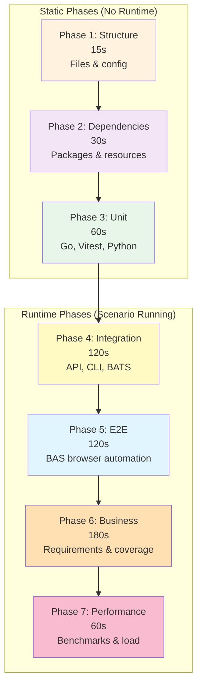

# Phased Testing Architecture

This guide explains Vrooli's comprehensive phased testing architecture and how to use Test Genie for scenario validation.

## Overview

Vrooli uses a **7-phase testing architecture** that progressively validates scenarios from basic structure through performance benchmarks. Test Genie orchestrates these phases through its Go-native API.

## The 7-Phase Architecture



| Phase | Timeout | Purpose | Requires Runtime |
|-------|---------|---------|------------------|
| **Structure** | 15s | Validate files and configuration | No |
| **Dependencies** | 30s | Check tools and resources | No |
| **Unit** | 60s | Run unit tests (Go, Node, Python) | No |
| **Integration** | 120s | Test API endpoints and CLI commands | Yes |
| **E2E** | 120s | Execute BAS browser automation workflows | Yes |
| **Business** | 180s | Validate requirements coverage | Yes |
| **Performance** | 60s | Run benchmarks (optional) | Yes |

See [Phase Catalog](../reference/phase-catalog.md) for detailed phase definitions.

## Running Tests with Test Genie

### Using Test Presets

Test Genie provides preconfigured presets for common testing scenarios:

```bash
# Quick sanity check (~1 min)
test-genie execute my-scenario --preset quick

# Smoke test before pushing (~4 min)
test-genie execute my-scenario --preset smoke

# Full validation before release (~8 min)
test-genie execute my-scenario --preset comprehensive
```

| Preset | Phases | Use Case |
|--------|--------|----------|
| **Quick** | Structure, Unit | Fast feedback during development |
| **Smoke** | Structure, Dependencies, Unit, Integration | Pre-push validation |
| **Comprehensive** | All 7 phases | Full coverage before release |

See [Presets Reference](../reference/presets.md) for detailed preset definitions.

### Using the REST API

For CI/CD and agent automation, use the synchronous execution API:

```bash
# Get API port
API_PORT=$(vrooli scenario port test-genie API_PORT)

# Execute with comprehensive preset
curl -X POST "http://localhost:${API_PORT}/api/v1/test-suite/my-scenario/execute-sync" \
  -H "Content-Type: application/json" \
  -d '{
    "preset": "comprehensive",
    "failFast": true
  }'
```

See [Sync Execution Guide](sync-execution.md) for complete API usage.

### Using the Makefile

From within a scenario directory:

```bash
cd scenarios/my-scenario
make test     # Run all tests via test-genie
make logs     # View test logs
```

## What Each Phase Validates

### Phase 1: Structure Validation

**Purpose**: Ensure scenario has required files and valid configuration.

**Checks**:
- Required files exist (README.md, PRD.md, Makefile)
- `.vrooli/service.json` is valid JSON with required fields
- Test directory structure is correct
- File permissions are appropriate

**Example failures**:
- Missing `.vrooli/service.json`
- Invalid JSON syntax in configuration
- Missing test directory

### Phase 2: Dependencies Check

**Purpose**: Verify all required tools and resources are available.

**Checks**:
- Language runtimes (Go, Node.js, Python) at required versions
- Package managers (pnpm, go mod) functional
- Required CLI tools present
- Resource dependencies declared in service.json

**Example failures**:
- Missing Go runtime
- pnpm not installed
- Declared resource not available

### Phase 3: Unit Tests

**Purpose**: Run unit tests for all languages present in the scenario.

**Runners**:
| Language | Detection | Command |
|----------|-----------|---------|
| Go | `go.mod` in `api/` | `go test ./...` |
| Node.js | `package.json` in `ui/` | `pnpm test` |
| Python | `pytest.ini` or `test_*.py` | `pytest` |

**Coverage requirements**:
- Warning: < 80%
- Error: < 70%

See [Scenario Unit Testing](scenario-unit-testing.md) for writing effective unit tests.

### Phase 4: Integration Tests

**Purpose**: Validate component interactions with running scenario.

**Requires**: Scenario must be running

**Checks**:
- API health endpoints responding
- UI accessible
- CLI commands functional
- Cross-component communication working

**Example tests**:
```bash
# API health check
curl -f http://localhost:${API_PORT}/health

# UI accessibility
curl -f http://localhost:${UI_PORT}

# CLI functionality
my-scenario-cli --version
```

### Phase 5: Business Logic Tests

**Purpose**: Validate end-to-end workflows and business requirements.

**Requires**: Scenario must be running

**Validates**:
- Complete user journeys (multi-step workflows)
- Business rules and domain logic
- Data integrity across operations
- Error recovery workflows

**Example workflow test**:
```bash
# Create → Update → Verify workflow
project_id=$(curl -s -X POST "$API_URL/projects" -d '{"name":"Test"}' | jq -r '.id')
curl -s -X PUT "$API_URL/projects/$project_id" -d '{"name":"Updated"}'
result=$(curl -s "$API_URL/projects/$project_id" | jq -r '.name')
[ "$result" = "Updated" ] && echo "PASS" || echo "FAIL"
```

For UI workflows, use [BAS playbooks](ui-testability.md) instead of curl-based testing.

### Phase 6: Performance Tests

**Purpose**: Establish performance baselines and detect regressions.

**Requires**: Scenario must be running

**Measures**:
- API response times (p50, p95, p99)
- Build duration (Go, UI)
- Resource usage
- Throughput under load

**Example checks**:
```bash
# Build time budget
time go build -o /dev/null ./... # Should complete < 30s

# API response time
time curl -s "$API_URL/health" # Should respond < 100ms
```

## Test Directory Structure

Scenarios should have this test structure:

```
scenario/
├── .vrooli/
│   ├── service.json      # Scenario configuration
│   └── testing.json      # Test-genie configuration (optional)
├── test/
│   ├── run-tests.sh      # Entry point (calls test-genie)
│   └── playbooks/        # BAS workflow tests (optional)
├── api/
│   └── *_test.go         # Go unit tests
└── ui/
    └── *.test.ts         # Vitest/Jest tests
```

### Minimal `test/run-tests.sh`

For scenarios using test-genie orchestration:

```bash
#!/bin/bash
set -euo pipefail

SCENARIO_NAME="$(basename "$(cd "${BASH_SOURCE[0]%/*}/.." && pwd)")"

# Delegate to test-genie
exec test-genie execute "$SCENARIO_NAME" --preset "${1:-comprehensive}" "$@"
```

## Configuration with `.vrooli/testing.json`

Customize test-genie behavior per scenario:

```json
{
  "phases": {
    "unit": {
      "timeout": 120,
      "coverageWarn": 85,
      "coverageError": 75
    },
    "performance": {
      "enabled": false
    }
  },
  "requirements": {
    "sync": true,
    "syncOnSuccess": true
  },
  "presets": {
    "default": "smoke"
  }
}
```

See [Phase Catalog](../reference/phase-catalog.md) for all configuration options.

## Requirements Tracking

Tag tests with `[REQ:ID]` to automatically track requirement coverage:

```go
func TestCreateProject(t *testing.T) {
    t.Run("creates project with valid data [REQ:MY-PROJECT-CREATE]", func(t *testing.T) {
        // Test implementation
    })
}
```

```typescript
describe('projectStore [REQ:MY-PROJECT-CRUD]', () => {
    it('creates project', () => { /* ... */ });
    it('updates project', () => { /* ... */ });
});
```

After running comprehensive tests, requirements are automatically synced:

```bash
test-genie execute my-scenario --preset comprehensive
# Requirements synced to requirements/index.json
```

See [Requirements Sync Guide](requirements-sync.md) for complete documentation.

## Dynamic Port Discovery

Never hardcode ports. Use dynamic discovery:

```bash
# Get ports from vrooli CLI
API_PORT=$(vrooli scenario port "$scenario_name" API_PORT)
UI_PORT=$(vrooli scenario port "$scenario_name" UI_PORT)

# Build URLs
API_URL="http://localhost:$API_PORT"
UI_URL="http://localhost:$UI_PORT"
```

## Coverage Standards

| Component | Minimum | Target |
|-----------|---------|--------|
| Unit Tests | 70% | 80%+ |
| Integration | All endpoints | All endpoints |
| Business Logic | Core workflows | All PRD requirements |
| Performance | Baselines set | No regressions |

## Common Issues & Solutions

| Issue | Solution |
|-------|----------|
| "service.json not found" | Create `.vrooli/service.json` |
| "Invalid JSON" | Validate: `jq empty .vrooli/service.json` |
| "Port discovery fails" | Ensure scenario is running |
| "Phase skipped" | Check if scenario needs to be running |
| "Coverage too low" | Add more unit tests |
| "Timeout exceeded" | Increase in `.vrooli/testing.json` |

## Testing Checklist

Before considering a scenario test-ready:

- [ ] `.vrooli/service.json` properly configured
- [ ] Test directory with `run-tests.sh`
- [ ] Unit tests with coverage > 70%
- [ ] `[REQ:ID]` tags on tests matching PRD requirements
- [ ] Integration tests for all API endpoints
- [ ] Business logic tests for core workflows
- [ ] Performance baselines established
- [ ] Dynamic port discovery (no hardcoded ports)
- [ ] `make test` works from scenario directory

## See Also

### Related Guides
- [Requirements Sync](requirements-sync.md) - Automatic requirement tracking
- [Scenario Unit Testing](scenario-unit-testing.md) - Writing effective unit tests
- [Performance Testing](performance-testing.md) - Build benchmarks and Lighthouse audits
- [Custom Presets](custom-presets.md) - Create tailored presets for CI/CD
- [Dashboard Guide](dashboard-guide.md) - Using the web UI
- [CLI Testing](cli-testing.md) - BATS testing for CLIs
- [UI Testability](ui-testability.md) - Design testable UIs
- [Sync Execution](sync-execution.md) - API usage for CI/CD
- [Troubleshooting](troubleshooting.md) - Debug common issues

### Reference
- [Phase Catalog](../reference/phase-catalog.md) - Detailed phase definitions
- [Presets](../reference/presets.md) - Preset configurations
- [API Endpoints](../reference/api-endpoints.md) - REST API reference
- [Test Runners](../reference/test-runners.md) - Language-specific runners

### Concepts
- [Architecture](../concepts/architecture.md) - Go orchestrator design
