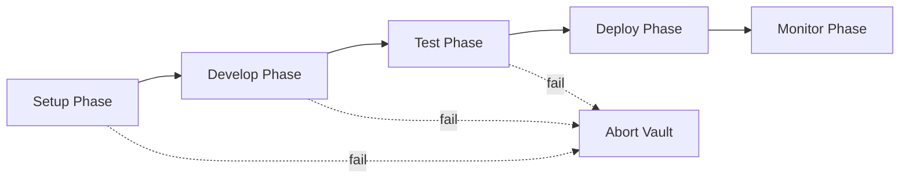

# Vault Testing Guide

> **Status**: Placeholder - Content to be developed

## Overview

Vault testing validates complex scenarios through their entire lifecycle, from setup through production monitoring. Unlike unit or integration tests that validate isolated functionality, vault tests ensure the complete system works end-to-end across multiple phases.

## What is Vault Testing?

Vault testing is multi-phase validation that:

- Tests scenarios through their full lifecycle (setup → develop → test → deploy → monitor)
- Validates phase dependencies and transitions
- Ensures each phase meets defined success criteria before proceeding
- Catches integration issues that single-phase tests miss

## When to Use Vault Testing

**Use vault testing for:**
- Complex scenarios with multiple components
- Scenarios with external resource dependencies
- Production-critical workflows
- End-to-end validation before release

**Don't use for:**
- Simple scenarios with minimal dependencies
- Quick iteration during development
- Unit-level validation

## Quick Start

```bash
# Create a vault test for your scenario
test-genie vault my-scenario \
  --phases setup,develop,test,deploy \
  --criteria ./success-criteria.yaml
```

## Vault Configuration

```yaml
# vault-config.yaml
name: my-scenario-vault
phases:
  setup:
    timeout: 300
    requirements:
      - resource_availability: true
      - database_schema: loaded

  develop:
    timeout: 600
    requirements:
      - api_endpoints: functional
      - business_logic: implemented

  test:
    timeout: 900
    requirements:
      - unit_tests: passing
      - integration_tests: passing
```

## Phase Dependencies



## Success Criteria

Each phase can define success criteria:

| Criterion | Description |
|-----------|-------------|
| `resource_availability` | Required resources are running and healthy |
| `database_schema` | Database migrations complete |
| `api_endpoints` | All API endpoints responding |
| `unit_tests` | Unit test suite passing |
| `integration_tests` | Integration test suite passing |
| `performance_baseline` | Performance within thresholds |

## Troubleshooting

### Vault Fails at Setup Phase

**Symptoms**: Vault aborts during initial setup

**Check**:
1. Resource availability: `vrooli status --resources`
2. Database connectivity
3. Network configuration

### Vault Hangs Between Phases

**Symptoms**: Vault doesn't transition to next phase

**Check**:
1. Phase timeout settings
2. Success criteria definitions
3. Resource locks

## See Also

- [Phased Testing](phased-testing.md) - Understanding test phases
- [Phase Catalog](../reference/phase-catalog.md) - Phase definitions
- [Architecture](../concepts/architecture.md) - Go orchestrator design
