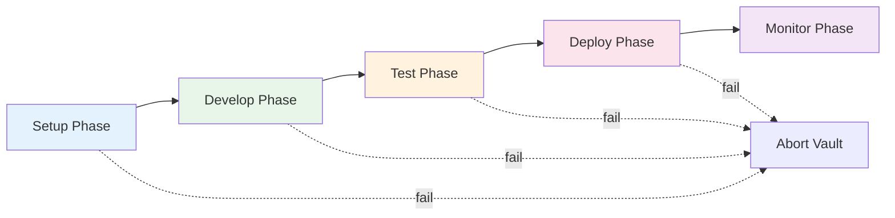

# Vault Testing Guide

Vault testing validates complex scenarios through their entire lifecycle, from setup through production monitoring. Unlike unit or integration tests that validate isolated functionality, vault tests ensure the complete system works end-to-end across multiple phases.

## What is Vault Testing?

Vault testing is **multi-phase lifecycle validation** that:

- Tests scenarios through their full lifecycle (setup -> develop -> test -> deploy -> monitor)
- Validates phase dependencies and transitions
- Ensures each phase meets defined success criteria before proceeding
- Catches integration issues that single-phase tests miss
- Simulates real-world deployment and operation



## When to Use Vault Testing

### Use Vault Testing For

| Scenario | Why |
|----------|-----|
| Complex multi-component apps | Validates component interactions across lifecycle |
| External resource dependencies | Confirms resources available and properly configured |
| Production-critical workflows | Ensures complete flow works before deployment |
| Release validation | Comprehensive pre-release verification |
| Deployment pipeline testing | Tests the deployment process itself |

### Don't Use For

| Scenario | Better Alternative |
|----------|-------------------|
| Simple scenarios with minimal dependencies | Unit + integration tests |
| Quick iteration during development | `--preset quick` |
| Unit-level validation | Unit test phase |
| UI-only changes | BAS workflow tests |

## Quick Start

### 1. Basic Vault Execution

```bash
# Run vault tests for a scenario
test-genie vault my-scenario

# Run specific phases only
test-genie vault my-scenario --phases setup,develop,test

# With custom timeout
test-genie vault my-scenario --timeout 3600
```

### 2. With Success Criteria

```bash
# Create criteria file
cat > vault-criteria.yaml <<'EOF'
name: my-scenario-vault
phases:
  setup:
    timeout: 300
    requirements:
      - resource_availability: true
      - database_schema: loaded
  test:
    timeout: 900
    requirements:
      - unit_tests: passing
      - coverage_threshold: 80
EOF

# Run with criteria
test-genie vault my-scenario --criteria ./vault-criteria.yaml
```

### 3. Generate Report

```bash
# Execute and generate report
test-genie vault my-scenario --report vault-report.json

# View report
cat vault-report.json | jq '.phases[].status'
```

## Vault Phases Explained

### Phase 1: Setup

**Purpose**: Initialize environment and verify all prerequisites.

**What It Validates**:
- Required resources are available (PostgreSQL, Redis, etc.)
- Configuration files are valid
- Network connectivity works
- Required services can be reached

**Example Setup Checks**:
```yaml
setup:
  timeout: 300
  requirements:
    - resource_availability: true      # All declared resources running
    - database_connectivity: true      # Can connect to database
    - config_valid: true               # Configuration files parse correctly
    - ports_available: true            # Required ports not in use
```

**Common Failures**:
| Failure | Cause | Solution |
|---------|-------|----------|
| Resource unavailable | Service not started | `vrooli resource start <name>` |
| Port in use | Conflicting process | Kill process or change port |
| Config invalid | Syntax error | Fix configuration file |

### Phase 2: Develop

**Purpose**: Build the application and verify it compiles/runs.

**What It Validates**:
- Go API builds successfully
- Node.js dependencies install
- UI compiles without errors
- Static assets generate correctly

**Example Develop Checks**:
```yaml
develop:
  timeout: 600
  requirements:
    - api_build: success               # Go API compiles
    - ui_build: success                # UI builds without errors
    - dependencies_installed: true     # All packages installed
    - migrations_applied: true         # Database schema up to date
```

**Common Failures**:
| Failure | Cause | Solution |
|---------|-------|----------|
| Build failed | Compilation error | Check build logs, fix code |
| Missing dependency | Package not found | Run `go mod tidy` or `npm install` |
| Migration failed | Schema conflict | Check migration files |

### Phase 3: Test

**Purpose**: Execute the full test suite.

**What It Validates**:
- Unit tests pass
- Integration tests pass
- Coverage meets threshold
- No flaky tests

**Example Test Checks**:
```yaml
test:
  timeout: 900
  requirements:
    - unit_tests: passing              # All unit tests pass
    - integration_tests: passing       # All integration tests pass
    - coverage_threshold: 80           # Coverage >= 80%
    - no_flaky_tests: true             # No intermittent failures
```

**Common Failures**:
| Failure | Cause | Solution |
|---------|-------|----------|
| Test failed | Bug in code | Debug and fix |
| Coverage low | Missing tests | Add tests for uncovered code |
| Flaky test | Race condition | Fix test isolation |

### Phase 4: Deploy

**Purpose**: Deploy to a staging/test environment.

**What It Validates**:
- Deployment scripts work
- Application starts correctly
- Health checks pass
- API endpoints respond

**Example Deploy Checks**:
```yaml
deploy:
  timeout: 600
  requirements:
    - deployment_success: true         # Deploy completed without error
    - health_check: passing            # /health returns 200
    - api_responsive: true             # API endpoints working
    - ui_accessible: true              # UI loads correctly
```

**Common Failures**:
| Failure | Cause | Solution |
|---------|-------|----------|
| Deploy failed | Script error | Check deployment logs |
| Health check failed | App crashed | Check application logs |
| Port conflict | Port in use | Use different port |

### Phase 5: Monitor

**Purpose**: Verify operational health and performance.

**What It Validates**:
- Response times within acceptable range
- No errors in logs
- Memory/CPU usage normal
- No resource leaks

**Example Monitor Checks**:
```yaml
monitor:
  timeout: 300
  requirements:
    - latency_p99: "<100ms"            # 99th percentile latency
    - error_rate: "<1%"                # Error rate below 1%
    - memory_stable: true              # No memory leaks
    - logs_clean: true                 # No error-level logs
```

**Common Failures**:
| Failure | Cause | Solution |
|---------|-------|----------|
| High latency | Performance issue | Profile and optimize |
| High error rate | Bug under load | Review error logs |
| Memory leak | Resource not freed | Fix memory management |

## Complete Working Example

### Scenario: E-Commerce API

This example shows a complete vault test for an e-commerce scenario.

#### 1. Create Vault Configuration

```yaml
# scenarios/ecommerce/vault-config.yaml
name: ecommerce-vault
description: Complete lifecycle validation for e-commerce API

phases:
  setup:
    timeout: 300
    requirements:
      - resource: postgres
        check: connectivity
      - resource: redis
        check: connectivity
      - config:
          file: .vrooli/service.json
          check: valid_json

  develop:
    timeout: 600
    commands:
      - "cd api && go build -o ./bin/api ./cmd/api"
      - "cd ui && npm ci && npm run build"
    requirements:
      - file_exists: api/bin/api
      - file_exists: ui/dist/index.html

  test:
    timeout: 900
    commands:
      - "cd api && go test -coverprofile=coverage.out ./..."
      - "cd ui && npm test -- --coverage"
    requirements:
      - go_coverage: 80
      - vitest_coverage: 75
      - all_tests: passing

  deploy:
    timeout: 600
    commands:
      - "./scripts/deploy-staging.sh"
    requirements:
      - endpoint_healthy: "http://localhost:8080/health"
      - endpoint_responsive: "http://localhost:8080/api/v1/products"

  monitor:
    timeout: 300
    duration: 60  # Monitor for 60 seconds
    requirements:
      - latency_p99_ms: 100
      - error_rate_percent: 1
      - memory_growth_mb: 50  # Max memory growth
```

#### 2. Run Vault Test

```bash
# Execute full vault
test-genie vault ecommerce --criteria ./vault-config.yaml

# Output:
# Vault Execution: ecommerce
# =============================
#
# [1/5] setup       PASSED  (45s)
#   PostgreSQL connectivity verified
#   Redis connectivity verified
#   Configuration valid
#
# [2/5] develop     PASSED  (180s)
#   API built successfully: api/bin/api
#   UI built successfully: ui/dist/index.html
#
# [3/5] test        PASSED  (240s)
#   Go tests: 156 passed, 0 failed
#   Go coverage: 87.3%
#   Vitest tests: 89 passed, 0 failed
#   UI coverage: 82.1%
#
# [4/5] deploy      PASSED  (90s)
#   Staging deployment completed
#   Health endpoint: 200 OK
#   Products endpoint: 200 OK (142ms)
#
# [5/5] monitor     PASSED  (75s)
#   Latency p99: 45ms (target: <100ms)
#   Error rate: 0.0% (target: <1%)
#   Memory growth: 12MB (target: <50MB)
#
# Vault Result: PASSED
# Total Duration: 10m 30s
```

#### 3. Handle Failures

```bash
# If a phase fails, get detailed report
test-genie vault ecommerce --criteria ./vault-config.yaml --report vault-report.json

# Analyze failure
cat vault-report.json | jq '.phases[] | select(.status == "failed")'

# Example failure output:
# {
#   "name": "test",
#   "status": "failed",
#   "duration": 180,
#   "error": "Coverage threshold not met",
#   "details": {
#     "go_coverage": 72.5,
#     "required": 80,
#     "gap": 7.5
#   },
#   "remediation": "Add tests for api/handlers/checkout.go (0% coverage)"
# }
```

## Success Criteria Reference

### Resource Checks

```yaml
requirements:
  # Check resource is running
  - resource: postgres
    check: running

  # Check connectivity
  - resource: redis
    check: connectivity

  # Check with custom timeout
  - resource: ollama
    check: connectivity
    timeout: 30
```

### File Checks

```yaml
requirements:
  # File exists
  - file_exists: api/bin/api

  # File has content
  - file_not_empty: coverage/report.json

  # JSON is valid
  - valid_json: .vrooli/service.json

  # File matches pattern
  - file_matches:
      path: api/go.mod
      pattern: "go 1.21"
```

### Command Checks

```yaml
requirements:
  # Command succeeds (exit 0)
  - command: "go build ./..."
    success: true

  # Command output contains
  - command: "go test ./..."
    output_contains: "PASS"

  # Command output matches
  - command: "curl -s localhost:8080/health"
    output_json:
      status: "healthy"
```

### Endpoint Checks

```yaml
requirements:
  # Endpoint returns 200
  - endpoint_healthy: "http://localhost:8080/health"

  # Endpoint responds within timeout
  - endpoint_responsive:
      url: "http://localhost:8080/api/v1/products"
      timeout: 5000
      expected_status: 200

  # Endpoint returns expected JSON
  - endpoint_json:
      url: "http://localhost:8080/health"
      expected:
        status: "healthy"
        readiness: true
```

### Coverage Checks

```yaml
requirements:
  # Go coverage threshold
  - go_coverage: 80

  # Vitest coverage threshold
  - vitest_coverage: 75

  # Python coverage threshold
  - pytest_coverage: 70
```

### Performance Checks

```yaml
requirements:
  # Latency percentiles
  - latency_p50_ms: 50
  - latency_p95_ms: 100
  - latency_p99_ms: 200

  # Error rates
  - error_rate_percent: 1

  # Resource usage
  - memory_mb: 512
  - cpu_percent: 80
```

## Best Practices

### 1. Start Simple, Add Complexity

```yaml
# Start with essential phases
phases:
  setup:
    requirements:
      - resource: postgres

  test:
    requirements:
      - all_tests: passing

# Add more as you gain confidence
```

### 2. Use Appropriate Timeouts

```yaml
# Phase-specific timeouts based on expected duration
setup: 300      # 5 minutes - usually quick
develop: 600    # 10 minutes - builds can be slow
test: 900       # 15 minutes - tests can be extensive
deploy: 600     # 10 minutes - deployment varies
monitor: 300    # 5 minutes - monitoring period
```

### 3. Include Remediation Hints

```yaml
requirements:
  - go_coverage: 80
    on_failure:
      message: "Coverage too low"
      remediation: "Run 'test-genie coverage --show-gaps' to identify untested code"
```

### 4. Group Related Checks

```yaml
# Group checks logically
database_checks:
  - resource: postgres
  - migration: applied
  - seed_data: loaded

api_checks:
  - build: success
  - health: passing
  - endpoints: responding
```

### 5. Test the Vault Configuration

```bash
# Dry run to validate config
test-genie vault my-scenario --criteria ./vault-config.yaml --dry-run

# Run individual phases
test-genie vault my-scenario --phases setup --criteria ./vault-config.yaml
```

## Troubleshooting

### Vault Fails at Setup Phase

**Symptoms**: Vault aborts during initial setup

**Diagnosis**:
```bash
# Check resource status
vrooli status --resources

# Check specific resource
vrooli resource status postgres

# Check ports
lsof -i :5432
```

**Solutions**:
- Start missing resources: `vrooli resource start postgres`
- Fix port conflicts: kill conflicting process
- Check configuration files for errors

### Vault Hangs Between Phases

**Symptoms**: Vault doesn't transition to next phase

**Diagnosis**:
```bash
# Check what's running
ps aux | grep test-genie

# Check for stuck processes
docker ps

# Check resource connections
pg_isready -h localhost
```

**Solutions**:
- Increase phase timeout
- Check for resource locks
- Review success criteria definitions

### Phase Passes Locally But Fails in CI

**Symptoms**: Works on dev machine, fails in CI

**Diagnosis**:
```bash
# Compare environments
env | sort > local_env.txt

# Check resource availability in CI
test-genie vault my-scenario --phases setup --verbose
```

**Solutions**:
- Ensure CI has same resources available
- Use consistent environment variables
- Add CI-specific criteria file

### Coverage Phase Fails

**Symptoms**: Tests pass but coverage check fails

**Diagnosis**:
```bash
# Check actual coverage
go test -coverprofile=coverage.out ./...
go tool cover -func=coverage.out

# Check threshold
cat vault-config.yaml | grep coverage
```

**Solutions**:
- Add tests for uncovered code
- Adjust coverage threshold if appropriate
- Exclude generated files from coverage

## Integration with CI/CD

### GitHub Actions Example

```yaml
name: Vault Tests
on: [push]

jobs:
  vault:
    runs-on: ubuntu-latest
    services:
      postgres:
        image: postgres:15
        env:
          POSTGRES_PASSWORD: postgres
        ports:
          - 5432:5432

    steps:
      - uses: actions/checkout@v4

      - name: Start test-genie
        run: |
          vrooli scenario start test-genie
          sleep 10

      - name: Run Vault Tests
        run: |
          test-genie vault my-scenario \
            --criteria ./vault-config.yaml \
            --report vault-report.json

      - name: Upload Report
        if: always()
        uses: actions/upload-artifact@v4
        with:
          name: vault-report
          path: vault-report.json
```

### GitLab CI Example

```yaml
vault-test:
  stage: test
  services:
    - postgres:15
  script:
    - vrooli scenario start test-genie
    - sleep 10
    - test-genie vault my-scenario --criteria ./vault-config.yaml
  artifacts:
    when: always
    paths:
      - vault-report.json
```

## See Also

- [Phased Testing](phased-testing.md) - Understanding test phases
- [Phase Catalog](../reference/phase-catalog.md) - Phase definitions
- [Architecture](../concepts/architecture.md) - Go orchestrator design
- [CLI Commands](../reference/cli-commands.md) - `test-genie vault` reference
- [Troubleshooting](troubleshooting.md) - Debug common issues
