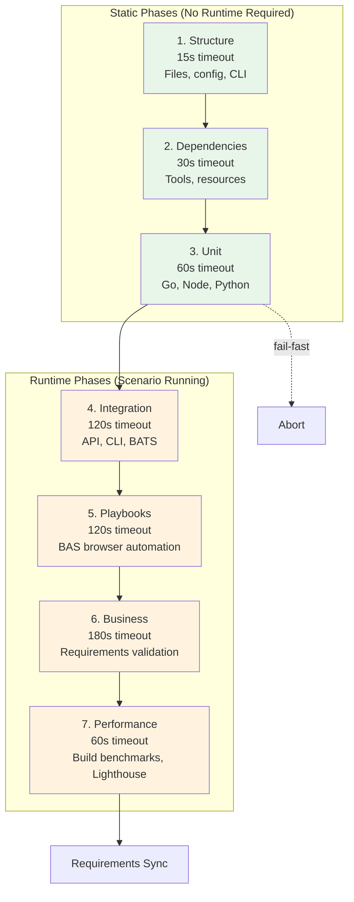

# Test Genie Phases

Test Genie uses a **7-phase progressive testing architecture** where each phase has specific responsibilities, timeouts, and dependencies. Phases execute sequentially, with earlier phases providing the foundation for later ones.

## Phase Overview



## Phase Summary

| Phase | Timeout | Optional | Requires Runtime | Purpose |
|-------|---------|----------|------------------|---------|
| [Structure](structure/README.md) | 15s | No | No | Validate files, config, CLI setup |
| [Dependencies](dependencies/README.md) | 30s | No | No | Verify tools and resources |
| [Unit](unit/README.md) | 60s | No | No | Run unit tests (Go, Node, Python) |
| [Integration](integration/README.md) | 120s | Yes | Yes | Test API, CLI, component interactions |
| [Playbooks](playbooks/README.md) | 120s | Yes | Yes | Execute BAS browser automation |
| [Business](business/README.md) | 180s | Yes | Yes | Validate requirements coverage |
| [Performance](performance/README.md) | 60s | Yes | Yes | Build benchmarks, Lighthouse audits |

## Static vs Runtime Phases

**Static phases** (1-3) can run without the scenario being started:
- Validate files exist and are well-formed
- Check dependencies are installed
- Execute unit tests in isolation

**Runtime phases** (4-7) require the scenario to be running:
- Need API endpoints accessible
- Need UI server running
- Test real component interactions

## Exit Codes

All phases use consistent exit codes:

| Code | Meaning |
|------|---------|
| 0 | Phase passed |
| 1 | Phase failed (test failures, validation errors) |
| 2 | Phase skipped (optional phase, runtime unavailable) |

## Running Phases

### Via CLI

```bash
# Run specific phases
test-genie execute my-scenario --phases structure,unit

# Run all phases (comprehensive)
test-genie execute my-scenario --preset comprehensive

# Quick check (structure + unit)
test-genie execute my-scenario --preset quick
```

### Via Makefile

```bash
cd scenarios/my-scenario
make test              # Run comprehensive preset
make test-quick        # Run quick preset
```

### Via REST API

```bash
API_PORT=$(vrooli scenario port test-genie API_PORT)
curl -X POST "http://localhost:${API_PORT}/api/v1/test-suite/my-scenario/execute-sync" \
  -H "Content-Type: application/json" \
  -d '{"phases": ["structure", "unit", "integration"]}'
```

## Configuration

Override phase settings in `.vrooli/testing.json`:

```json
{
  "phases": {
    "unit": {
      "timeout": 120,
      "coverageWarn": 85,
      "coverageError": 75
    },
    "performance": {
      "enabled": false
    }
  }
}
```

## Presets

Presets bundle phases for common use cases:

| Preset | Phases | Duration | Use Case |
|--------|--------|----------|----------|
| **quick** | structure, unit | ~1 min | Fast feedback during development |
| **smoke** | structure, dependencies, unit, integration | ~4 min | Pre-push validation |
| **comprehensive** | All 7 phases | ~8 min | Full validation before release |

See [Presets Reference](../reference/presets.md) for custom preset configuration.

## Phase Documentation

Each phase has its own documentation folder with detailed guides:

- **[Structure](structure/README.md)** - File validation, CLI approaches, UI smoke tests
- **[Dependencies](dependencies/README.md)** - Tool and resource verification
- **[Unit](unit/README.md)** - Test runners, coverage, requirement tagging
- **[Integration](integration/README.md)** - CLI testing with BATS, API health checks
- **[Playbooks](playbooks/README.md)** - BAS browser automation workflows
- **[Business](business/README.md)** - Requirements validation and sync
- **[Performance](performance/README.md)** - Build benchmarks, Lighthouse audits

## See Also

- [Architecture](../concepts/architecture.md) - Go orchestrator design
- [Presets](../reference/presets.md) - Preset configurations
- [API Endpoints](../reference/api-endpoints.md) - REST API reference
- [Troubleshooting](../guides/troubleshooting.md) - Debug common issues
