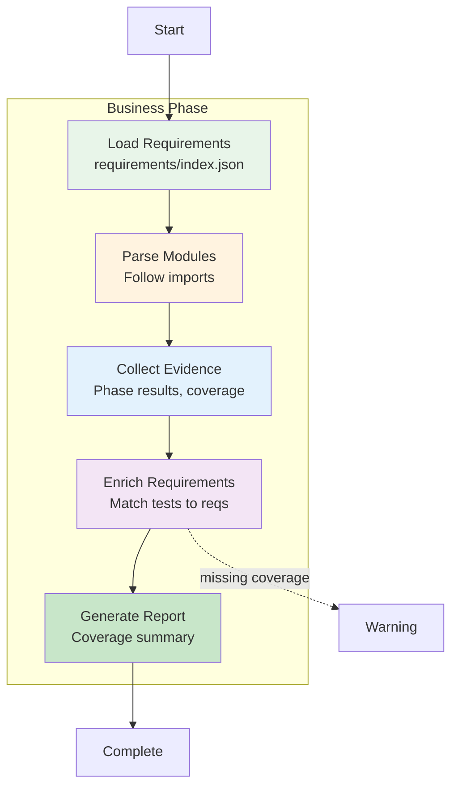

# Business Phase

**ID**: `business`
**Timeout**: 180 seconds
**Optional**: Yes (when runtime not available)
**Requires Runtime**: Yes

The business phase validates requirements coverage and business logic by analyzing test results against the requirements registry. It ensures PRD requirements are properly tested.

## What Gets Validated



## Requirements Registry

Requirements are defined in `requirements/` with an index file:

```json
// requirements/index.json
{
  "imports": [
    "01-core/module.json",
    "02-features/module.json"
  ]
}
```

Each module contains requirements:

```json
{
  "_metadata": {
    "module": "core-features"
  },
  "requirements": [
    {
      "id": "REQ-001",
      "title": "User authentication",
      "validation": [
        {
          "type": "test",
          "ref": "api/auth_test.go",
          "status": "implemented"
        }
      ]
    }
  ]
}
```

## Evidence Sources

The phase collects evidence from multiple sources:

| Source | Location | Content |
|--------|----------|---------|
| Phase Results | Orchestrator | Test pass/fail |
| Go Coverage | `coverage.out` | Code coverage |
| Vitest | `vitest-requirements.json` | Tagged tests |
| Manual | `manual-validations/` | Manual records |

## Validation Types

| Type | Description | Auto-sync |
|------|-------------|-----------|
| `test` | Unit/integration test | Yes |
| `automation` | BAS workflow | Yes |
| `manual` | Manual verification | No |
| `review` | Code review | No |

## Exit Codes

| Code | Meaning |
|------|---------|
| 0 | Requirements validated |
| 1 | Critical requirements uncovered |
| 2 | Skipped |

## Configuration

```json
{
  "phases": {
    "business": {
      "timeout": 240,
      "requirementsCoverageWarn": 80,
      "requirementsCoverageError": 60
    }
  },
  "requirements": {
    "sync": true
  }
}
```

## Related Documentation

- [Requirements Auto-Sync](requirements-sync.md) - How sync works

## See Also

- [Phases Overview](../README.md) - All phases
- [Playbooks Phase](../playbooks/README.md) - Previous phase
- [Performance Phase](../performance/README.md) - Next phase
