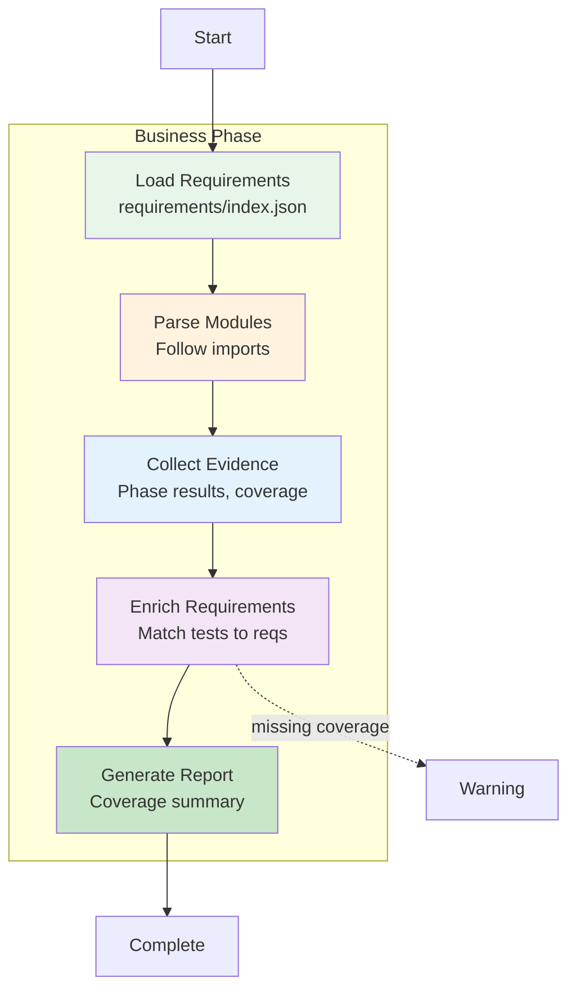

# Business Phase

**ID**: `business`
**Optional**: No
**Requires Runtime**: No (pure read-only filesystem validation)
**Presets**: quick, smoke, comprehensive

The business phase validates requirements coverage and business logic by analyzing test results against the requirements registry. It ensures PRD requirements are properly tested. It is part of the `quick` and `smoke` presets (read-only, runs in seconds); the requirements *syncer* — the only thing that writes to `requirements/*.json` or PRD.md — stays gated behind full-coverage runs and never fires from quick/smoke.

This phase declares a [Phase Capability Contract](../../concepts/phase-capability-contract.md); the sections below follow the required remediation-doc skeleton.

## North Star

At maximum maturity the scenario carries a **closed, provably-current intent spine**: a template-conformant PRD that states intent in a machine-checkable shape, a structurally sound and honest requirements registry, an OT ↔ requirement ↔ validation graph that joins cleanly in both directions, and requirement statuses that are *earned from fresh evidence* rather than asserted. The culminating capability, `evidence_traceability`, reaches L3 "Evidence fresh" — every claim is backed by a sync snapshot fresh relative to the latest suite run or an unexpired manual attestation, so the contract provably tells the truth as of now.

## The rungs and their gates

Each of the four capabilities carries its own monotone L0→L3 ladder (L0 is uniformly "artifact missing/unparseable — nothing to evaluate"; each rung implies the one below).

| Capability | L1 (Foundation) | L2 (Ready) | L3 top rung — North Star | Next unlock from L1 |
|---|---|---|---|---|
| `prd_contract` | PRD present but sections/tiers missing | Template conformant (all required sections) | **PRD clean** — a trustworthy statement of intent | All required template sections and P0/P1/P2 OT tiers present |
| `requirements_registry` | Registry parseable but has integrity findings | Registry honest (structure sound) | **Registry clean** — a complete, falsifiable claim set | No structural integrity findings; starter template replaced |
| `intent_linkage` | Spine joinable but with dangling refs/orphans | Spine linked (both directions clean) | **Linkage clean** — the intent spine is fully closed | Every prd_ref resolves, every P0/P1 target covered, every ref exists |
| `evidence_traceability` | Evidence present but claims not all honest | Claims honest (all statuses earned) | **Evidence fresh** — every claim provably current | No unproven claims; every status earned, not asserted |

## What each finding means

Each finding caps its capability at the named rung; only ERROR severities fail the phase (business emits no BLOCKER), so structural defects fail while quality/freshness debt stays advisory.

| Code | Capability | Caps at | Severity | Fails phase? |
|---|---|---|---|---|
| `prd_missing_prd` | prd_contract | L0 | ERROR | **Yes** |
| `prd_template_sections` | prd_contract | L1 | ERROR | **Yes** |
| `prd_template_content` / `prd_ot_id_format` | prd_contract | L2 | WARNING | No |
| `prd_missing_requirements` / `business_registry_unparseable` | requirements_registry | L0 | ERROR | **Yes** |
| `business_duplicate_req_id` / `business_import_cycle` / `business_orphaned_ref` / `business_req_missing_id` | requirements_registry | L1 | ERROR | **Yes** |
| `business_starter_template` | requirements_registry | L1 | WARNING | No |
| `business_req_missing_title` / `business_invalid_status` / `business_req_no_validation` | requirements_registry | L2 | WARNING | No |
| `intent.ref_missing` | intent_linkage | L1 | ERROR | **Yes** |
| `intent.prd_ref_unmatched` / `intent.ot_orphan` | intent_linkage | L1 | WARNING | No |
| `business_status_unearned` | evidence_traceability | L1 | ERROR | **Yes** |
| `business_unproven_claim` | evidence_traceability | L1 | WARNING | No |
| `business_evidence_stale` / `business_manual_expired` | evidence_traceability | L2 | WARNING | No |

## The canonical fix

- **PRD contract (`prd_missing_prd`, `prd_template_sections`, `prd_template_content`, `prd_ot_id_format`)** → author a `PRD.md` at the scenario root (product decision; the wizard scaffolds one interactively); the missing-sections and OT-ID-format defects are auto-fixable, while filling thin/placeholder sections with truthful content is judgment the calling agent owns.
- **Registry integrity (`business_registry_unparseable`, `prd_missing_requirements`, `business_duplicate_req_id`, `business_import_cycle`, `business_orphaned_ref`, `business_req_missing_id`)** → repair broken JSON, mint a real registry (auto-scaffolded), and resolve duplicate IDs, cycles, and dangling refs by hand — each requires knowing which side is the bug, since IDs are stable evidence anchors.
- **Registry quality (`business_starter_template`, `business_req_missing_title`, `business_invalid_status`, `business_req_no_validation`)** → replace starter requirements with real falsifiable claims, title every requirement, and attach at least one real validation entry (never a fake one — that games the ladder); invalid status vocabulary is auto-normalized.
- **Intent linkage (`intent.ref_missing`, `intent.prd_ref_unmatched`, `intent.ot_orphan`)** → point each broken validation ref at its moved/renamed target, reconcile each `prd_ref` with a real operational target, and cover every orphaned P0/P1 target (orphan detection is auto-fixable).
- **Evidence traceability (`business_status_unearned`, `business_unproven_claim`, `business_evidence_stale`, `business_manual_expired`)** → never hand-edit a status; earn it. Run the comprehensive suite so requirements-sync writes an honest snapshot, and re-perform + re-log expired manual attestations. Test Genie owns the run that freshens evidence; business-health only reports the staleness.

## How to verify

```bash
# See the current rung, gaps, and next move for every business capability:
business-health validate scenario <scenario>

# Or drive it through Test Genie and read the per-phase scorecard:
test-genie execute <scenario> --phases business
test-genie runs findings --scenario <scenario>
```

The `business` line in the scorecard shows the current rung, the single highest-unlock next move, and a runnable doc-search topic that resolves back to the sections above.

## Findings

Every run emits typed `ArchitectureFinding`s alongside the human-readable observations, feeding the swarm-manager `business` dimension. Structural requirement-registry findings use `FINDING_SOURCE_BUSINESS`; intent-ladder findings use `FINDING_SOURCE_ARCHITECTURE` so their `afid` is stable across cartographer/test-genie producers. Findings appear in the suite `--json` output per phase; severities are capped at ERROR in v1 (never BLOCKER), and findings never change the phase's pass/fail.

| Code | Severity | Meaning |
|------|----------|---------|
| `business_starter_template` | WARNING | Registry still contains `template-starter`-tagged scaffold requirements |
| `business_duplicate_req_id:<ID>` | ERROR | Duplicate requirement ID |
| `business_import_cycle:<ID>` | ERROR | Cycle in the requirement hierarchy |
| `business_orphaned_ref:<ID>` | ERROR/WARNING | `children`/`depends_on` points at a nonexistent requirement |
| `intent.ref_missing:<ID>` | ERROR | `validation[].ref` points at a nonexistent file |
| `business_req_no_validation:<ID>` | WARNING (ERROR if P0) | Requirement declares no validation at all |
| `intent.prd_ref_unmatched:<ID>` | WARNING | `prd_ref` (OT-…) matches no operational target in PRD.md |
| `business_req_missing_id` / `business_req_missing_title` / `business_invalid_status` | ERROR/WARNING | Structural field defects, now typed |

The autosteer skill for this dimension is `requirements-traceability-steer` (prompt-manager store). Producer: `api/internal/orchestrator/phases/phase_business_findings.go`.

## What Gets Validated


```mermaid
graph TB
    subgraph "Business Phase"
        LOAD[Load Requirements<br/>requirements/index.json]
        PARSE[Parse Modules<br/>Follow imports]
        EVIDENCE[Collect Evidence<br/>Phase results, coverage]
        ENRICH[Enrich Requirements<br/>Match tests to reqs]
        REPORT[Generate Report<br/>Coverage summary]
    end

    START[Start] --> LOAD
    LOAD --> PARSE
    PARSE --> EVIDENCE
    EVIDENCE --> ENRICH
    ENRICH --> REPORT
    REPORT --> DONE[Complete]

    ENRICH -.->|missing coverage| WARN[Warning]

    style LOAD fill:#e8f5e9
    style PARSE fill:#fff3e0
    style EVIDENCE fill:#e3f2fd
    style ENRICH fill:#f3e5f5
    style REPORT fill:#c8e6c9
```

## Requirements Registry

Requirements are defined in `requirements/` with an index file:

```json
// requirements/index.json
{
  "imports": [
    "01-core/module.json",
    "02-features/module.json"
  ]
}
```

Each module contains requirements:

```json
{
  "_metadata": {
    "module": "core-features"
  },
  "requirements": [
    {
      "id": "REQ-001",
      "title": "User authentication",
      "validation": [
        {
          "type": "test",
          "ref": "api/auth_test.go",
          "status": "implemented"
        }
      ]
    }
  ]
}
```

## Evidence Sources

The phase collects evidence from multiple sources:

| Source | Location | Content |
|--------|----------|---------|
| Phase Results | Orchestrator | Test pass/fail |
| Go Coverage | `coverage.out` | Code coverage |
| Vitest | `vitest-requirements.json` | Tagged tests |
| Manual | `manual-validations/` | Manual records |

## Validation Types

| Type | Description | Auto-sync |
|------|-------------|-----------|
| `test` | Unit/integration test | Yes |
| `automation` | BAS workflow | Yes |
| `manual` | Manual verification | No |
| `review` | Code review | No |

## Exit Codes

| Code | Meaning |
|------|---------|
| 0 | Requirements validated |
| 1 | Critical requirements uncovered |
| 2 | Skipped |

## Configuration

```json
{
  "phases": {
    "business": {
      "timeout": 240,
      "requirementsCoverageWarn": 80,
      "requirementsCoverageError": 60
    }
  },
  "requirements": {
    "sync": true
  }
}
```

## Related Documentation

- [Requirements Auto-Sync](requirements-sync.md) - How sync works

## See Also

- [Phases Overview](../README.md) - All phases
- [Workflow Phase](../workflow/README.md) - Previous phase
- [Performance Phase](../performance/README.md) - Next phase
