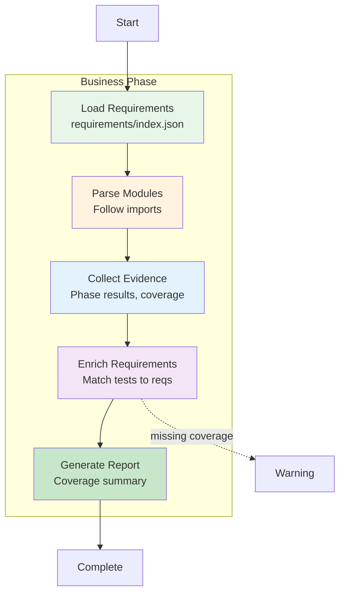

# Business Phase

**ID**: `business`
**Optional**: No
**Requires Runtime**: No (pure read-only filesystem validation)
**Presets**: quick, smoke, comprehensive

The business phase validates requirements coverage and business logic by analyzing test results against the requirements registry. It ensures PRD requirements are properly tested. It is part of the `quick` and `smoke` presets (read-only, runs in seconds); the requirements *syncer* — the only thing that writes to `requirements/*.json` or PRD.md — stays gated behind full-coverage runs and never fires from quick/smoke.

## Findings

Every run emits typed `ArchitectureFinding`s alongside the human-readable observations, feeding the ecosystem-manager `business` dimension. Structural requirement-registry findings use `FINDING_SOURCE_BUSINESS`; intent-ladder findings use `FINDING_SOURCE_ARCHITECTURE` so their `afid` is stable across cartographer/test-genie producers. Findings appear in the suite `--json` output per phase; severities are capped at ERROR in v1 (never BLOCKER), and findings never change the phase's pass/fail.

| Code | Severity | Meaning |
|------|----------|---------|
| `business_starter_template` | WARNING | Registry still contains `template-starter`-tagged scaffold requirements |
| `business_duplicate_req_id:<ID>` | ERROR | Duplicate requirement ID |
| `business_import_cycle:<ID>` | ERROR | Cycle in the requirement hierarchy |
| `business_orphaned_ref:<ID>` | ERROR/WARNING | `children`/`depends_on` points at a nonexistent requirement |
| `intent.ref_missing:<ID>` | ERROR | `validation[].ref` points at a nonexistent file |
| `business_req_no_validation:<ID>` | WARNING (ERROR if P0) | Requirement declares no validation at all |
| `intent.prd_ref_unmatched:<ID>` | WARNING | `prd_ref` (OT-…) matches no operational target in PRD.md |
| `business_req_missing_id` / `business_req_missing_title` / `business_invalid_status` | ERROR/WARNING | Structural field defects, now typed |

The autosteer skill for this dimension is `requirements-traceability-steer` (prompt-manager store). Producer: `api/internal/orchestrator/phases/phase_business_findings.go`.

## What Gets Validated


```mermaid
graph TB
    subgraph "Business Phase"
        LOAD[Load Requirements<br/>requirements/index.json]
        PARSE[Parse Modules<br/>Follow imports]
        EVIDENCE[Collect Evidence<br/>Phase results, coverage]
        ENRICH[Enrich Requirements<br/>Match tests to reqs]
        REPORT[Generate Report<br/>Coverage summary]
    end

    START[Start] --> LOAD
    LOAD --> PARSE
    PARSE --> EVIDENCE
    EVIDENCE --> ENRICH
    ENRICH --> REPORT
    REPORT --> DONE[Complete]

    ENRICH -.->|missing coverage| WARN[Warning]

    style LOAD fill:#e8f5e9
    style PARSE fill:#fff3e0
    style EVIDENCE fill:#e3f2fd
    style ENRICH fill:#f3e5f5
    style REPORT fill:#c8e6c9
```

## Requirements Registry

Requirements are defined in `requirements/` with an index file:

```json
// requirements/index.json
{
  "imports": [
    "01-core/module.json",
    "02-features/module.json"
  ]
}
```

Each module contains requirements:

```json
{
  "_metadata": {
    "module": "core-features"
  },
  "requirements": [
    {
      "id": "REQ-001",
      "title": "User authentication",
      "validation": [
        {
          "type": "test",
          "ref": "api/auth_test.go",
          "status": "implemented"
        }
      ]
    }
  ]
}
```

## Evidence Sources

The phase collects evidence from multiple sources:

| Source | Location | Content |
|--------|----------|---------|
| Phase Results | Orchestrator | Test pass/fail |
| Go Coverage | `coverage.out` | Code coverage |
| Vitest | `vitest-requirements.json` | Tagged tests |
| Manual | `manual-validations/` | Manual records |

## Validation Types

| Type | Description | Auto-sync |
|------|-------------|-----------|
| `test` | Unit/integration test | Yes |
| `automation` | BAS workflow | Yes |
| `manual` | Manual verification | No |
| `review` | Code review | No |

## Exit Codes

| Code | Meaning |
|------|---------|
| 0 | Requirements validated |
| 1 | Critical requirements uncovered |
| 2 | Skipped |

## Configuration

```json
{
  "phases": {
    "business": {
      "timeout": 240,
      "requirementsCoverageWarn": 80,
      "requirementsCoverageError": 60
    }
  },
  "requirements": {
    "sync": true
  }
}
```

## Related Documentation

- [Requirements Auto-Sync](requirements-sync.md) - How sync works

## See Also

- [Phases Overview](../README.md) - All phases
- [Workflow Phase](../workflow/README.md) - Previous phase
- [Performance Phase](../performance/README.md) - Next phase
