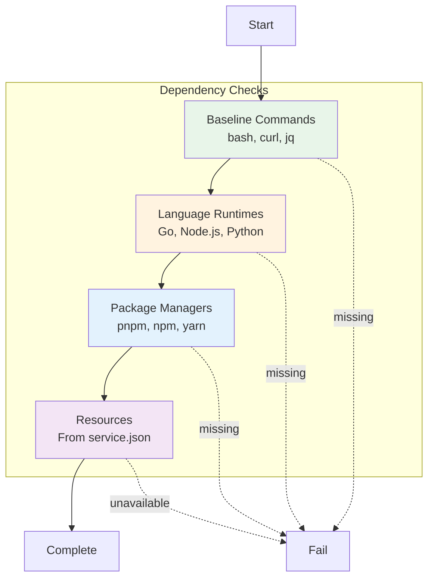

# Dependencies Phase

**ID**: `dependencies`
**Timeout**: 30 seconds
**Optional**: No
**Requires Runtime**: No

The dependencies phase verifies that all required tools, runtimes, and resources are available before running tests. It prevents cryptic failures later by catching missing dependencies upfront.

## What Gets Checked



## Baseline Commands

These commands are always required:

| Command | Purpose | Install |
|---------|---------|---------|
| `bash` | Shell scripting | System package |
| `curl` | HTTP requests | `apt install curl` |
| `jq` | JSON processing | `apt install jq` |

## Language Runtimes

Detected based on scenario structure:

| Language | Detection | Minimum Version |
|----------|-----------|-----------------|
| Go | `api/go.mod` exists | 1.21+ |
| Node.js | `ui/package.json` exists | 18+ |
| Python | `pytest.ini` or `test_*.py` | 3.10+ |

## Package Managers

For Node.js scenarios:

| Manager | Detection | Priority |
|---------|-----------|----------|
| pnpm | `pnpm-lock.yaml` exists | 1 (preferred) |
| npm | `package-lock.json` exists | 2 |
| yarn | `yarn.lock` exists | 3 |

## Resource Dependencies

Resources declared in `.vrooli/service.json` are checked:

```json
{
  "resources": {
    "required": ["postgres", "redis"],
    "optional": ["browserless"]
  }
}
```

The phase verifies:
- Required resources are running and healthy
- Optional resources are noted if missing

## Exit Codes

| Code | Meaning |
|------|---------|
| 0 | All dependencies available |
| 1 | Missing required dependency |

## Common Failures

| Error | Cause | Solution |
|-------|-------|----------|
| "go: command not found" | Go not installed | Install Go from golang.org |
| "pnpm: command not found" | pnpm not installed | `npm install -g pnpm` |
| "Resource postgres not running" | Database not started | `vrooli resource start postgres` |
| "Node.js version too old" | Outdated Node.js | Install Node.js 18+ |

## Configuration

Override dependency checks in `.vrooli/testing.json`:

```json
{
  "dependencies": {
    "go": {
      "required": true,
      "minVersion": "1.21"
    },
    "node": {
      "required": true,
      "minVersion": "18"
    },
    "python": {
      "required": false
    },
    "resources": {
      "skip": ["browserless"]
    }
  }
}
```

## See Also

- [Phases Overview](../README.md) - All phases
- [Structure Phase](../structure/README.md) - Previous phase
- [Unit Phase](../unit/README.md) - Next phase
