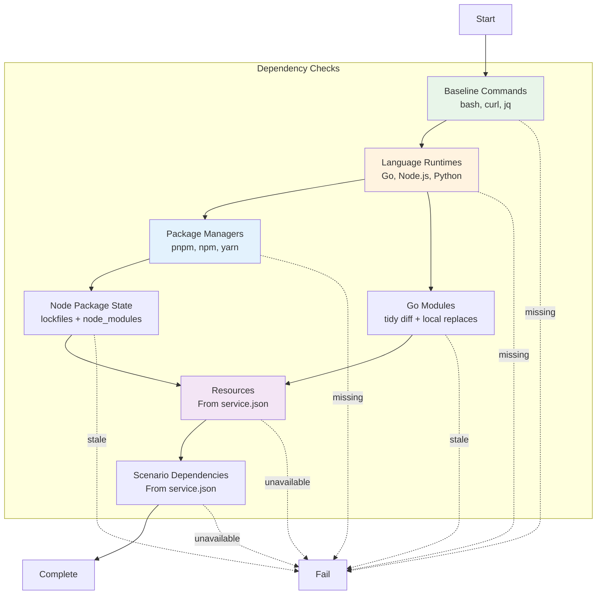

# Dependencies Phase

**ID**: `dependencies`
**Timeout**: 30 seconds
**Optional**: No
**Requires Runtime**: No

The dependencies phase is a read-only preflight. It verifies that required tools, runtimes, package state, Go module metadata, resources, and scenario dependencies are ready before later phases run. It does not install packages, start resources, start scenarios, or mutate `go.mod` / `go.sum`.

## What Gets Checked


```mermaid
graph TB
    subgraph "Dependency Checks"
        BASELINE[Baseline Commands<br/>bash, curl, jq]
        RUNTIMES[Language Runtimes<br/>Go, Node.js, Python]
        PKGMGRS[Package Managers<br/>pnpm, npm, yarn]
        GOMOD[Go Modules<br/>tidy diff + local replaces]
        NODESTATE[Node Package State<br/>lockfiles + node_modules]
        RESOURCES[Resources<br/>From service.json]
        SCENARIOS[Scenario Dependencies<br/>From service.json]
    end

    START[Start] --> BASELINE
    BASELINE --> RUNTIMES
    RUNTIMES --> PKGMGRS
    RUNTIMES --> GOMOD
    PKGMGRS --> NODESTATE
    NODESTATE --> RESOURCES
    GOMOD --> RESOURCES
    RESOURCES --> SCENARIOS
    SCENARIOS --> DONE[Complete]

    BASELINE -.->|missing| FAIL[Fail]
    RUNTIMES -.->|missing| FAIL
    PKGMGRS -.->|missing| FAIL
    GOMOD -.->|stale| FAIL
    NODESTATE -.->|stale| FAIL
    RESOURCES -.->|unavailable| FAIL
    SCENARIOS -.->|unavailable| FAIL

    style BASELINE fill:#e8f5e9
    style RUNTIMES fill:#fff3e0
    style PKGMGRS fill:#e3f2fd
    style RESOURCES fill:#f3e5f5
```

## Baseline Commands

These commands are always required:

| Command | Purpose | Install |
|---------|---------|---------|
| `bash` | Shell scripting | System package |
| `curl` | HTTP requests | `apt install curl` |
| `jq` | JSON processing | `apt install jq` |

## Language Runtimes

Detected based on scenario structure:

| Language | Detection | Minimum Version |
|----------|-----------|-----------------|
| Go | `api/go.mod` exists or Go module CLI adapter exists | `>=1.21` |
| Node.js | `package.json` or `ui/package.json` exists | `>=18.0.0` |
| Python | `requirements.txt` or `pyproject.toml` exists | `>=3.10.0` |

Version constraints use `>=` comparisons. Package manager versions can also be configured for `pnpm`, `npm`, and `yarn`.

## Package Managers

For Node.js scenarios:

| Manager | Detection | Priority |
|---------|-----------|----------|
| pnpm | `pnpm-lock.yaml` exists | 1 (preferred) |
| npm | `package-lock.json` exists | 2 |
| yarn | `yarn.lock` exists | 3 |

## Go Module State

When `api/go.mod` exists, the phase checks:

- local `replace` targets exist
- `GOWORK=off go mod tidy -diff` reports no `go.mod` / `go.sum` drift
- optional `go build ./...` when `dependencies.go_modules.build=true`

If drift is detected, the phase fails with `go_module_drift` and recommends:

```bash
cd scenarios/<name>/api && GOWORK=off go mod tidy
```

This catches the stale shared-package state that can otherwise make a scenario fail to restart after shared package changes.

## JavaScript Package State

For each detected Node workspace (`.` or `ui`), the phase checks:

- exactly one lockfile when lockfiles are required
- lockfile manager coherence (`pnpm-lock.yaml`, `package-lock.json`, or `yarn.lock`)
- `node_modules` exists when `require_node_modules=true`

If install state is stale, the phase fails with `node_install_state_stale` and recommends installing dependencies in the reported workspace, for example:

```bash
pnpm install --ignore-workspace
```

## Resource Dependencies

Resources declared in `.vrooli/service.json` are checked:

```json
{
  "resources": {
    "required": ["redis", "ollama"],
    "optional": ["browser-automation-studio"]
  }
}
```

The phase verifies:
- Required resources are running and healthy
- Scenarios using embedded SQLite may declare no external resources at all
- Unknown health can pass when the resource is running and `allow_unknown_health_when_running=true`

## Scenario Dependencies

Required entries under `.vrooli/service.json` `dependencies.scenarios` are checked with typed `vrooli scenario status <name> --json`. Required dependencies must be running and, when health is known, healthy. The phase reports `required_scenario_unhealthy` with start/restart remediation; it does not start dependencies itself.

## Exit Codes

| Code | Meaning |
|------|---------|
| 0 | All dependencies available |
| 1 | Missing required dependency |

## Common Failures

| Error | Cause | Solution |
|-------|-------|----------|
| "go: command not found" | Go not installed | Install Go from golang.org |
| "pnpm: command not found" | pnpm not installed | `npm install -g pnpm` |
| `go_module_drift` | `api/go.mod` or `api/go.sum` stale after shared package change | `cd scenarios/<name>/api && GOWORK=off go mod tidy` |
| `node_install_state_stale` | Missing `node_modules` or conflicting lockfiles | Run the matching package-manager install in the workspace |
| "Resource <name> not running" | Required resource not started | `vrooli resource start <name>` |
| `required_scenario_unhealthy` | Required scenario dependency stopped or unhealthy | `vrooli scenario start <name>` or `vrooli scenario restart <name>` |
| "Node.js version too old" | Outdated Node.js | Install Node.js 18+ |

## Configuration

Override dependency checks in `.vrooli/testing.json`:

```json
{
  "dependencies": {
    "strict": true,
    "runtime_versions": {
      "go": ">=1.21",
      "node": ">=18.0.0",
      "python3": ">=3.10.0",
      "pnpm": ""
    },
    "go_modules": {
      "enabled": true,
      "tidy_diff": true,
      "build": false,
      "local_replace_resolution": true
    },
    "node_packages": {
      "enabled": true,
      "require_node_modules": true,
      "lockfile_required": true
    },
    "resources": {
      "health_policy": "fail",
      "allow_unknown_health_when_running": true,
      "skip": []
    },
    "scenarios": {
      "enabled": true,
      "health_policy": "fail"
    }
  }
}
```

## See Also

- [Phases Overview](../README.md) - All phases
- [Structure Phase](../structure/README.md) - Previous phase
- [Quality Phase](../quality/README.md) - Next phase
