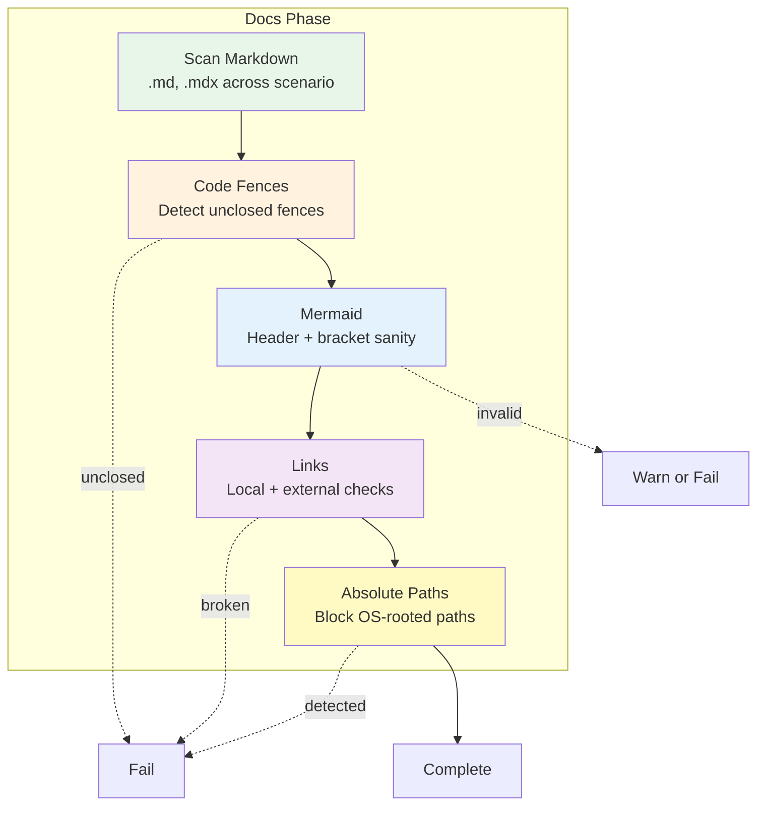

# Docs Phase

**ID**: `docs`  
**Timeout**: 60 seconds (default)  
**Optional**: No  
**Requires Runtime**: No

The docs phase validates Markdown health before any runtime-dependent tests run. It catches broken docs that block agents: malformed Markdown, invalid mermaid diagrams, broken links (local and external), and absolute filesystem paths that hurt portability.

## What Gets Validated



### Checks

| Check | Behavior |
|-------|----------|
| Markdown structure | Fails on unclosed fences; warns on empty/invalid mermaid in non-strict mode |
| Mermaid diagrams | Header validation (graph/flowchart/sequenceDiagram/etc) + bracket balance; strict mode fails, non-strict warns |
| Link integrity | Local paths must exist; external URLs are HTTP-checked with timeouts and ignores |
| Absolute paths | Reject OS-rooted paths (`/home/...`, `C:\...`) unless allowlisted |

## Configuration (`.vrooli/testing.json`)

```json
{
  "docs": {
    "markdown": { "enabled": true },
    "mermaid": { "enabled": true, "strict": true },
    "links": {
      "enabled": true,
      "ignore": ["http://localhost:*", "https://staging.example.com"],
      "max_concurrency": 6,
      "timeout_ms": 5000,
      "strict_external": false
    },
    "absolute_paths": {
      "enabled": true,
      "allow": ["/api/"]
    }
  }
}
```

| Option | Default | Description |
|--------|---------|-------------|
| `markdown.enabled` | `true` | Toggle Markdown scanning |
| `mermaid.enabled` | `true` | Toggle mermaid validation |
| `mermaid.strict` | `true` | Fail on invalid mermaid (warn only when `false`) |
| `links.enabled` | `true` | Toggle link validation |
| `links.ignore` | `[]` | Prefix/glob patterns to skip (localhost is ignored by default) |
| `links.max_concurrency` | `6` | Parallel external link checks |
| `links.timeout_ms` | `5000` | Per-request timeout |
| `links.strict_external` | `false` | Treat external timeouts/errors as failures (vs warnings) |
| `absolute_paths.enabled` | `true` | Toggle absolute filesystem path detection |
| `absolute_paths.allow` | `[]` | Allowlisted absolute prefixes |

## Exit Codes

| Code | Meaning |
|------|---------|
| 0 | Docs validation passed |
| 1 | Validation failed (broken links, invalid mermaid, unclosed fences, absolute paths) |

## Skips & Notes

- The phase runs for all scenarios with Markdown files; it is not optional.
- External link checks ignore localhost/127.0.0.1 by default to avoid false alarms from dev-only endpoints.
- Root-relative URLs (e.g., `/api/v1/health`) are permitted; only OS-rooted filesystem paths fail unless allowlisted.
