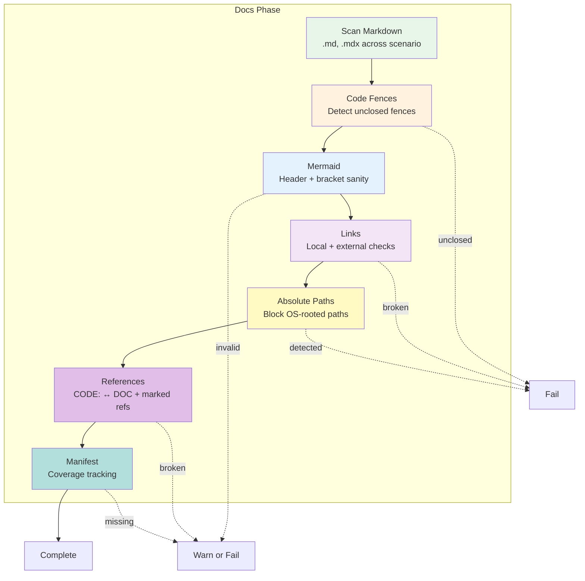

# Docs Phase

**ID**: `docs`
**Timeout**: 60 seconds (default)
**Optional**: No
**Requires Runtime**: No

The docs phase validates Markdown health before any runtime-dependent tests run. It catches broken docs that block agents: malformed Markdown, invalid mermaid diagrams, broken links (local and external), absolute filesystem paths that hurt portability, broken bidirectional code↔documentation references, and broken marked inline `path` / `doc` references.

This phase declares a [Phase Capability Contract](../../concepts/phase-capability-contract.md); the sections below follow the required remediation-doc skeleton.

## North Star

At maximum maturity the scenario's documentation is a **trustworthy, navigable knowledge surface an agent can act on without verification**: a scenario-owned docs contract and manifest that validate, every required doc present and correctly placed, readable and structurally sound Markdown, clean local links, and code/doc/marked references that resolve to real targets. The deepest agent-facing capabilities — `content_quality` and `reference_integrity` — reach their L3 "Advisory-ready" rung, meaning no maturity-blocking findings remain and the remaining debt is visible, triaged advisory rather than a trap that silently misleads a reader.

## The rungs and their gates

Each of the seven capabilities carries its own monotone L0→L3 ladder (L0 is uniformly "Blocked — the contract/content/links cannot be trusted"; each rung implies the one below).

| Capability | L1 | L2 | L3 top rung — North Star | Next unlock from L1 |
|---|---|---|---|---|
| `doc_contract` | Contract discoverable (readable) | Contract valid, fallback-tolerant | **Contract clean** — valid and scenario-owned | Make the docs manifest and all contract metadata schema-valid |
| `required_docs` | Required docs present | Placement managed | **Placement clean** — present, correctly placed, no residue | Retire temporary docs; register or remove extra docs |
| `append_log_integrity` | Append-log contracts valid | Append-log managed | **Append-log clean** — safe to use | Keep append-log contracts synced with target docs |
| `content_quality` | Content readable | Content managed | **Advisory-ready** — no maturity-blocking findings | Resolve markdown, Mermaid, absolute-path, and number findings |
| `link_health` | Local links healthy | Links managed | **Links clean** | Resolve or triage external link warnings and failures |
| `reference_integrity` | References resolvable | References managed | **Advisory-ready** — no maturity-blocking findings | Resolve partial/unknown marked-ref or command-snippet validation |
| `manifest_coverage` | Coverage present | Coverage managed | **Coverage clean** | Register orphaned docs or remove obsolete files |

## What each finding means

Each finding caps its capability at the named rung; only ERROR severities fail the phase (docs emits no BLOCKER), so broken references and links fail while quality/advisory debt stays non-failing.

| Code | Capability | Caps at | Severity | Fails phase? |
|---|---|---|---|---|
| `contract_missing` / `schema_violation` / `manifest_missing` / `invalid_contract_kind` | doc_contract | L1 | ERROR | **Yes** |
| `scenario_manifest_missing` | doc_contract | L2 | WARNING | No |
| `misplaced_doc` / `missing_doc` | required_docs | L1 | WARNING | No |
| `extra_doc` / `temporary_doc` | required_docs | L2 | INFO / WARNING | No |
| `append_log_missing_heading` / `append_log_invalid_fields` | append_log_integrity | L1 | ERROR | **Yes** |
| `file_read_error` | content_quality | L1 | ERROR | **Yes** |
| `markdown_unclosed_fence` | content_quality | L1 | WARNING | No |
| `mermaid_invalid` / `mermaid_unverified` / `absolute_path` / `unmarked_number` | content_quality | L2 | WARNING | No |
| `broken_local_link` | link_health | L1 | ERROR | **Yes** |
| `broken_link_parse` | link_health | L1 | WARNING | No |
| `external_link_warning` / `broken_external_link` | link_health | L2 | WARNING (advisory) | No |
| `broken_code_ref` / `broken_doc_ref` / `broken_marked_ref` | reference_integrity | L1 | ERROR | **Yes** |
| `unknown_marked_ref` / `unknown_cli_ref` / `unknown_command_snippet` | reference_integrity | L2 | WARNING/INFO (advisory) | No |
| `manifest_missing_doc` | manifest_coverage | L1 | ERROR | **Yes** |
| `manifest_orphaned_doc` | manifest_coverage | L2 | WARNING (advisory) | No |

## The canonical fix

- **Doc contract (`contract_missing`, `schema_load_error`, `schema_violation`, `manifest_missing`, `invalid_contract_*`, `missing_*` metadata, `scenario_manifest_missing`)** → resolve or author the scenario-owned `docs/manifest.json` and make its schema, kind, stage, maturity, and per-document metadata validate; promoting from template fallback to a scenario manifest is an ownership decision.
- **Required docs (`missing_doc`, `misplaced_doc`, `extra_doc`, `temporary_doc`)** → create missing docs with scenario-specific content, move misplaced docs to their contract paths (auto), and retire temporary docs or register/remove extra ones.
- **Append-log integrity (`append_log_missing_heading`, `append_log_invalid_fields`, `append_log_invalid_date_source`, `append_log_invalid_format`)** → align each append-log operation's target heading, fields, date source, and format with the document it writes to.
- **Content quality (`file_read_error`, `markdown_unclosed_fence`, `mermaid_invalid`, `mermaid_unverified`, `absolute_path`, `unmarked_number`, `number_marker_without_reason`)** → fix read errors and unclosed fences, correct Mermaid semantics; for `mermaid_unverified`, restore the parser engine rather than accepting an unverified result; replace OS-rooted absolute paths with portable references, and tag or remove derived numbers with a source-of-truth rationale.
- **Link health (`broken_local_link`, `broken_link_parse`, `external_link_warning`, `broken_external_link`)** → repair or remove broken local targets and malformed link syntax; triage external warnings (decide whether the source is still authoritative).
- **Reference integrity (`broken_code_ref`, `broken_doc_ref`, `broken_marked_ref`, `broken_command_snippet`, `unknown_*`, `partial_*`)** → point each broken code/doc/marked reference and command snippet at its correct current target, and register or rewrite unknown markers/CLI refs.
- **Manifest coverage (`manifest_missing_doc`, `manifest_orphaned_doc`)** → add missing docs or correct their manifest registration, and register orphaned Markdown or delete obsolete files.

## How to verify

```bash
# See the current rung, gaps, and next move for every docs capability:
knowledge-observatory validate scenario <scenario>

# Or drive it through Test Genie and read the per-phase scorecard:
test-genie execute <scenario> --phases docs
test-genie runs findings --scenario <scenario>
```

The `docs` line in the scorecard shows the current rung, the single highest-unlock next move, and a runnable doc-search topic that resolves back to the sections above.

## Pipeline Position

```
┌──────────┐  ┌──────────┐  ┌──────────┐  ┌────────┐  ┌──────────────────┐
│Structure │→ │Contracts │→ │   Deps   │→ │Quality │→ │      DOCS        │
│ weight:10│  │ weight:20│  │weight:30 │  │weight:50│  │   weight: 60     │
└──────────┘  └──────────┘  └──────────┘  └────────┘  └────────┬─────────┘
                                                               ↓
┌──────────┐  ┌──────────┐  ┌──────────┐  ┌──────────┐  ┌──────────┐
│  Smoke   │→ │   Unit   │→ │Integration│→ │Playbooks │→ │   Perf   │
└──────────┘  └──────────┘  └──────────┘  └──────────┘  └──────────┘
```

The docs phase runs BEFORE any runtime-dependent tests, acting as a quality gate for documentation health.

## What Gets Validated


```mermaid
graph TB
    subgraph "Docs Phase"
        SCAN[Scan Markdown<br/>.md, .mdx across scenario]
        FENCES[Code Fences<br/>Detect unclosed fences]
        MERMAID[Mermaid<br/>Header + bracket sanity]
        LINKS[Links<br/>Local + external checks]
        ABS[Absolute Paths<br/>Block OS-rooted paths]
        REFS[References<br/>CODE: ↔ DOC + marked refs]
        MANIFEST[Manifest<br/>Coverage tracking]
    end

    SCAN --> FENCES --> MERMAID --> LINKS --> ABS --> REFS --> MANIFEST --> DONE[Complete]

    FENCES -.->|unclosed| FAIL[Fail]
    MERMAID -.->|invalid| WARN[Warn or Fail]
    LINKS -.->|broken| FAIL
    ABS -.->|detected| FAIL
    REFS -.->|broken| WARN[Warn or Fail]
    MANIFEST -.->|missing| WARN

    style SCAN fill:#e8f5e9
    style FENCES fill:#fff3e0
    style MERMAID fill:#e3f2fd
    style LINKS fill:#f3e5f5
    style ABS fill:#fff9c4
    style REFS fill:#e1bee7
    style MANIFEST fill:#b2dfdb
```

The docs phase performs 6 validation checks:

| Check | Behavior | Default |
|-------|----------|---------|
| Markdown structure | Fails on unclosed code fences | Enabled |
| Mermaid diagrams | Header + bracket validation; strict mode fails, non-strict warns | Enabled (strict) |
| Link integrity | Local paths must exist; external URLs HTTP-checked | Enabled |
| Absolute paths | Reject OS-rooted paths unless allowlisted | Enabled |
| **Bidirectional refs** | Validate `[CODE: ...]` in docs and `// DOC:` in code | Enabled (warn) |
| **Marked refs** | Validate required `path:...` and `doc:...` inline refs | Enabled (warn) |
| **Manifest coverage** | Track docs registered in `docs/manifest.json` | Disabled |

## Bidirectional Reference Validation

The docs phase validates bidirectional references between code and documentation:

```
     DOCUMENTATION                              CODE
┌───────────────────────┐              ┌───────────────────────┐
│  docs/guide.md        │              │  src/server.go        │
│                       │   validates  │                       │
│  See the server code: │◄────────────►│  // DOC: docs/guide.md│
│  [CODE: src/server.go │              │  func StartServer() { │
│         #StartServer] │              │      ...              │
└───────────────────────┘              └───────────────────────┘
```

**Supported formats:**

| In Documentation | In Code |
|------------------|---------|
| `[CODE: path/file.ext]` | `// DOC: docs/file.md` |
| `[CODE: path/file.ext#Function]` | `/* DOC: docs/file.md */` |
| `[CODE: path/file.ext:42]` | `# DOC: docs/file.md#section` |

Marked inline references use the project-level syntax from `docs/reference/machine-readable-references.md`. Test Genie validates required `path` and `doc` refs against the scenario directory:

| Syntax | Behavior |
|--------|----------|
| `` `path:src/main.go` `` | Target file or directory must exist |
| `` `doc:docs/guide.md#section` `` | Target `.md` / `.mdx` file must exist |
| `` `path[example]:missing.go` `` | Parsed and counted, but current existence is not required |
| `` `topic:team/foo` `` | Parsed and skipped by Test Genie; prompt-manager owns topic validation |

### Checks

## Configuration (`.vrooli/testing.json`)

```json
{
  "docs": {
    "markdown": { "enabled": true },
    "mermaid": { "enabled": true, "strict": true },
    "links": {
      "enabled": true,
      "ignore": ["http://localhost:*", "https://staging.example.com"],
      "max_concurrency": 6,
      "timeout_ms": 5000,
      "strict_external": false
    },
    "absolute_paths": {
      "enabled": true,
      "allow": ["/api/"]
    },
    "paths": {
      "exclude_dirs": ["archive"],
      "exclude_globs": ["ideas/*-archived/**"]
    },
    "references": {
      "enabled": true,
      "validate_code_refs": true,
      "validate_doc_refs": true,
      "validate_marked_refs": true,
      "code_extensions": [".ts", ".tsx", ".js", ".jsx", ".go", ".py", ".rs", ".java", ".kt"],
      "strict": false,
      "skip_dirs": ["generated"]
    },
    "manifest": {
      "enabled": false,
      "require_all_docs_registered": false,
      "manifest_path": "docs/manifest.json"
    }
  }
}
```

| Option | Default | Description |
|--------|---------|-------------|
| `markdown.enabled` | `true` | Toggle Markdown scanning |
| `mermaid.enabled` | `true` | Toggle mermaid validation |
| `mermaid.strict` | `true` | Fail on invalid mermaid (warn only when `false`) |
| `links.enabled` | `true` | Toggle link validation |
| `links.ignore` | `[]` | Prefix/glob patterns to skip (localhost is ignored by default) |
| `links.max_concurrency` | `6` | Parallel external link checks |
| `links.timeout_ms` | `5000` | Per-request timeout |
| `links.strict_external` | `false` | Treat external timeouts/errors as failures (vs warnings) |
| `absolute_paths.enabled` | `true` | Toggle absolute filesystem path detection |
| `absolute_paths.allow` | `[]` | Allowlisted absolute prefixes |
| `paths.exclude_dirs` | `[]` | Exclude directories by name or relative path prefix from docs scanning |
| `paths.exclude_globs` | `[]` | Exclude scenario-relative path globs (supports `**`) from docs scanning |
| `references.enabled` | `true` | Toggle bidirectional reference validation |
| `references.validate_code_refs` | `true` | Check `[CODE: ...]` references in docs |
| `references.validate_doc_refs` | `true` | Check `// DOC:` comments in code |
| `references.validate_marked_refs` | `true` | Check required marked `path` and `doc` refs in docs |
| `references.code_extensions` | `[".ts", ".go", ...]` | File extensions to scan for DOC: comments |
| `references.strict` | `false` | Fail on broken references (warn only when `false`) |
| `references.skip_dirs` | `[]` | Additional directories to skip when scanning code |
| `manifest.enabled` | `false` | Toggle manifest coverage checking |
| `manifest.require_all_docs_registered` | `false` | Warn when docs exist but aren't in manifest |
| `manifest.manifest_path` | `"docs/manifest.json"` | Path to the manifest file |

## Exit Codes

| Code | Meaning |
|------|---------|
| 0 | Docs validation passed |
| 1 | Validation failed (broken links, invalid mermaid, unclosed fences, absolute paths) |

## Skips & Notes

- The phase runs for all scenarios with Markdown files; it is not optional.
- External link checks ignore localhost/127.0.0.1 by default to avoid false alarms from dev-only endpoints.
- Root-relative URLs (e.g., `/api/v1/health`) are permitted; only OS-rooted filesystem paths fail unless allowlisted.
- Bidirectional reference validation skips common directories (node_modules, dist, .git, etc.) by default.
- Use `docs.paths.exclude_globs` for archived snapshots (for example `ideas/*-archived/**`) so active docs remain strict without historical-link noise.

## Implementation

The docs phase is a **thin shared validation client**: it calls
`knowledge-observatory`'s `ScenarioValidationService.ValidateScenario` and
maps the returned `assessment.findings` into Test Genie observations and
architecture findings. Knowledge Observatory packs its native `DocHealthResponse`
into `native_detail` for its own CLI/UI. There is no inline validation in
test-genie — every markdown / mermaid / link / path / reference / manifest
check lives in knowledge-observatory.

If knowledge-observatory is unreachable, the docs phase fails fast with
`FailureClassMissingDependency`. There is no fallback.

- [CODE: api/internal/orchestrator/phases/phase_validationprovider.go#runDocsPhase] - Docs registration for the generic provider runner
- [CODE: api/internal/orchestrator/phases/validationprovider/provider.go] - Shared provider runner and assessment mapping
- See knowledge-observatory's `api/internal/services/dochealth/` for the validators themselves.

## Summary Metrics

The phase returns a `Summary` struct with these metrics:

| Metric | Description |
|--------|-------------|
| `filesChecked` | Total Markdown files scanned |
| `localLinks` / `externalLinks` | Links found by type |
| `brokenLinks` | Failed local or external links |
| `mermaidValidated` / `mermaidFailures` | Mermaid diagram results |
| `markdownWarnings` / `markdownFailures` | Markdown syntax issues |
| `absolutePathHits` / `absoluteFailures` | Absolute path detections |
| `codeRefsFound` / `codeRefsBroken` | `[CODE: ...]` reference results |
| `docRefsFound` / `docRefsBroken` | `// DOC:` comment results |
| `codeFilesScanned` | Code files scanned for DOC: comments |
| `markedRefsFound` / `markedRefsBroken` | Marked inline reference results |
| `markedRefsSkipped` / `markedRefsUnknown` | Marked refs skipped by qualifier/domain and refs with unknown markers |
| `docsInManifest` / `docsNotInManifest` | Manifest coverage |
