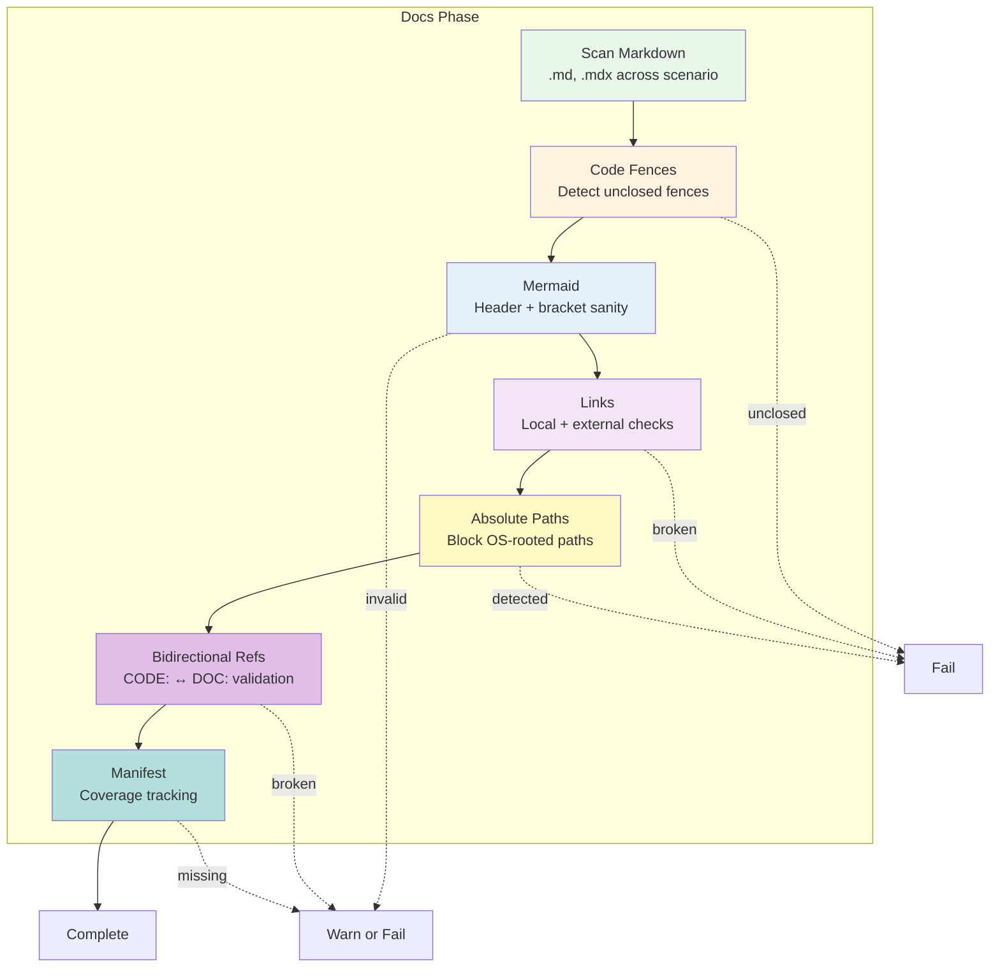

# Docs Phase

**ID**: `docs`
**Timeout**: 60 seconds (default)
**Optional**: No
**Requires Runtime**: No

The docs phase validates Markdown health before any runtime-dependent tests run. It catches broken docs that block agents: malformed Markdown, invalid mermaid diagrams, broken links (local and external), absolute filesystem paths that hurt portability, and broken bidirectional code↔documentation references.

## Pipeline Position

```
┌──────────┐  ┌──────────┐  ┌──────────┐  ┌────────┐  ┌──────────────────┐
│Structure │→ │Standards │→ │   Deps   │→ │  Lint  │→ │      DOCS        │
│ weight:10│  │ weight:20│  │weight:30 │  │weight:50│  │   weight: 60     │
└──────────┘  └──────────┘  └──────────┘  └────────┘  └────────┬─────────┘
                                                               ↓
┌──────────┐  ┌──────────┐  ┌──────────┐  ┌──────────┐  ┌──────────┐
│  Smoke   │→ │   Unit   │→ │Integration│→ │Playbooks │→ │   Perf   │
└──────────┘  └──────────┘  └──────────┘  └──────────┘  └──────────┘
```

The docs phase runs BEFORE any runtime-dependent tests, acting as a quality gate for documentation health.

## What Gets Validated


```mermaid
graph TB
    subgraph "Docs Phase"
        SCAN[Scan Markdown<br/>.md, .mdx across scenario]
        FENCES[Code Fences<br/>Detect unclosed fences]
        MERMAID[Mermaid<br/>Header + bracket sanity]
        LINKS[Links<br/>Local + external checks]
        ABS[Absolute Paths<br/>Block OS-rooted paths]
        REFS[Bidirectional Refs<br/>CODE: ↔ DOC: validation]
        MANIFEST[Manifest<br/>Coverage tracking]
    end

    SCAN --> FENCES --> MERMAID --> LINKS --> ABS --> REFS --> MANIFEST --> DONE[Complete]

    FENCES -.->|unclosed| FAIL[Fail]
    MERMAID -.->|invalid| WARN[Warn or Fail]
    LINKS -.->|broken| FAIL
    ABS -.->|detected| FAIL
    REFS -.->|broken| WARN[Warn or Fail]
    MANIFEST -.->|missing| WARN

    style SCAN fill:#e8f5e9
    style FENCES fill:#fff3e0
    style MERMAID fill:#e3f2fd
    style LINKS fill:#f3e5f5
    style ABS fill:#fff9c4
    style REFS fill:#e1bee7
    style MANIFEST fill:#b2dfdb
```

The docs phase performs 6 validation checks:

| Check | Behavior | Default |
|-------|----------|---------|
| Markdown structure | Fails on unclosed code fences | Enabled |
| Mermaid diagrams | Header + bracket validation; strict mode fails, non-strict warns | Enabled (strict) |
| Link integrity | Local paths must exist; external URLs HTTP-checked | Enabled |
| Absolute paths | Reject OS-rooted paths unless allowlisted | Enabled |
| **Bidirectional refs** | Validate `[CODE: ...]` in docs and `// DOC:` in code | Enabled (warn) |
| **Manifest coverage** | Track docs registered in `docs/manifest.json` | Disabled |

## Bidirectional Reference Validation

The docs phase validates bidirectional references between code and documentation:

```
     DOCUMENTATION                              CODE
┌───────────────────────┐              ┌───────────────────────┐
│  docs/guide.md        │              │  src/server.go        │
│                       │   validates  │                       │
│  See the server code: │◄────────────►│  // DOC: docs/guide.md│
│  [CODE: src/server.go │              │  func StartServer() { │
│         #StartServer] │              │      ...              │
└───────────────────────┘              └───────────────────────┘
```

**Supported formats:**

| In Documentation | In Code |
|------------------|---------|
| `[CODE: path/file.ext]` | `// DOC: docs/file.md` |
| `[CODE: path/file.ext#Function]` | `/* DOC: docs/file.md */` |
| `[CODE: path/file.ext:42]` | `# DOC: docs/file.md#section` |

### Checks

## Configuration (`.vrooli/testing.json`)

```json
{
  "docs": {
    "markdown": { "enabled": true },
    "mermaid": { "enabled": true, "strict": true },
    "links": {
      "enabled": true,
      "ignore": ["http://localhost:*", "https://staging.example.com"],
      "max_concurrency": 6,
      "timeout_ms": 5000,
      "strict_external": false
    },
    "absolute_paths": {
      "enabled": true,
      "allow": ["/api/"]
    },
    "references": {
      "enabled": true,
      "validate_code_refs": true,
      "validate_doc_refs": true,
      "code_extensions": [".ts", ".tsx", ".js", ".jsx", ".go", ".py", ".rs", ".java", ".kt"],
      "strict": false,
      "skip_dirs": ["generated"]
    },
    "manifest": {
      "enabled": false,
      "require_all_docs_registered": false,
      "manifest_path": "docs/manifest.json"
    }
  }
}
```

| Option | Default | Description |
|--------|---------|-------------|
| `markdown.enabled` | `true` | Toggle Markdown scanning |
| `mermaid.enabled` | `true` | Toggle mermaid validation |
| `mermaid.strict` | `true` | Fail on invalid mermaid (warn only when `false`) |
| `links.enabled` | `true` | Toggle link validation |
| `links.ignore` | `[]` | Prefix/glob patterns to skip (localhost is ignored by default) |
| `links.max_concurrency` | `6` | Parallel external link checks |
| `links.timeout_ms` | `5000` | Per-request timeout |
| `links.strict_external` | `false` | Treat external timeouts/errors as failures (vs warnings) |
| `absolute_paths.enabled` | `true` | Toggle absolute filesystem path detection |
| `absolute_paths.allow` | `[]` | Allowlisted absolute prefixes |
| `references.enabled` | `true` | Toggle bidirectional reference validation |
| `references.validate_code_refs` | `true` | Check `[CODE: ...]` references in docs |
| `references.validate_doc_refs` | `true` | Check `// DOC:` comments in code |
| `references.code_extensions` | `[".ts", ".go", ...]` | File extensions to scan for DOC: comments |
| `references.strict` | `false` | Fail on broken references (warn only when `false`) |
| `references.skip_dirs` | `[]` | Additional directories to skip when scanning code |
| `manifest.enabled` | `false` | Toggle manifest coverage checking |
| `manifest.require_all_docs_registered` | `false` | Warn when docs exist but aren't in manifest |
| `manifest.manifest_path` | `"docs/manifest.json"` | Path to the manifest file |

## Exit Codes

| Code | Meaning |
|------|---------|
| 0 | Docs validation passed |
| 1 | Validation failed (broken links, invalid mermaid, unclosed fences, absolute paths) |

## Skips & Notes

- The phase runs for all scenarios with Markdown files; it is not optional.
- External link checks ignore localhost/127.0.0.1 by default to avoid false alarms from dev-only endpoints.
- Root-relative URLs (e.g., `/api/v1/health`) are permitted; only OS-rooted filesystem paths fail unless allowlisted.
- Bidirectional reference validation skips common directories (node_modules, dist, .git, etc.) by default.

## Implementation

The docs phase is implemented in:
- [CODE: api/internal/docs/runner.go#Run] - Main validation orchestration
- [CODE: api/internal/docs/config.go#Settings] - Configuration model and defaults
- [CODE: api/internal/docs/types.go#Summary] - Result metrics and types

## Summary Metrics

The phase returns a `Summary` struct with these metrics:

| Metric | Description |
|--------|-------------|
| `filesChecked` | Total Markdown files scanned |
| `localLinks` / `externalLinks` | Links found by type |
| `brokenLinks` | Failed local or external links |
| `mermaidValidated` / `mermaidFailures` | Mermaid diagram results |
| `markdownWarnings` / `markdownFailures` | Markdown syntax issues |
| `absolutePathHits` / `absoluteFailures` | Absolute path detections |
| `codeRefsFound` / `codeRefsBroken` | `[CODE: ...]` reference results |
| `docRefsFound` / `docRefsBroken` | `// DOC:` comment results |
| `codeFilesScanned` | Code files scanned for DOC: comments |
| `docsInManifest` / `docsNotInManifest` | Manifest coverage |
