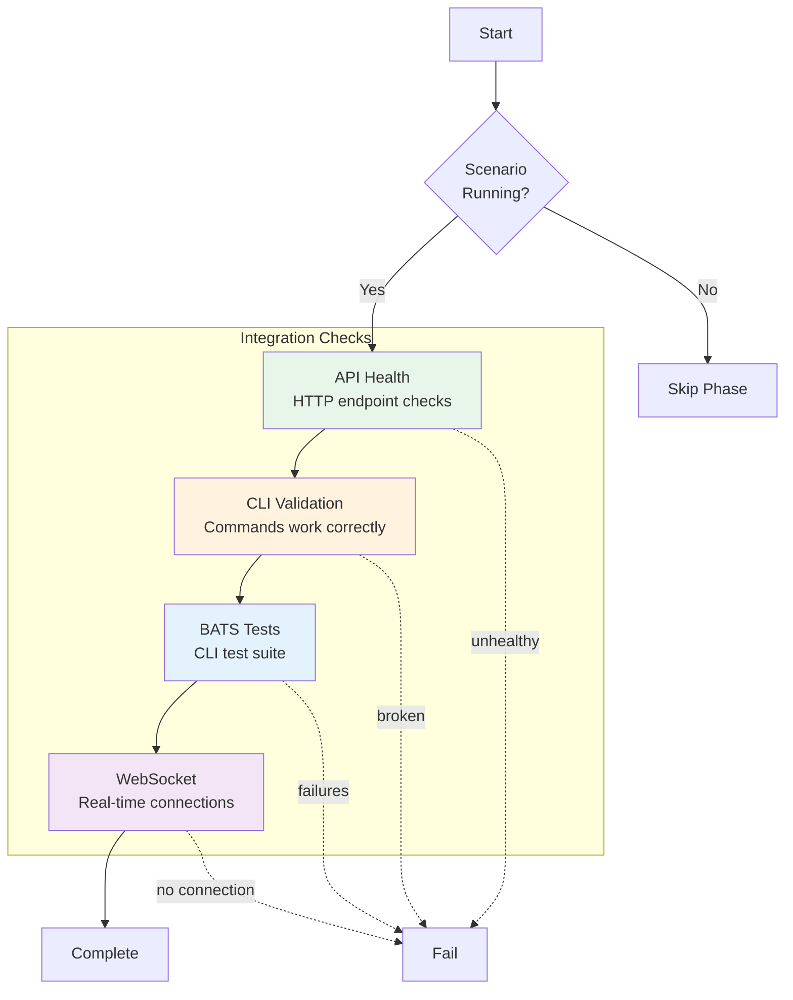

# Integration Phase

**ID**: `integration`
**Timeout**: 120 seconds
**Optional**: Yes (when runtime not available)
**Requires Runtime**: Yes

The integration phase tests component interactions with a running scenario. It validates API endpoints, CLI functionality, WebSocket connections, and cross-component communication.

## What Gets Tested



## Runtime Requirement

The integration phase requires the scenario to be running:

```bash
# Start scenario first
vrooli scenario start my-scenario

# Then run integration tests
test-genie execute my-scenario --phases integration
```

If the scenario isn't running, the phase is skipped (exit code 2).

## API Health Checks

Validates that API endpoints respond correctly:

- Health endpoint returns 200
- Response time within threshold (default: 1000ms)
- Expected response format

The API URL is automatically detected from:
1. Lifecycle metadata (`~/.vrooli/processes/scenarios/<name>/start-api.json`)
2. Environment variables configured in `service.json`

## CLI Validation

Checks CLI functionality:

| Check | Command | Expected |
|-------|---------|----------|
| Binary exists | `which <cli>` | Found in PATH |
| Help works | `<cli> help` | Shows usage |
| Version works | `<cli> version` | Shows version with "version" in output |

## BATS Test Execution

Runs BATS test files from `cli/*.bats`:

```bash
bats cli/*.bats --tap
```

See [CLI Testing with BATS](cli-testing.md) for writing effective CLI tests.

## WebSocket Validation

Validates WebSocket connectivity for scenarios with real-time features.

### How WebSocket URL is Derived

WebSocket URLs are **derived from the API URL** following the pattern established by `@vrooli/api-base`. This is because scenarios typically proxy WebSocket connections through the same server as HTTP requests:

```
API URL:       http://localhost:8080
WebSocket URL: ws://localhost:8080/api/v1/ws  (derived)
```

The derivation process:
1. **Protocol conversion**: `http://` → `ws://`, `https://` → `wss://`
2. **Path appended**: API URL + configured WebSocket path

This follows the `@vrooli/api-base` architecture where the UI server's `proxyWebSocketUpgrade()` function proxies WebSocket connections to the API server.

**Reference**: See `packages/api-base/docs/concepts/websocket-support.md` for the full WebSocket architecture.

### Configuration

Configure WebSocket validation in `.vrooli/testing.json`:

```json
{
  "integration": {
    "websocket": {
      "enabled": true,
      "path": "/api/v1/ws",
      "max_connection_ms": 2000
    }
  }
}
```

| Field | Description | Default |
|-------|-------------|---------|
| `enabled` | Whether to run WebSocket validation | `true` (if path is set) |
| `path` | WebSocket endpoint path (appended to API URL) | (none - skips if empty) |
| `max_connection_ms` | Maximum connection time in milliseconds | 2000 |

### When WebSocket Validation Runs

WebSocket validation only runs when:
1. The scenario is running (API URL is detected)
2. A `websocket.path` is configured in `testing.json`
3. `websocket.enabled` is not explicitly set to `false`

If any of these conditions are not met, WebSocket validation is gracefully skipped.

### Example: Scenario with WebSocket Support

For a chat scenario using `@vrooli/api-base`:

**`.vrooli/testing.json`**:
```json
{
  "integration": {
    "api": {
      "health_endpoint": "/health",
      "max_response_ms": 1000
    },
    "websocket": {
      "enabled": true,
      "path": "/api/v1/ws",
      "max_connection_ms": 3000
    }
  }
}
```

**What happens**:
1. API health check: `GET http://localhost:8080/health`
2. WebSocket validation: `ws://localhost:8080/api/v1/ws` (derived from API URL)

## Exit Codes

| Code | Meaning |
|------|---------|
| 0 | All integration tests pass |
| 1 | Integration failures |
| 2 | Skipped (runtime not available) |

## Full Configuration Reference

```json
{
  "integration": {
    "api": {
      "health_endpoint": "/health",
      "max_response_ms": 1000
    },
    "websocket": {
      "enabled": true,
      "path": "/api/v1/ws",
      "max_connection_ms": 2000
    }
  }
}
```

| Section | Field | Description | Default |
|---------|-------|-------------|---------|
| `api` | `health_endpoint` | Health check path | `/health` |
| `api` | `max_response_ms` | Max response time (ms) | 1000 |
| `websocket` | `enabled` | Enable WebSocket checks | `true` if path set |
| `websocket` | `path` | WebSocket endpoint path | (none) |
| `websocket` | `max_connection_ms` | Max connection time (ms) | 2000 |

## Related Documentation

- [CLI Testing with BATS](cli-testing.md) - Writing CLI tests
- [@vrooli/api-base WebSocket Support](/packages/api-base/docs/concepts/websocket-support.md) - WebSocket architecture

## See Also

- [Phases Overview](../README.md) - All phases
- [Unit Phase](../unit/README.md) - Previous phase
- [Playbooks Phase](../playbooks/README.md) - Next phase
