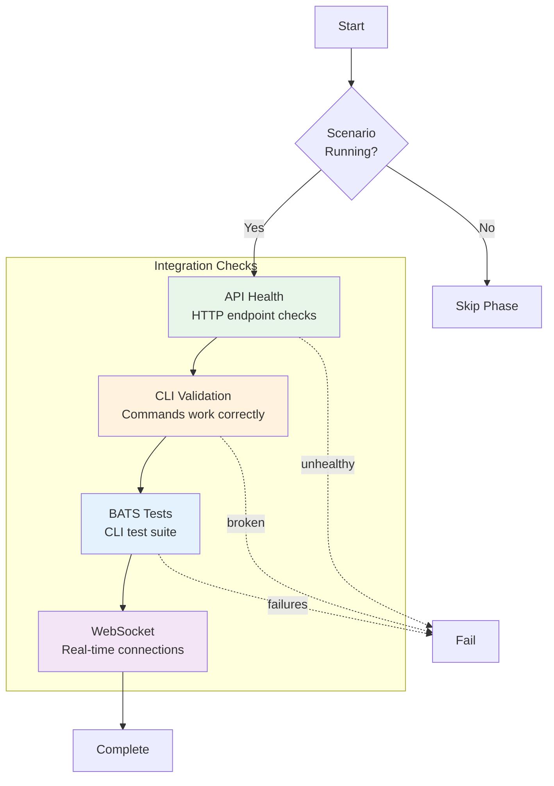

# Integration Phase

**ID**: `integration`
**Timeout**: 120 seconds
**Optional**: Yes (when runtime not available)
**Requires Runtime**: Yes

The integration phase tests component interactions with a running scenario. It validates API endpoints, CLI functionality, and cross-component communication.

## What Gets Tested



## Runtime Requirement

The integration phase requires the scenario to be running:

```bash
# Start scenario first
vrooli scenario start my-scenario

# Then run integration tests
test-genie execute my-scenario --phases integration
```

If the scenario isn't running, the phase is skipped (exit code 2).

## API Health Checks

Validates that API endpoints respond correctly:

- Health endpoint returns 200
- Response time within threshold
- Expected response format

## CLI Validation

Checks CLI functionality:

| Check | Command | Expected |
|-------|---------|----------|
| Binary exists | `which <cli>` | Found in PATH |
| Help works | `<cli> --help` | Shows usage |
| Version works | `<cli> --version` | Shows version |

## BATS Test Execution

Runs BATS test files from `cli/*.bats`:

```bash
bats test/cli/*.bats --tap
```

See [CLI Testing with BATS](cli-testing.md) for writing effective CLI tests.

## Exit Codes

| Code | Meaning |
|------|---------|
| 0 | All integration tests pass |
| 1 | Integration failures |
| 2 | Skipped (runtime not available) |

## Configuration

```json
{
  "phases": {
    "integration": {
      "timeout": 180,
      "api": {
        "healthEndpoint": "/health",
        "maxResponseMs": 1000
      },
      "cli": {
        "skipBats": false
      }
    }
  }
}
```

## Related Documentation

- [CLI Testing with BATS](cli-testing.md) - Writing CLI tests

## See Also

- [Phases Overview](../README.md) - All phases
- [Unit Phase](../unit/README.md) - Previous phase
- [Playbooks Phase](../playbooks/README.md) - Next phase
