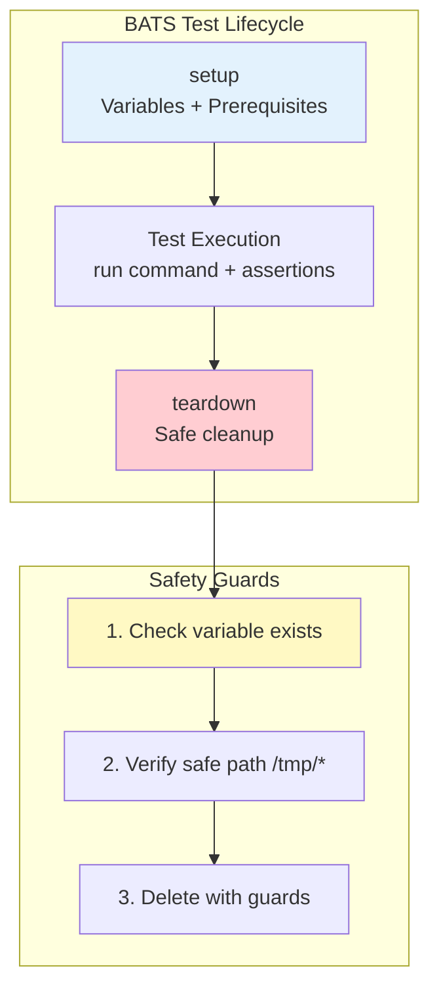

# CLI Testing with BATS

> **⚠️ WARNING**: CLI tests using BATS have unique safety risks. A misconfigured teardown can delete your entire project. Read the safety section below carefully before proceeding.

## Overview



## What is BATS?

BATS (Bash Automated Testing System) is a testing framework for Bash scripts and command-line applications. It's the standard for CLI testing in Vrooli.

## Installation

```bash
# Via npm (recommended)
npm install -g bats

# Via package manager
apt-get install bats        # Debian/Ubuntu
brew install bats-core       # macOS
```

## BATS Test Structure

```bash
#!/usr/bin/env bats

# Runs before EACH test
setup() {
    # Setup code here
}

# Runs after EACH test (even if skipped!)
teardown() {
    # Cleanup code here
}

@test "description of test" {
    # Test commands here
    run my-command
    [ "$status" -eq 0 ]
    [[ "$output" =~ "expected" ]]
}
```

## ⚠️ Critical Safety Rules

### Rule 1: Variable Order in setup()

```bash
# ✅ CORRECT - Variables BEFORE skip
setup() {
    export TEST_DIR="/tmp/test-$$"
    export TEST_FILE="/tmp/test-file-$$"
    
    if ! command -v my-cli >/dev/null 2>&1; then
        skip "CLI not installed"
    fi
}

# ❌ WRONG - Variables AFTER skip (never set if skipped!)
setup() {
    if ! command -v my-cli >/dev/null 2>&1; then
        skip "CLI not installed"
    fi
    export TEST_DIR="/tmp/test-$$"  # Never reached!
}
```

### Rule 2: Safe teardown()

```bash
# ✅ SAFE - Multiple guards
teardown() {
    # Guard 1: Check variable exists
    if [ -n "${TEST_DIR:-}" ]; then
        # Guard 2: Verify safe path
        case "$TEST_DIR" in
            /tmp/*)
                rm -rf "$TEST_DIR" 2>/dev/null || true
                ;;
            *)
                echo "WARNING: Unsafe path $TEST_DIR" >&2
                ;;
        esac
    fi
}

# ❌ DANGEROUS - Can delete everything!
teardown() {
    rm -rf "$TEST_DIR"/*  # If TEST_DIR is empty = rm -rf /*
}
```

## Complete Safe Template

```bash
#!/usr/bin/env bats

# Test configuration
readonly CLI_NAME="my-cli"
readonly TEST_TIMEOUT=5

setup() {
    # 1. ALWAYS set variables FIRST
    export TEST_DIR="/tmp/${CLI_NAME}-test-$$"
    export TEST_FILE="/tmp/${CLI_NAME}-test-file-$$"
    export API_PORT="${API_PORT:-8080}"
    
    # 2. Check prerequisites AFTER variables
    if ! command -v "$CLI_NAME" >/dev/null 2>&1; then
        skip "$CLI_NAME not installed"
    fi
    
    # 3. Create test environment
    mkdir -p "$TEST_DIR"
    echo "test data" > "$TEST_FILE"
}

teardown() {
    # Safe cleanup with multiple guards
    local paths=("$TEST_DIR" "$TEST_FILE")
    
    for path in "${paths[@]}"; do
        if [ -n "${path:-}" ] && [ -e "$path" ]; then
            case "$path" in
                /tmp/*)
                    rm -rf "$path" 2>/dev/null || true
                    ;;
                *)
                    echo "WARNING: Refusing to delete $path (not in /tmp)" >&2
                    ;;
            esac
        fi
    done
}

# Helper functions
service_running() {
    timeout 3 curl -sf "http://localhost:${API_PORT}/health" >/dev/null 2>&1
}

is_valid_json() {
    echo "$1" | jq . >/dev/null 2>&1
}

# Basic tests
@test "CLI shows version" {
    run $CLI_NAME --version
    [ "$status" -eq 0 ]
    [[ "$output" =~ "v[0-9]+\.[0-9]+\.[0-9]+" ]]
}

@test "CLI shows help" {
    run $CLI_NAME --help
    [ "$status" -eq 0 ]
    [[ "$output" =~ "Usage:" ]]
    [[ "$output" =~ "Commands:" ]]
}

@test "CLI handles invalid command" {
    run $CLI_NAME nonexistent-command
    [ "$status" -ne 0 ]
    [[ "$output" =~ "Error" ]] || [[ "$output" =~ "Unknown" ]]
}

# File operations
@test "CLI processes input file" {
    echo "input data" > "$TEST_DIR/input.txt"
    
    run $CLI_NAME process "$TEST_DIR/input.txt"
    [ "$status" -eq 0 ]
    [ -f "$TEST_DIR/output.txt" ]
    
    output_content=$(cat "$TEST_DIR/output.txt")
    [[ "$output_content" =~ "processed" ]]
}

# API integration
@test "CLI connects to API" {
    if ! service_running; then
        skip "API service not running"
    fi
    
    run $CLI_NAME status
    [ "$status" -eq 0 ]
    [[ "$output" =~ "connected" ]]
}

# JSON output
@test "CLI returns valid JSON with --json flag" {
    run $CLI_NAME list --json
    [ "$status" -eq 0 ]
    is_valid_json "$output"
}

# Error handling
@test "CLI handles missing required arguments" {
    run $CLI_NAME process
    [ "$status" -ne 0 ]
    [[ "$output" =~ "required" ]] || [[ "$output" =~ "missing" ]]
}

@test "CLI handles non-existent file gracefully" {
    run $CLI_NAME process "/nonexistent/file.txt"
    [ "$status" -ne 0 ]
    [[ "$output" =~ "not found" ]] || [[ "$output" =~ "does not exist" ]]
}

# Timeout handling
@test "CLI respects timeout" {
    run timeout "$TEST_TIMEOUT" $CLI_NAME long-running-command
    # Check if timed out (124) or completed
    [ "$status" -eq 124 ] || [ "$status" -eq 0 ]
}
```

## Running BATS Tests

```bash
# Run single test file
bats test/cli/my-cli.bats

# Run all BATS tests
bats test/cli/*.bats

# Run with TAP output (for CI/CD)
bats --tap test/cli/*.bats

# Run specific test by name
bats test/cli/my-cli.bats --filter "shows version"

# Verbose output for debugging
bats -v test/cli/my-cli.bats
```

## BATS Assertions

```bash
# Check exit status
[ "$status" -eq 0 ]           # Success
[ "$status" -ne 0 ]           # Failure

# Check output contains text
[[ "$output" =~ "pattern" ]]  # Regex match
[[ "$output" == "exact" ]]    # Exact match
[[ "$output" != "text" ]]     # Not equal

# Check output lines
[ "${lines[0]}" = "first line" ]
[ "${#lines[@]}" -eq 5 ]      # 5 lines of output

# File checks
[ -f "$file" ]                 # File exists
[ -d "$dir" ]                  # Directory exists
[ -s "$file" ]                 # File not empty
[ -x "$file" ]                 # File executable

# Numeric comparisons
[ "$count" -gt 10 ]            # Greater than
[ "$count" -le 20 ]            # Less than or equal
```

## Advanced Patterns

### Testing with Mock Data

```bash
@test "CLI processes complex data" {
    # Create mock data
    cat > "$TEST_DIR/mock.json" <<EOF
{
    "users": [
        {"id": 1, "name": "Alice"},
        {"id": 2, "name": "Bob"}
    ]
}
EOF
    
    run $CLI_NAME import "$TEST_DIR/mock.json"
    [ "$status" -eq 0 ]
    [[ "$output" =~ "2 users imported" ]]
}
```

### Testing Interactive Commands

```bash
@test "CLI handles interactive input" {
    # Use echo to provide input
    echo "yes" | run $CLI_NAME delete --confirm
    [ "$status" -eq 0 ]
    [[ "$output" =~ "deleted" ]]
}
```

### Testing with Environment Variables

```bash
@test "CLI respects environment variables" {
    API_URL="http://custom:9999" run $CLI_NAME config
    [ "$status" -eq 0 ]
    [[ "$output" =~ "custom:9999" ]]
}
```

### Conditional Tests

```bash
@test "CLI premium features (if available)" {
    if [ -z "$PREMIUM_LICENSE" ]; then
        skip "Premium features not licensed"
    fi
    
    run $CLI_NAME premium-feature
    [ "$status" -eq 0 ]
}
```

## Common Pitfalls

### 1. Forgetting quotes around variables
```bash
# ❌ WRONG - Breaks with spaces
run $CLI_NAME process $file_with_spaces

# ✅ CORRECT
run $CLI_NAME process "$file_with_spaces"
```

### 2. Not handling service dependencies
```bash
# ✅ CORRECT - Check service before testing
@test "API integration" {
    if ! service_running; then
        skip "Service not running"
    fi
    # ... rest of test
}
```

### 3. Assuming test order
```bash
# ❌ WRONG - Tests run in isolation
@test "step 1" {
    echo "data" > /tmp/shared.txt
}

@test "step 2" {
    cat /tmp/shared.txt  # May not exist!
}

# ✅ CORRECT - Each test is independent
@test "complete workflow" {
    echo "data" > "$TEST_DIR/data.txt"
    run $CLI_NAME process "$TEST_DIR/data.txt"
    [ -f "$TEST_DIR/output.txt" ]
}
```

## Debugging BATS Tests

```bash
# Run with trace output
bash -x test/cli/my-cli.bats

# Add debug output in tests
@test "debugging example" {
    echo "Debug: TEST_DIR=$TEST_DIR" >&3
    run $CLI_NAME process "$TEST_DIR/file"
    echo "Debug: status=$status" >&3
    echo "Debug: output=$output" >&3
    [ "$status" -eq 0 ]
}

# Run single test for debugging
bats test/cli/my-cli.bats --filter "debugging example"
```

## Integration with CI/CD

```yaml
# .github/workflows/test.yml
name: CLI Tests
on: [push, pull_request]

jobs:
  test:
    runs-on: ubuntu-latest
    steps:
      - uses: actions/checkout@v4

      - name: Install BATS
        run: npm install -g bats

      - name: Run CLI tests via test-genie
        run: |
          # Run comprehensive tests which include CLI BATS tests
          test-genie execute my-scenario --preset comprehensive

          # Or run BATS directly
          bats --tap test/cli/*.bats
```

## Best Practices

1. **Safety First**: Always validate variables before using in destructive operations
2. **Isolation**: Each test should be independent and idempotent
3. **Clarity**: Use descriptive test names that explain what's being tested
4. **Coverage**: Test success paths, error conditions, and edge cases
5. **Performance**: Keep individual tests under 5 seconds
6. **Documentation**: Comment complex test logic
7. **Helpers**: Extract common patterns into helper functions

## See Also

### Related Guides
- [Integration Phase](README.md) - Integration phase overview
- [Phases Overview](../README.md) - 11-phase architecture
- [Scenario Unit Testing](../unit/scenario-unit-testing.md) - Testing application code
- [UI Testability](../../guides/ui-testability.md) - Testing UI components

### Reference
- [Test Runners](../unit/test-runners.md) - All test runner documentation
- [Presets](../../reference/presets.md) - Test preset configurations

### External Resources
- [BATS Official Docs](https://bats-core.readthedocs.io/) - External framework documentation
- [BATS GitHub](https://github.com/bats-core/bats-core) - Source and examples

---

**Remember**: A test that might delete production files is worse than no test at all. When in doubt, add another safety check.
