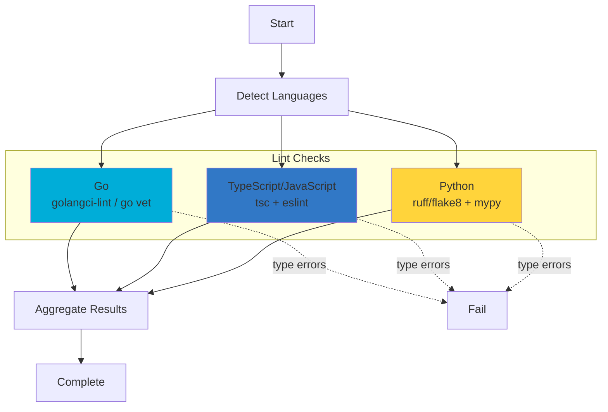

# Lint Phase

**ID**: `lint`
**Timeout**: 30 seconds
**Optional**: No
**Requires Runtime**: No

The lint phase runs static analysis including type checking and code linting across Go, TypeScript/JavaScript, and Python. Type errors cause failures; lint warnings are reported but don't fail the phase.

## What Gets Checked



## Severity Handling

The lint phase distinguishes between two severity levels:

| Severity | Effect | Examples |
|----------|--------|----------|
| **Type Errors** | Fail phase | tsc errors, Go type mismatches, mypy errors |
| **Lint Warnings** | Pass with warnings | ESLint rules, golangci-lint style issues, ruff warnings |

This design allows CI to catch type errors (which would cause runtime failures) while not blocking on style issues that can be addressed later.

## Go Linting

**Detection**: `api/go.mod` exists

| Tool | Priority | What It Checks |
|------|----------|----------------|
| golangci-lint | 1 (preferred) | Type errors, style, complexity, bugs |
| go vet | 2 (fallback) | Type errors, suspicious constructs |

### Tool Selection

```
if golangci-lint available:
    run golangci-lint
else:
    log warning
    run go vet
```

### Type-Related Linters

These golangci-lint linters produce type errors (failures):
- `typecheck` - Type checking
- `govet` - Go vet issues
- `staticcheck` - Static analysis

All other linters produce warnings (non-failures).

## TypeScript/JavaScript Linting

**Detection**: `ui/package.json` exists

| Tool | Purpose | When Run |
|------|---------|----------|
| tsc | Type checking | `tsconfig.json` exists |
| eslint | Linting | ESLint config exists |

### tsc Type Checking

Runs `tsc --noEmit` to check types without generating output.

Type errors cause phase failure:
```
src/App.tsx(10,5): error TS2322: Type 'string' is not assignable to type 'number'.
```

### ESLint Linting

Detects config files:
- `.eslintrc`, `.eslintrc.js`, `.eslintrc.json`
- `eslint.config.js`, `eslint.config.mjs`

ESLint findings are warnings (non-failures).

## Python Linting

**Detection**: `pyproject.toml`, `setup.py`, `requirements.txt`, `pytest.ini`, or `.py` files

| Tool | Priority | What It Checks |
|------|----------|----------------|
| ruff | 1 (preferred) | Fast Python linter (replaces flake8) |
| flake8 | 2 (fallback) | Style, complexity |
| mypy | Optional | Type checking (if configured) |

### Tool Selection

```
if ruff available:
    run ruff
else if flake8 available:
    log warning
    run flake8
```

### mypy Type Checking

Runs when mypy is configured:
- `mypy.ini` exists, or
- `pyproject.toml` contains `[tool.mypy]`

mypy errors are type errors (failures).

## Exit Codes

| Code | Meaning |
|------|---------|
| 0 | No type errors (warnings may exist) |
| 1 | Type errors found |

## Output

The lint phase produces observations for each language:

```
[lint] Starting lint validation...
[lint] Linting Go code...
[lint] Go: golangci-lint found no issues
[lint] Linting TypeScript/JavaScript...
[lint] Node: tsc found no type errors
[lint] Node: eslint found 3 issue(s)
[lint] Lint validation passed (2 languages checked)
```

## Common Failures

| Error | Cause | Solution |
|-------|-------|----------|
| "tsc found 5 type error(s)" | TypeScript type mismatches | Fix type annotations |
| "mypy found 3 type error(s)" | Python type mismatches | Fix type hints |
| "golangci-lint: typecheck" | Go compilation errors | Fix Go types |
| "golangci-lint not found" | Tool not installed | `go install github.com/golangci/golangci-lint/cmd/golangci-lint@latest` |

## Configuration

### Phase Configuration (testing.json)

Configure lint behavior in `.vrooli/testing.json`:

```json
{
  "lint": {
    "languages": {
      "go": {
        "enabled": true,
        "strict": false
      },
      "node": {
        "enabled": true,
        "strict": false
      },
      "python": {
        "enabled": true,
        "strict": false
      }
    }
  }
}
```

| Option | Type | Default | Description |
|--------|------|---------|-------------|
| `languages.<lang>.enabled` | boolean | `true` | Enable/disable linting for this language |
| `languages.<lang>.strict` | boolean | `false` | Treat all lint warnings as errors (fails phase) |

### Strict Mode

When `strict: true` is set for a language, all lint findings (not just type errors) will cause the phase to fail. This is useful for enforcing code style in CI pipelines.

### Tool Configuration

The lint phase respects standard tool configurations:

| Language | Config Files |
|----------|-------------|
| Go | `.golangci.yml`, `.golangci.yaml` |
| TypeScript | `tsconfig.json` |
| ESLint | `.eslintrc.*`, `eslint.config.*` |
| Python | `pyproject.toml`, `ruff.toml`, `.flake8`, `mypy.ini` |

## See Also

- [Phases Overview](../README.md) - All phases
- [Dependencies Phase](../dependencies/README.md) - Previous phase
- [Smoke Phase](../smoke/README.md) - Next phase
