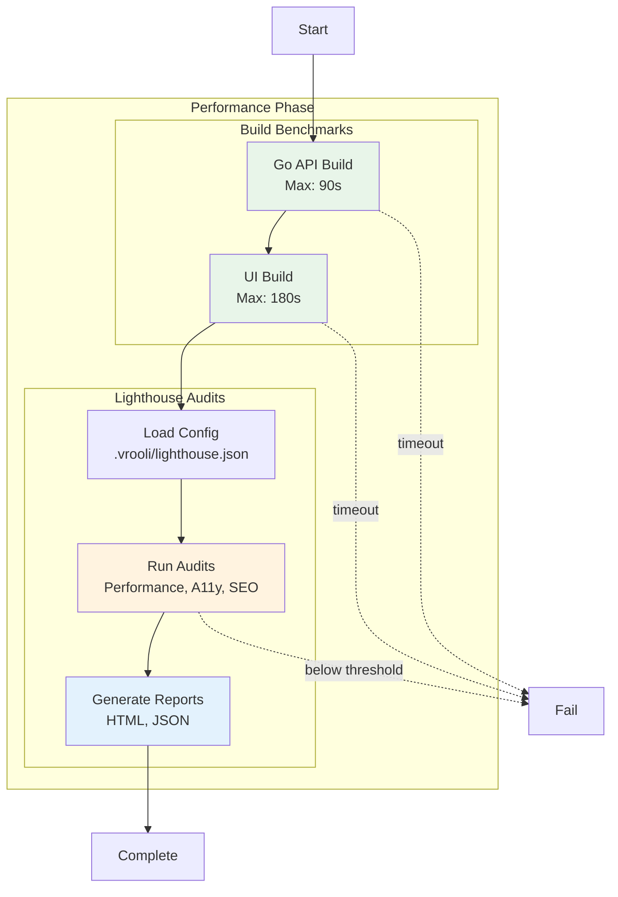

# Performance Phase

**ID**: `performance`
**Timeout**: 60 seconds
**Optional**: Yes
**Requires Runtime**: Yes

The performance phase measures build times and runs Lighthouse audits to ensure scenarios meet performance requirements. It detects regressions by comparing against configured thresholds.

## What Gets Measured



## Build Benchmarks

### Go API Build
- **Default threshold**: 90 seconds
- **Command**: `go build ./...` in `api/`
- **Measures**: Compilation time

### UI Build
- **Default threshold**: 180 seconds
- **Command**: `pnpm build` in `ui/`
- **Measures**: Bundle generation time

## Lighthouse Audits

Configure in `.vrooli/lighthouse.json`:

```json
{
  "enabled": true,
  "pages": [
    {
      "id": "home",
      "path": "/",
      "thresholds": {
        "performance": { "error": 0.80, "warn": 0.90 },
        "accessibility": { "error": 0.90, "warn": 0.95 }
      }
    }
  ]
}
```

### Metrics

| Category | Measures |
|----------|----------|
| Performance | FCP, LCP, CLS, TBT |
| Accessibility | A11y best practices |
| Best Practices | Security, modern APIs |
| SEO | Meta tags, crawlability |

## Exit Codes

| Code | Meaning |
|------|---------|
| 0 | Performance within thresholds |
| 1 | Performance regression detected |
| 2 | Skipped |

## Configuration

```json
{
  "phases": {
    "performance": {
      "enabled": true,
      "timeout": 120,
      "goBuildMaxSeconds": 120,
      "uiBuildMaxSeconds": 240
    }
  }
}
```

## Related Documentation

- [Performance Testing Guide](performance-testing.md) - Detailed guide
- [Lighthouse Integration](lighthouse.md) - Lighthouse configuration

## See Also

- [Phases Overview](../README.md) - All phases
- [Business Phase](../business/README.md) - Previous phase
