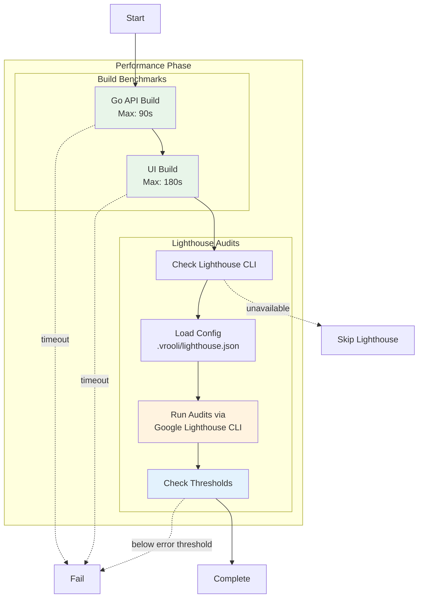

# Performance Phase

**ID**: `performance`
**Timeout**: 60 seconds (default)
**Optional**: Yes
**Requires Runtime**: Yes (for Lighthouse audits)

The performance phase measures build times and runs Lighthouse audits to ensure scenarios meet performance requirements. It detects regressions by comparing against configured thresholds.

## What Gets Measured



## Build Benchmarks

### Go API Build
- **Default threshold**: 90 seconds
- **Command**: `go build ./...` in `api/`
- **Measures**: Compilation time
- **Failure**: Build errors or exceeds threshold

### UI Build
- **Default threshold**: 180 seconds
- **Command**: `pnpm build` (or npm/yarn) in `ui/`
- **Measures**: Bundle generation time
- **Skipped**: If no `ui/` directory or no `build` script

## Lighthouse Audits

Lighthouse audits run via [Google's official Lighthouse CLI](https://github.com/GoogleChrome/lighthouse), the canonical implementation for web performance testing. This requires:
- Lighthouse CLI installed (`npm install -g lighthouse`) or available via npx
- Chrome/Chromium browser installed (Lighthouse auto-detects it)
- UI running and accessible (for page audits)

### Configuration

Configure in `.vrooli/lighthouse.json`:

```json
{
  "enabled": true,
  "pages": [
    {
      "id": "home",
      "path": "/",
      "label": "Home Page",
      "thresholds": {
        "performance": { "error": 0.75, "warn": 0.85 },
        "accessibility": { "error": 0.90, "warn": 0.95 },
        "best-practices": { "error": 0.85, "warn": 0.90 },
        "seo": { "error": 0.80, "warn": 0.90 }
      }
    }
  ],
  "global_options": {
    "lighthouse": {
      "extends": "lighthouse:default",
      "settings": {
        "onlyCategories": ["performance", "accessibility", "best-practices", "seo"],
        "throttlingMethod": "simulate",
        "formFactor": "desktop"
      }
    },
    "timeout_ms": 90000
  }
}
```

### Threshold Behavior

| Score vs Threshold | Result |
|-------------------|--------|
| Score >= warn threshold | Pass |
| Error <= score < warn | Warning (pass with note) |
| Score < error threshold | Fail |

### Categories

| Category | Measures |
|----------|----------|
| Performance | FCP, LCP, CLS, TBT, Speed Index |
| Accessibility | A11y best practices, ARIA, contrast |
| Best Practices | Security headers, modern APIs, HTTPS |
| SEO | Meta tags, crawlability, mobile-friendly |

### Skipping Lighthouse

Lighthouse audits are skipped when:
- `enabled: false` in lighthouse.json
- No pages configured
- Lighthouse CLI is unavailable (not installed and npx unavailable)
- No UI URL provided

## Exit Codes

| Code | Meaning |
|------|---------|
| 0 | All benchmarks and audits passed |
| 1 | Build timeout, build failure, or threshold violation |
| 2 | Phase skipped |

## Configuration

Build thresholds in `.vrooli/testing.json`:

```json
{
  "performance": {
    "go_build_max_seconds": 120,
    "ui_build_max_seconds": 240,
    "require_go_build": true,
    "require_ui_build": false
  }
}
```

## Implementation

The performance phase is implemented in:
- `api/internal/performance/runner.go` - Main orchestrator
- `api/internal/performance/golang/` - Go build benchmarks
- `api/internal/performance/nodejs/` - UI build benchmarks
- `api/internal/performance/lighthouse/` - Lighthouse audits via Google Lighthouse CLI

## See Also

- [Phases Overview](../README.md) - All phases
- [Business Phase](../business/README.md) - Previous phase
- [Google Lighthouse](https://github.com/GoogleChrome/lighthouse) - Official Lighthouse CLI documentation
