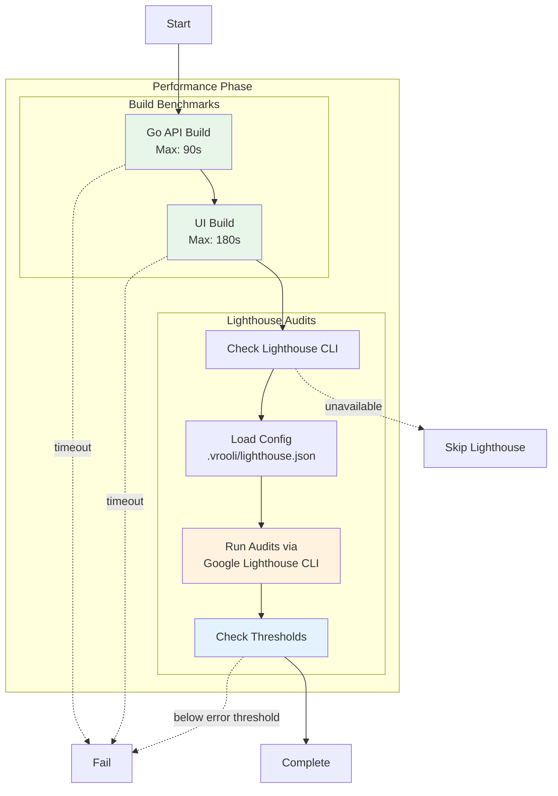

# Performance Phase

**ID**: `performance`
**Timeout**: 60 seconds (default)
**Optional**: Yes
**Requires Runtime**: Yes (for Lighthouse audits)

The performance phase measures build times and runs Lighthouse audits to ensure scenarios meet performance requirements. It detects regressions by comparing against configured thresholds.

This phase declares a [Phase Capability Contract](../../concepts/phase-capability-contract.md); the sections below follow the required remediation-doc skeleton.

## North Star

Performance is **measured, gated, and clean end to end**: the measurable surface
and capture tier resolve from Code Facts, React Tier-1 profiling instrumentation
attributes every component commit, all declared budget axes (build time, bundle
size, LCP, startup, component commits) are honored by the newest gated
measurement, runtime producers (build, Lighthouse, trace analysis) execute and
report no blocking regression, and persisted trend coverage exists for every
out-of-band axis. At maximum maturity the capability ladders all reach their top
rung — `surface_resolution` L2, `profiling_infra` L3, `budget_gates` L3, the
deepest `runtime_measurement` L3 (runtime performance measurement is clean), and
`trend_coverage` L2 — so a scenario's performance is provably within budget rather
than assumed.

## The rungs and their gates

Each capability declares a monotone ladder (each rung implies the one below).

**`surface_resolution`** — is the measurable target surface + capture tier known?
- L0 Performance surface unavailable → *A resolvable scenario with Code Facts-backed performance axes.*
- L1 Capture tier decided → *Maximum surface-resolution maturity.*
- L2 Surface resolution clean → maximum.

**`profiling_infra`** — is React Tier-1 commit-attribution instrumentation present?
- L0 Profiling infra unavailable → *A React UI surface where perf-build instrumentation can be inspected.*
- L1 Profiling inspectable → *Vite profiling aliases, `build:profile` script, profiler utility, and React.Profiler boundary.*
- L2 Profiling ready → *Maximum profiling-infrastructure maturity.*
- L3 Profiling clean → maximum.

**`budget_gates`** — are declared performance budgets honored?
- L0 Budget gate unavailable → *Readable performance budgets and latest measurement samples.*
- L1 Budget gate active → *No build, bundle, LCP, startup, component-commit, or per-flow budget breach.*
- L2 Budgets honored → *Maximum budget-gate maturity.*
- L3 Budget gates clean → maximum.

**`runtime_measurement`** (deepest) — do runtime producers report no blocking regression?
- L0 Runtime measurement unavailable → *Build/Lighthouse/trace producers can execute or read artifacts.*
- L1 Runtime measurement active → *Successful execution producers, Lighthouse thresholds, and component hot-spot checks.*
- L2 Runtime measured → *Maximum runtime-measurement maturity.*
- L3 Runtime clean → maximum; runtime performance measurement is clean.

**`trend_coverage`** — is persisted trend coverage present for out-of-band axes?
- L0 Trend coverage unavailable → *Persisted performance samples for out-of-band axes.*
- L1 Trend visibility → *Advisory continuous-capture gaps are resolved.*
- L2 Trend covered → maximum.

## What each finding means

Each finding caps the named capability at a rung; only ERROR/BLOCKER severities
fail the phase, so warnings and infos are honest, non-failing debt.

| Code | Capability | Caps at | Severity | Fails phase? |
|---|---|---|---|---|
| `PERF_BUILD_FAILED` | runtime_measurement | L0 | ERROR | Yes |
| `PERF_BUDGET_BREACH_GO_BUILD` | budget_gates | L2 | ERROR | Yes |
| `PERF_BUDGET_BREACH_UI_BUILD` | budget_gates | L2 | ERROR | Yes |
| `PERF_BUDGET_BREACH_BUNDLE` | budget_gates | L2 | ERROR | Yes |
| `PERF_BUDGET_BREACH_LCP` | budget_gates | L2 | ERROR | Yes |
| `PERF_BUDGET_BREACH_STARTUP` | budget_gates | L2 | ERROR | Yes |
| `PERF_BUDGET_BREACH_COMPONENT_COMMIT_AVG` / `..._MAX` | budget_gates | L2 | ERROR | Yes |
| `PERF_LIGHTHOUSE_BELOW_ERROR_THRESHOLD` | runtime_measurement | L2 | ERROR | Yes |
| `PERF_COMPONENT_COMMIT_OVER_BUDGET` | runtime_measurement | L2 | WARNING | No |
| `perf_build_vite_profile_mode` / `perf_build_profile_script` / `perf_build_profiler_util` / `perf_build_profiler_boundary` | profiling_infra | L2 | WARNING | No |
| `PERF_BUDGET_AXIS_UNGATED` | trend_coverage | L1 | INFO | No |

## The canonical fix

- **`PERF_BUILD_FAILED`** → the build does not compile during execution-mode
  benchmarking: fix the build error first; the scenario cannot ship until it
  compiles.
- **`PERF_BUDGET_BREACH_*`** (go build, UI build, bundle, LCP, startup,
  component-commit avg/max) → a real performance regression against a declared
  budget: profile and investigate the regressed axis and bring it back under
  budget — do not merely raise the budget. Load the `performance` skill (add
  `ui-health` for component-commit axes).
- **`PERF_LIGHTHOUSE_BELOW_ERROR_THRESHOLD`** → a Lighthouse category scored below
  its configured error threshold in `.vrooli/lighthouse.json`: investigate the
  UI quality/performance regression driving the low score.
- **`PERF_COMPONENT_COMMIT_OVER_BUDGET`** → a slow component-commit hot spot:
  profile the component and reduce its commit cost (`performance`, `ui-health`).
- **`perf_build_*` profiling-infra findings** → auto-fixable instrumentation gaps:
  add the Vite profiling aliases, `build:profile` script, profiler utility, and
  React.Profiler boundary (the implemented fixer scaffolds these).
- **`PERF_BUDGET_AXIS_UNGATED`** → a declared budget axis measured out of band:
  visibility debt only; add persisted trend coverage or adjust capture cadence as
  an operational tradeoff.

## How to verify

```bash
# See the current rung, gaps, and next move for every capability:
performance-health validate scenario <scenario>

# Or drive it through Test Genie and read the per-phase scorecard + findings:
test-genie execute <scenario> --phases performance
test-genie runs findings --scenario <scenario>
```

The `performance` line in the scorecard shows the focus capability's current rung,
the single highest-unlock next move, and a runnable doc-search topic that resolves
back to the sections above.

## What Gets Measured


```mermaid
graph TB
    subgraph "Performance Phase"
        subgraph "Build Benchmarks"
            GO_BUILD[Go API Build<br/>Max: 90s]
            UI_BUILD[UI Build<br/>Max: 180s]
        end

        subgraph "Lighthouse Audits"
            LH_CHECK[Check Lighthouse CLI]
            LH_CONFIG[Load Config<br/>.vrooli/lighthouse.json]
            LH_AUDIT[Run Audits via<br/>Google Lighthouse CLI]
            LH_THRESHOLD[Check Thresholds]
        end
    end

    START[Start] --> GO_BUILD
    GO_BUILD --> UI_BUILD
    UI_BUILD --> LH_CHECK
    LH_CHECK --> LH_CONFIG
    LH_CONFIG --> LH_AUDIT
    LH_AUDIT --> LH_THRESHOLD
    LH_THRESHOLD --> DONE[Complete]

    GO_BUILD -.->|timeout| FAIL[Fail]
    UI_BUILD -.->|timeout| FAIL
    LH_CHECK -.->|unavailable| SKIP[Skip Lighthouse]
    LH_THRESHOLD -.->|below error threshold| FAIL

    style GO_BUILD fill:#e8f5e9
    style UI_BUILD fill:#e8f5e9
    style LH_AUDIT fill:#fff3e0
    style LH_THRESHOLD fill:#e3f2fd
```

## Build Benchmarks

### Go API Build
- **Default threshold**: 90 seconds
- **Command**: `go build ./...` in `api/`
- **Measures**: Compilation time
- **Failure**: Build errors or exceeds threshold

### UI Build
- **Default threshold**: 180 seconds
- **Command**: `pnpm build` (or npm/yarn) in `ui/`
- **Measures**: Bundle generation time
- **Skipped**: If no `ui/` directory or no `build` script

## Lighthouse Audits

Lighthouse audits run via [Google's official Lighthouse CLI](https://github.com/GoogleChrome/lighthouse), the canonical implementation for web performance testing. This requires:
- Lighthouse CLI installed (`npm install -g lighthouse`) or available via npx
- Chrome/Chromium browser installed (Lighthouse auto-detects it)
- UI running and accessible (for page audits)

### Configuration

Configure in `.vrooli/lighthouse.json`:

```json
{
  "enabled": true,
  "pages": [
    {
      "id": "home",
      "path": "/",
      "label": "Home Page",
      "thresholds": {
        "performance": { "error": 0.75, "warn": 0.85 },
        "accessibility": { "error": 0.90, "warn": 0.95 },
        "best-practices": { "error": 0.85, "warn": 0.90 },
        "seo": { "error": 0.80, "warn": 0.90 }
      }
    }
  ],
  "global_options": {
    "lighthouse": {
      "extends": "lighthouse:default",
      "settings": {
        "onlyCategories": ["performance", "accessibility", "best-practices", "seo"],
        "throttlingMethod": "simulate",
        "formFactor": "desktop"
      }
    },
    "timeout_ms": 90000
  }
}
```

### Threshold Behavior

| Score vs Threshold | Result |
|-------------------|--------|
| Score >= warn threshold | Pass |
| Error <= score < warn | Warning (pass with note) |
| Score < error threshold | Fail |

### Categories

| Category | Measures |
|----------|----------|
| Performance | FCP, LCP, CLS, TBT, Speed Index |
| Accessibility | A11y best practices, ARIA, contrast |
| Best Practices | Security headers, modern APIs, HTTPS |
| SEO | Meta tags, crawlability, mobile-friendly |

### Skipping Lighthouse

Lighthouse audits are skipped when:
- `enabled: false` in lighthouse.json
- No pages configured
- Lighthouse CLI is unavailable (not installed and npx unavailable)
- No UI URL provided

## Exit Codes

| Code | Meaning |
|------|---------|
| 0 | All benchmarks and audits passed |
| 1 | Build timeout, build failure, or threshold violation |
| 2 | Phase skipped |

## Configuration

Build thresholds in `.vrooli/testing.json`:

```json
{
  "performance": {
    "go_build_max_seconds": 120,
    "ui_build_max_seconds": 240,
    "require_go_build": true,
    "require_ui_build": false
  }
}
```

## Implementation

The performance phase is implemented in:
- `api/internal/performance/runner.go` - Main orchestrator
- `api/internal/performance/golang/` - Go build benchmarks
- `api/internal/performance/nodejs/` - UI build benchmarks
- `api/internal/performance/lighthouse/` - Lighthouse audits via Google Lighthouse CLI

## See Also

- [Phases Overview](../README.md) - All phases
- [Business Phase](../business/README.md) - Previous phase
- [Google Lighthouse](https://github.com/GoogleChrome/lighthouse) - Official Lighthouse CLI documentation
