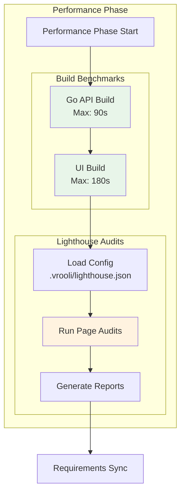

# Performance Testing Guide

This guide covers Test Genie's performance testing capabilities, including build benchmarks, Lighthouse audits, response time validation, and regression detection.

## Overview

Test Genie's performance phase validates that scenarios meet performance requirements through two complementary approaches:

1. **Build Benchmarks** - Measure Go API and UI build times against configurable thresholds
2. **Lighthouse Audits** - Test web performance, accessibility, and best practices for UI components



## Quick Start

### 1. Run Performance Tests

```bash
# Run only the performance phase
test-genie execute my-scenario --phases performance

# Run comprehensive preset (includes performance)
test-genie execute my-scenario --preset comprehensive
```

### 2. View Results

```bash
# Check phase results
cat coverage/phase-results/performance.json | jq .

# View Lighthouse HTML reports (if configured)
open test/artifacts/lighthouse/*.html
```

## Build Benchmarks

The performance phase automatically benchmarks build times for both Go APIs and Node.js UIs.

### Go API Build Benchmark

**Default threshold**: 90 seconds

The orchestrator runs `go build ./...` in the `api/` directory and measures completion time.

**What triggers a failure**:
- Build takes longer than the threshold
- Compilation errors occur
- Go toolchain not available

**Example output**:
```
[performance] building Go API binary in /scenarios/my-scenario/api
[performance] go build completed in 12s
```

### UI Build Benchmark

**Default threshold**: 180 seconds

The orchestrator detects the package manager (pnpm, npm, yarn) and runs the `build` script.

**What triggers a failure**:
- Build takes longer than the threshold
- Build script fails
- Missing node_modules (auto-installs if missing)

**Example output**:
```
[performance] running UI build via pnpm
[performance] ui build completed in 45s
```

### Configuring Build Thresholds

Override thresholds in `.vrooli/testing.json`:

```json
{
  "phases": {
    "performance": {
      "enabled": true,
      "timeout": 300,
      "goBuildMaxSeconds": 120,
      "uiBuildMaxSeconds": 240
    }
  }
}
```

## Lighthouse Audits

For scenarios with a UI, configure Lighthouse to audit web performance, accessibility, and best practices.

### Prerequisites

1. **Chrome/Chromium** installed on the system
2. **Scenario running** with accessible UI
3. **Configuration file** at `.vrooli/lighthouse.json`

### Configuration

Create `.vrooli/lighthouse.json` in your scenario:

```json
{
  "_metadata": {
    "description": "Lighthouse testing configuration"
  },
  "enabled": true,
  "pages": [
    {
      "id": "home",
      "path": "/",
      "label": "Home Page",
      "viewport": "desktop",
      "thresholds": {
        "performance": { "error": 0.80, "warn": 0.90 },
        "accessibility": { "error": 0.90, "warn": 0.95 },
        "best-practices": { "error": 0.85, "warn": 0.90 },
        "seo": { "error": 0.80, "warn": 0.90 }
      },
      "requirements": ["MY-PERF-HOME"]
    },
    {
      "id": "dashboard",
      "path": "/dashboard",
      "label": "Main Dashboard",
      "viewport": "desktop",
      "waitForSelector": "[data-testid='dashboard-loaded']",
      "waitForMs": 2000,
      "thresholds": {
        "performance": { "error": 0.70, "warn": 0.85 },
        "accessibility": { "error": 0.90, "warn": 0.95 }
      },
      "requirements": ["MY-PERF-DASHBOARD"]
    }
  ],
  "global_options": {
    "chrome_flags": ["--headless", "--no-sandbox"],
    "timeout_ms": 60000,
    "retries": 2,
    "lighthouse": {
      "settings": {
        "throttlingMethod": "simulate",
        "onlyCategories": ["performance", "accessibility", "best-practices", "seo"]
      }
    }
  },
  "reporting": {
    "formats": ["json", "html"],
    "output_dir": "test/artifacts/lighthouse",
    "fail_on_error": true
  }
}
```

### Understanding Thresholds

Scores are 0.0-1.0 (displayed as 0-100%):

| Threshold Type | Behavior |
|----------------|----------|
| **error** | Score below this fails the phase |
| **warn** | Score below this logs a warning but passes |

**Recommended thresholds by page type**:

| Page Type | Performance | Accessibility | Best Practices |
|-----------|-------------|---------------|----------------|
| Static landing | 0.90 / 0.95 | 0.95 / 0.98 | 0.90 / 0.95 |
| SPA dashboard | 0.75 / 0.85 | 0.90 / 0.95 | 0.85 / 0.90 |
| Heavy interactive | 0.65 / 0.80 | 0.90 / 0.95 | 0.80 / 0.90 |
| Data visualization | 0.60 / 0.75 | 0.85 / 0.90 | 0.80 / 0.90 |

### Viewport Options

```json
{
  "viewport": "desktop"   // 1350x940
}
```

```json
{
  "viewport": "mobile"    // 375x667, mobile user agent
}
```

Test the same page at multiple viewports:

```json
{
  "pages": [
    {
      "id": "home-desktop",
      "path": "/",
      "viewport": "desktop",
      "thresholds": { "performance": { "error": 0.85 } }
    },
    {
      "id": "home-mobile",
      "path": "/",
      "viewport": "mobile",
      "thresholds": { "performance": { "error": 0.70 } }
    }
  ]
}
```

### Waiting for Dynamic Content

For SPAs that load data asynchronously:

```json
{
  "id": "dashboard",
  "path": "/dashboard",
  "waitForSelector": "[data-testid='content-ready']",
  "waitForMs": 3000
}
```

## Requirements Integration

Link performance tests to PRD requirements for automatic tracking.

### 1. Define Performance Requirement

In `requirements/performance/metrics.json`:

```json
{
  "requirements": [
    {
      "id": "MY-PERF-HOME",
      "description": "Home page loads within performance budget",
      "validation": [
        {
          "type": "lighthouse",
          "ref": ".vrooli/lighthouse.json",
          "page_id": "home",
          "category": "performance",
          "threshold": 0.85,
          "phase": "performance",
          "status": "not_implemented"
        }
      ]
    }
  ]
}
```

### 2. Link in Lighthouse Config

```json
{
  "pages": [
    {
      "id": "home",
      "path": "/",
      "requirements": ["MY-PERF-HOME"]
    }
  ]
}
```

### 3. Run and Sync

```bash
# Run with requirements sync
test-genie execute my-scenario --preset comprehensive

# Check updated requirement status
cat requirements/performance/metrics.json | jq '.requirements[0].validation[0].status'
```

## Performance Optimization Workflow

### Step 1: Establish Baselines

Start with loose thresholds to establish baselines:

```json
{
  "thresholds": {
    "performance": { "error": 0.50, "warn": 0.70 }
  }
}
```

### Step 2: Run Initial Audit

```bash
test-genie execute my-scenario --phases performance --verbose
```

### Step 3: Review Reports

Open the HTML report to see specific recommendations:

```bash
open test/artifacts/lighthouse/home_desktop_*.html
```

### Step 4: Optimize

Common performance improvements:

| Issue | Solution |
|-------|----------|
| Large bundle size | Code splitting, tree shaking |
| Slow API responses | Add caching, optimize queries |
| Unoptimized images | Use WebP, lazy loading |
| Render blocking CSS | Critical CSS inlining |
| No compression | Enable gzip/brotli |

### Step 5: Tighten Thresholds

As you optimize, increase thresholds:

```json
{
  "thresholds": {
    "performance": { "error": 0.80, "warn": 0.90 }
  }
}
```

## Regression Detection

### Build Time Regression

If build times increase significantly:

1. **Check for new dependencies** - `go mod graph` or `pnpm why`
2. **Profile the build** - `go build -x ./...` for verbose output
3. **Review recent changes** - Did a new package add significant compile time?

### Lighthouse Score Regression

If scores drop between runs:

1. **Compare HTML reports** - Look for new opportunities
2. **Check bundle analyzer** - Did bundle size increase?
3. **Review network waterfall** - Are new requests blocking?
4. **Test in isolation** - Disable new features to identify cause

### Tracking Trends

View historical performance data in the Test Genie dashboard:

1. Navigate to **Runs** tab
2. Select your scenario
3. Switch to **History** tab
4. Compare phase results across executions

## CI/CD Integration

### GitHub Actions Example

```yaml
name: Performance Tests

on:
  push:
    branches: [main]
  pull_request:
    branches: [main]

jobs:
  performance:
    runs-on: ubuntu-latest
    steps:
      - uses: actions/checkout@v4

      - name: Setup environment
        run: ./scripts/manage.sh setup --yes yes --resources none

      - name: Start scenario
        run: vrooli scenario start my-scenario

      - name: Wait for readiness
        run: |
          timeout 60 bash -c 'until curl -f http://localhost:8080/health; do sleep 2; done'

      - name: Run performance tests
        run: test-genie execute my-scenario --phases performance --timeout 300s

      - name: Upload Lighthouse reports
        uses: actions/upload-artifact@v4
        if: always()
        with:
          name: lighthouse-reports
          path: scenarios/my-scenario/test/artifacts/lighthouse/
```

### Fail-Fast for PRs

For pull requests, you may want stricter thresholds:

```json
{
  "presets": {
    "pr-check": {
      "phases": ["structure", "unit", "performance"],
      "failFast": true
    }
  }
}
```

## Troubleshooting

### Build Benchmark Issues

| Symptom | Cause | Solution |
|---------|-------|----------|
| "go build failed" | Compilation error | Fix Go errors first |
| "go command not found" | Missing Go | Install Go toolchain |
| "exceeded 90s" | Slow build | Profile dependencies, increase threshold |
| "ui build failed" | Vite/webpack error | Check build logs |
| "node_modules missing" | Dependencies not installed | Phase auto-installs, check for errors |

### Lighthouse Issues

| Symptom | Cause | Solution |
|---------|-------|----------|
| "Chrome not found" | Missing browser | Install chromium: `apt install chromium-browser` |
| "Connection refused" | Scenario not running | Start scenario first |
| "Timeout waiting for page" | Slow load or selector issue | Increase `waitForMs` or fix selector |
| "Score 0 on accessibility" | Page not rendering | Check for JavaScript errors |
| Flaky scores | Network variance | Enable `throttlingMethod: "simulate"` |

### Debugging Performance Phase

```bash
# Run with verbose output
test-genie execute my-scenario --phases performance --verbose

# Check raw phase results
cat coverage/phase-results/performance.json | jq .

# View orchestrator logs
cat coverage/test-genie.log | grep -i performance
```

## Best Practices

### 1. Test Production Builds

Always benchmark production builds, not development:

```bash
cd ui && pnpm build
test-genie execute my-scenario --phases performance
```

### 2. Consistent Environment

Ensure CI and local environments are similar:
- Same Node.js version
- Same Go version
- Similar system resources

### 3. Separate Desktop and Mobile

Mobile performance differs significantly:

```json
{
  "pages": [
    { "id": "home-desktop", "path": "/", "viewport": "desktop" },
    { "id": "home-mobile", "path": "/", "viewport": "mobile" }
  ]
}
```

### 4. Focus on Critical Paths

Audit the pages users visit most:
- Landing/home page
- Main dashboard/workspace
- Key conversion pages

### 5. Document Performance Budgets

Add comments explaining threshold choices:

```json
{
  "_metadata": {
    "description": "Performance budgets based on competitor analysis",
    "baseline_date": "2024-01-15",
    "notes": "Home must load faster than competitor X (85%+ target)"
  }
}
```

## See Also

### Related Guides
- [Performance Phase](README.md) - Performance phase overview
- [Lighthouse Integration](lighthouse.md) - Detailed Lighthouse configuration
- [Phases Overview](../README.md) - Understanding the 7-phase architecture
- [Requirements Sync](../business/requirements-sync.md) - Automatic requirement tracking

### Reference
- [Presets](../../reference/presets.md) - Preset configurations
- [API Endpoints](../../reference/api-endpoints.md) - REST API for CI/CD

### Concepts
- [Architecture](../../concepts/architecture.md) - Go orchestrator design
- [Strategy](../../concepts/strategy.md) - Three-layer validation approach
