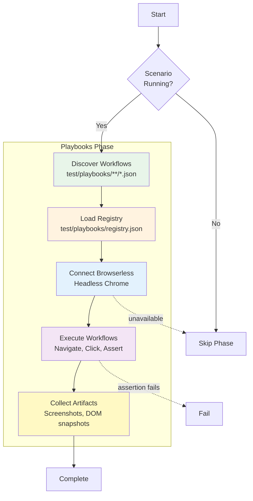

# Playbooks Phase

**ID**: `playbooks` (also known as E2E)
**Timeout**: 120 seconds
**Optional**: Yes (when runtime not available)
**Requires Runtime**: Yes

The playbooks phase executes Browser Automation Studio (BAS) workflows for end-to-end UI testing. Workflows are declarative JSON files that automate browser interactions.

## What Gets Tested



## Workflow Structure

Workflows are JSON files defining browser automation steps:

```json
{
  "metadata": {
    "description": "Test project creation flow",
    "version": 1
  },
  "nodes": [
    {
      "id": "navigate-home",
      "type": "navigate",
      "data": {
        "destinationType": "scenario",
        "scenario": "my-scenario",
        "scenarioPath": "/"
      }
    },
    {
      "id": "click-create",
      "type": "click",
      "data": {
        "selector": "[data-testid='create-btn']"
      }
    }
  ],
  "edges": [
    {
      "source": "navigate-home",
      "target": "click-create"
    }
  ]
}
```

## Workflow Registry

Workflows are registered in `test/playbooks/registry.json`:

```json
{
  "workflows": [
    {
      "id": "create-project",
      "path": "ui/projects/create.json",
      "requirements": ["MY-PROJECT-CREATE"]
    }
  ]
}
```

## Browserless Integration

The phase uses Browserless for headless browser automation:

```bash
# Ensure Browserless is running
vrooli resource status browserless

# Start if needed
vrooli resource start browserless
```

## Exit Codes

| Code | Meaning |
|------|---------|
| 0 | All workflows pass |
| 1 | Workflow assertions failed |
| 2 | Skipped (runtime/browserless unavailable) |

## Configuration

```json
{
  "phases": {
    "playbooks": {
      "timeout": 180,
      "browserless": {
        "endpoint": "http://localhost:3000"
      },
      "artifacts": {
        "screenshots": true,
        "domSnapshots": true
      }
    }
  }
}
```

## Related Documentation

- [UI Automation with BAS](ui-automation-with-bas.md) - Writing BAS workflows

## See Also

- [Phases Overview](../README.md) - All phases
- [Integration Phase](../integration/README.md) - Previous phase
- [Business Phase](../business/README.md) - Next phase
