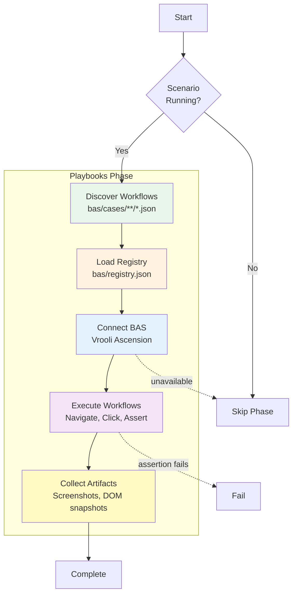

# Playbooks Phase

**ID**: `playbooks` (also known as E2E)
**Timeout**: 120 seconds
**Optional**: Yes (when runtime not available)
**Requires Runtime**: Yes

The playbooks phase executes Vrooli Ascension (BAS) workflows for end-to-end UI testing. Workflows are declarative JSON files that automate browser interactions.

Core contract:
- test-genie executes **only** workflows listed in `bas/registry.json` (which is generated from `bas/cases/**`)
- workflows are executed **as-authored** (no placeholder substitution or scenario URL rewriting in test-genie)
- test-genie provides BAS `project_root` (absolute path to `bas/`) and `initial_params` (seed-state.json) and handles isolation + cleanup

## What Gets Tested



## Workflow Structure

Workflows are JSON files defining browser automation steps:

```json
{
  "metadata": {
    "description": "Test project creation flow",
    "version": 1
  },
  "nodes": [
    {
      "id": "navigate-home",
      "type": "navigate",
      "data": {
        "destinationType": "scenario",
        "scenario": "my-scenario",
        "scenarioPath": "/"
      }
    },
    {
      "id": "click-create",
      "type": "click",
      "data": {
        "selector": "[data-testid='create-btn']"
      }
    }
  ],
  "edges": [
    {
      "source": "navigate-home",
      "target": "click-create"
    }
  ]
}
```

## Directory Structure

Playbooks follow a canonical directory layout:

```
bas/
├── registry.json       # Auto-generated manifest
├── cases/              # Assertive validations (mirrors PRD)
│   ├── 01-foundation/  # Two-digit prefix for ordering
│   └── 02-builder/
├── flows/              # Optional journeys (not executed by test-genie)
├── actions/            # Reusable subflows/components (not executed by test-genie)
└── seeds/              # Seed entrypoint (seed.go preferred, seed.sh allowed)
```

Key conventions:
- **Two-digit prefixes** (`01-`, `02-`) ensure deterministic execution order
- **`actions/`** contains reusable subflows referenced via `workflowPath` (resolved by BAS relative to `project_root`)
- **`seeds/`** contains `seed.go` (or `seed.sh`) for test data

See [Directory Structure](directory-structure.md) for complete documentation including fixture metadata, token types, and authoring checklist.

## Workflow Registry

The registry (`bas/registry.json`) is **auto-generated** and tracks all playbooks:

```json
{
  "_note": "AUTO-GENERATED — run 'test-genie registry build' to refresh",
  "scenario": "my-scenario",
  "generated_at": "2025-12-05T10:00:00Z",
  "playbooks": [
    {
      "file": "bas/cases/01-foundation/create-project.json",
      "description": "Creates a new project",
      "order": "01.01",
      "requirements": ["MY-PROJECT-CREATE"],
      "fixtures": [],
      "reset": "full"
    }
  ]
}
```

Regenerate after adding or moving playbooks:

```bash
test-genie registry build
```

## Vrooli Ascension Integration

The phase uses Vrooli Ascension (BAS) for workflow execution. BAS is a separate Vrooli scenario that provides a Playwright-based browser automation engine.

```bash
# Ensure BAS is running
vrooli scenario status browser-automation-studio

# Start if needed
vrooli scenario start browser-automation-studio
```

## Exit Codes

| Code | Meaning |
|------|---------|
| 0 | All workflows pass |
| 1 | Workflow assertions failed |
| 2 | Skipped (runtime/BAS unavailable) |

## Proto Contract Guardrails

The playbooks phase parses BAS timelines with **strict protojson** (`DiscardUnknown=false`). Any BAS response field not defined in `packages/proto/schemas/browser-automation-studio/v1/timeline.proto` will fail the phase. To avoid drift:
- Update the shared proto first for any new BAS timeline fields, then regenerate (`make -C packages/proto generate`) and run the breaking check (`make -C packages/proto breaking`, baseline `BUF_BASE_BRANCH=master`).
- Keep golden timeline fixtures in `scenarios/test-genie/api/internal/playbooks/execution/testdata/` passing: `go test ./scenarios/test-genie/api/internal/playbooks/execution -run Golden`.
- When a parse error occurs, inspect the timeline artifact and re-run Buf breaking to confirm the proto contract matches BAS.

Contract guardrails: Playbooks now treat BAS timeline responses as strict proto contracts. If `/executions/{id}/timeline` contains unknown fields or drifts from the published proto, parsing fails and the phase fails, writing a timeline artifact plus parse error summary under `coverage/automation/<workflow>/`. Update the shared proto or BAS handler when making intentional contract changes.

## Configuration

Configure the playbooks phase in `.vrooli/testing.json`:

```json
{
  "playbooks": {
    "enabled": true,
    "bas": {
      "endpoint": "http://localhost:8080/api/v1",
      "timeout_ms": 30000,
      "launch_timeout_ms": 60000
    },
    "artifacts": {
      "screenshots": true,
      "dom_snapshots": true
    }
  },
  "phases": {
    "playbooks": {
      "timeout": "3m"
    }
  }
}
```

### Retain isolation for debugging

| Option | Default | Description |
|--------|---------|-------------|
| `TEST_GENIE_PLAYBOOKS_RETAIN` | `0` | Set to `1` before running Playbooks to retain the temporary Postgres/Redis instances for inspection. Observations will include ready-to-run `psql`/`redis-cli` commands. |

Set `TEST_GENIE_PLAYBOOKS_RETAIN=1` before running the Playbooks phase to keep the temporary Postgres/Redis instances alive after execution. The phase logs will print `psql`/`redis-cli` commands targeting the retained resources. By default, isolation is torn down and the scenario is restarted against its normal resources after Playbooks completes.

## Related Documentation

- [Directory Structure](directory-structure.md) - Canonical layout, fixtures, seeds, naming conventions
- [UI Automation with BAS](ui-automation-with-bas.md) - Writing workflow JSON, node types, selectors

## See Also

- [Phases Overview](../README.md) - All phases
- [Integration Phase](../integration/README.md) - Previous phase
- [Business Phase](../business/README.md) - Next phase
