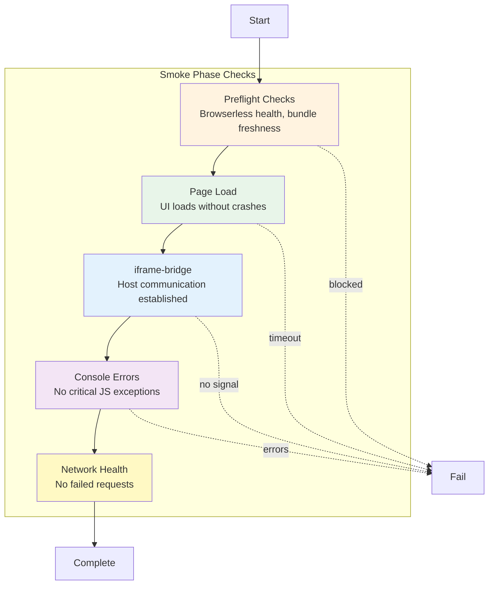

# Smoke Phase

**ID**: `smoke`
**Timeout**: 90 seconds (default)
**Optional**: Yes
**Requires Runtime**: Yes

The smoke phase validates that a scenario's UI loads correctly, establishes communication with the host via iframe-bridge, and produces no critical JavaScript errors. It runs after the lint phase and before unit tests as a quick sanity check.

## What Gets Validated



## Quick Start

### Enable UI Smoke Testing

UI smoke testing is **enabled by default** for scenarios with a `ui/` directory. To customize settings, add configuration to `.vrooli/testing.json`:

```json
{
  "structure": {
    "ui_smoke": {
      "enabled": true,
      "timeout_ms": 90000,
      "handshake_timeout_ms": 15000,
      "handshake_signals": []
    }
  }
}
```

> **Note**: The configuration remains under `structure.ui_smoke` for backwards compatibility with existing scenario configurations.

### Run Smoke Tests

```bash
# Run smoke phase directly
test-genie execute my-scenario --phases smoke

# Run comprehensive preset (includes smoke)
test-genie execute my-scenario --preset comprehensive

# Check test artifacts
ls coverage/ui-smoke/
```

## Configuration Reference

### Configuration Options

| Field | Type | Default | Description |
|-------|------|---------|-------------|
| `enabled` | boolean | `true` | Enable/disable UI smoke testing |
| `timeout_ms` | number | `90000` | Overall timeout for the test (ms) |
| `handshake_timeout_ms` | number | `15000` | Max time to wait for iframe-bridge handshake (ms) |
| `handshake_signals` | string[] | `[]` | Custom window property paths to check for readiness |

### Default Handshake Signals

When no custom signals are provided, the following signals are checked (in order):

1. `window.__vrooliBridgeChildInstalled`
2. `window.IFRAME_BRIDGE_READY`
3. `window.IframeBridge.ready`
4. `window.iframeBridge.ready`
5. `window.IframeBridge.getState().ready`

### Custom Handshake Signals

You can define custom signals for apps that use different readiness indicators:

```json
{
  "structure": {
    "ui_smoke": {
      "handshake_signals": [
        "myApp.initialized",
        "REACT_APP_READY",
        "store.getState().isReady"
      ]
    }
  }
}
```

Signal patterns supported:
- **Simple property**: `"MY_FLAG"` checks `window.MY_FLAG === true`
- **Nested property**: `"app.ready"` checks `window.app && window.app.ready === true`
- **Method call**: `"store.getState().ready"` checks `window.store && typeof window.store.getState === 'function' && window.store.getState().ready === true`

## Prerequisites

### 1. Browserless Resource

The UI smoke test requires Browserless to be running:

```bash
# Check status
resource-browserless manage status

# Start if needed
resource-browserless manage start
```

### 2. iframe-bridge Dependency

Your UI must have `@vrooli/iframe-bridge` as a dependency in `ui/package.json`:

```json
{
  "dependencies": {
    "@vrooli/iframe-bridge": "workspace:*"
  }
}
```

**What is iframe-bridge?**

The `@vrooli/iframe-bridge` package provides communication utilities between Vrooli's host environment and scenario UIs embedded in iframes. It handles:

- **Ready signaling**: Notifies the host when the UI has finished initializing
- **Message passing**: Enables secure cross-origin communication between host and iframe
- **Storage shimming**: Patches localStorage/sessionStorage for iframe compatibility

### 3. UI Port Definition

Your scenario should define a UI port in `.vrooli/service.json`:

```json
{
  "ports": {
    "ui": {
      "env_var": "UI_PORT",
      "description": "UI development server port"
    }
  }
}
```

## Execution Flow

The UI smoke test follows this sequence:

1. **Check configuration** - Skip if disabled in testing.json
2. **Check Browserless health** - Block if Browserless is offline
3. **Check bundle freshness** - Block if source files are newer than dist
4. **Discover UI port** - Find the running UI server port
5. **Check iframe-bridge dependency** - Fail if missing
6. **Execute browser session** - Load UI in iframe via Browserless
7. **Evaluate handshake** - Wait for bridge readiness signal
8. **Write artifacts** - Save screenshot, console logs, etc.
9. **Build result** - Determine pass/fail status

## Test Results

### Status Values

| Status | Meaning |
|--------|---------|
| `passed` | UI loaded successfully with handshake |
| `failed` | Test encountered errors (JS errors, network failures, no handshake) |
| `skipped` | Test was skipped (no UI directory, disabled, or no UI port defined) |
| `blocked` | Precondition failed (Browserless offline, bundle stale, port not running) |

### Result JSON

Results are stored in `coverage/ui-smoke/latest.json`:

```json
{
  "scenario": "my-scenario",
  "status": "passed",
  "message": "UI loaded successfully",
  "timestamp": "2025-12-03T10:30:00Z",
  "duration_ms": 3500,
  "ui_url": "http://localhost:3000",
  "handshake": {
    "signaled": true,
    "timed_out": false,
    "duration_ms": 1200
  },
  "artifacts": {
    "screenshot": "coverage/ui-smoke/screenshot.png",
    "console": "coverage/ui-smoke/console.json",
    "network": "coverage/ui-smoke/network.json",
    "html": "coverage/ui-smoke/dom.html",
    "raw": "coverage/ui-smoke/raw.json"
  }
}
```

## Artifacts

All artifacts are stored in `coverage/ui-smoke/`:

| File | Format | Content |
|------|--------|---------|
| `screenshot.png` | PNG | UI screenshot at test completion |
| `console.json` | JSON | All console messages (log/warn/error/info) |
| `network.json` | JSON | Failed network requests (4xx/5xx/timeouts) |
| `dom.html` | HTML | Complete DOM snapshot |
| `raw.json` | JSON | Full Browserless response (minus screenshot) |
| `latest.json` | JSON | Complete result object with metadata |
| `README.md` | Markdown | Human-readable summary with troubleshooting |

## Troubleshooting

### Browserless Offline

**Symptom**: Test blocked with "Browserless resource is offline"

**Solution**:
```bash
resource-browserless manage start
```

### Bundle Stale

**Symptom**: Test blocked with "Source file newer than bundle"

**Solution**:
```bash
vrooli scenario restart my-scenario
```

### Handshake Timeout

**Symptom**: Test failed with "Iframe bridge never signaled ready"

**Why This Fails the Test**:

The iframe-bridge handshake is **required** for UI smoke tests to pass. This is by design because:

1. **Vrooli's architecture** relies on iframe embedding for scenario UIs
2. **Production readiness** requires proper host-iframe communication
3. **Silent failures** in the bridge would cause runtime issues

**Solutions**:

1. **Verify iframe-bridge installation**:
   ```bash
   grep iframe-bridge ui/package.json
   cd ui && pnpm add @vrooli/iframe-bridge
   ```

2. **Ensure proper initialization** in your app entry point:
   ```typescript
   import { initIframeBridge } from '@vrooli/iframe-bridge';
   initIframeBridge();
   ```

3. **Check console.json artifact** for JavaScript errors:
   ```bash
   cat coverage/ui-smoke/console.json | jq '.[] | select(.type == "error")'
   ```

4. **Use custom handshake signals** if your app uses different readiness indicators

5. **Increase timeout** if your app legitimately takes longer to initialize

### UI Port Not Detected

**Symptom**: Test blocked with "UI port is defined in service.json but not detected"

**Solutions**:
1. Ensure your scenario is running: `vrooli scenario status my-scenario`
2. Check UI server logs: `vrooli scenario logs my-scenario --step start-ui`
3. Restart the scenario: `vrooli scenario restart my-scenario`

## Best Practices

### 1. Keep UI Smoke Tests Fast

UI smoke is meant to be a quick sanity check. If your UI takes too long to load:
- Optimize initial bundle size
- Defer non-critical resources
- Use the default timeouts (90s is generous)

### 2. Initialize iframe-bridge Early

Initialize iframe-bridge as early as possible in your app entry point so the readiness signal fires quickly:

```typescript
import { initIframeBridge } from '@vrooli/iframe-bridge';
initIframeBridge();
```

### 3. Use Meaningful Handshake Signals

If using custom signals, choose ones that indicate your app is truly ready:
- After initial data fetches complete
- After authentication state is resolved
- After core components have mounted

### 4. Handle Errors Gracefully

Unhandled JavaScript errors will cause the test to fail. Ensure your app has proper error boundaries.

## See Also

- [Phases Overview](../README.md) - Phase architecture
- [Lint Phase](../lint/README.md) - Previous phase
- [Unit Phase](../unit/README.md) - Next phase
- [UI Automation with BAS](../playbooks/ui-automation-with-bas.md) - Full UI testing
