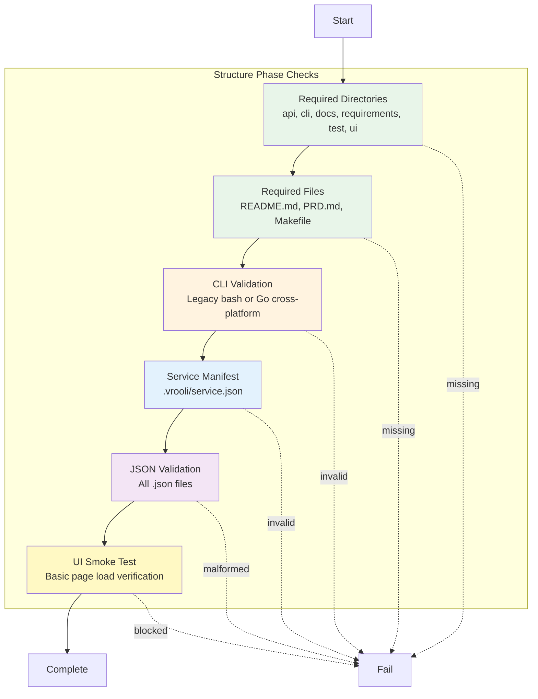

# Structure Phase

**ID**: `structure`
**Timeout**: 15 seconds
**Optional**: No
**Requires Runtime**: No

The structure phase validates that a scenario has the required files, directories, and configuration to be considered well-formed. It runs first and fails fast if basic requirements aren't met.

## What Gets Validated



## Required Directories

By default, scenarios must have these directories:

| Directory | Purpose |
|-----------|---------|
| `api/` | Go API source code |
| `cli/` | Command-line interface |
| `docs/` | Documentation |
| `requirements/` | PRD requirements tracking |
| `test/` | Test artifacts and playbooks |
| `ui/` | Frontend source code |

## Required Files

| File | Purpose |
|------|---------|
| `README.md` | Scenario overview |
| `PRD.md` | Product requirements document |
| `Makefile` | Build and test commands |
| `.vrooli/service.json` | Scenario configuration |
| `.vrooli/testing.json` | Test-genie configuration |
| `api/main.go` | API entry point |
| `cli/install.sh` | CLI installation script |

## CLI Validation

The structure phase detects and validates two CLI approaches:

### Cross-Platform Go CLI (Recommended)

Detected when `cli/main.go` and `cli/go.mod` exist. This modern approach:
- Compiles to native binaries for all platforms
- Uses shared `packages/cli-core` infrastructure
- Supports automatic stale-checking and rebuilds
- Provides consistent flag parsing and configuration

### Legacy Bash CLI

Detected when `cli/<scenario-name>` is a bash script. This older approach:
- Works on Unix systems only
- Requires bash runtime
- Limited cross-platform support

When a legacy CLI is detected, an informational message is shown:
> "Legacy bash CLI detected. Cross-platform Go CLI available - see [CLI Approaches](cli-approaches.md)"

See [CLI Approaches](cli-approaches.md) for migration guidance.

## Service Manifest Validation

The `.vrooli/service.json` file must:
- Be valid JSON
- Have `service.name` matching the scenario directory name
- Define at least one health check under `lifecycle.health.checks`

Example:
```json
{
  "service": {
    "name": "my-scenario"
  },
  "lifecycle": {
    "health": {
      "checks": [
        {
          "name": "api",
          "type": "http",
          "endpoint": "/health"
        }
      ]
    }
  }
}
```

## JSON Validation

All `.json` files in the scenario are validated for correct syntax. Skipped directories:
- `.git`
- `node_modules`
- `dist`
- `build`
- `coverage`
- `artifacts`

## UI Smoke Testing

When configured, the structure phase runs a quick UI smoke test to verify:
- Pages load without crashing
- No critical JavaScript errors
- Expected elements are present

See [UI Smoke Testing](ui-smoke.md) for configuration details.

## Configuration

Customize structure validation in `.vrooli/testing.json`:

```json
{
  "structure": {
    "additional_dirs": ["extensions"],
    "additional_files": ["configs/custom.json"],
    "exclude_dirs": ["legacy"],
    "exclude_files": ["deprecated.md"],
    "validations": {
      "service_json_name_matches_directory": true,
      "check_json_validity": true
    },
    "ui_smoke": {
      "enabled": true
    }
  }
}
```

| Field | Type | Default | Description |
|-------|------|---------|-------------|
| `additional_dirs` | string[] | `[]` | Extra required directories |
| `additional_files` | string[] | `[]` | Extra required files |
| `exclude_dirs` | string[] | `[]` | Skip these directories |
| `exclude_files` | string[] | `[]` | Skip these files |
| `validations.service_json_name_matches_directory` | bool | `true` | Enforce name match |
| `validations.check_json_validity` | bool | `true` | Validate JSON syntax |
| `ui_smoke.enabled` | bool | `false` | Run UI smoke test |

## Exit Codes

| Code | Meaning |
|------|---------|
| 0 | All structure checks pass |
| 1 | Missing files, invalid config, or validation failure |

## Common Failures

| Error | Cause | Solution |
|-------|-------|----------|
| "Missing directory: api" | Required directory doesn't exist | Create the directory |
| "Missing file: .vrooli/service.json" | Service manifest not found | Run `vrooli scenario init` |
| "service.name does not match scenario" | Name mismatch in service.json | Update `service.name` to match directory |
| "Invalid JSON: config.json" | Malformed JSON file | Fix JSON syntax |
| "No health checks defined" | Missing health configuration | Add health checks to service.json |

## Related Documentation

- [CLI Approaches](cli-approaches.md) - Legacy vs cross-platform CLI patterns
- [UI Smoke Testing](ui-smoke.md) - Configure UI smoke tests

## See Also

- [Phases Overview](../README.md) - All phases
- [Dependencies Phase](../dependencies/README.md) - Next phase
