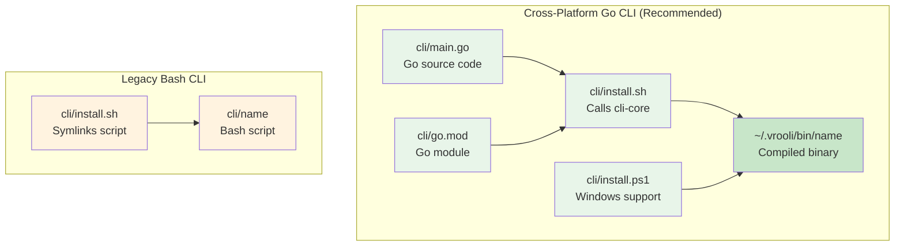

# CLI Approaches

Vrooli scenarios support two CLI implementation patterns. The **cross-platform Go CLI** is recommended for new scenarios, while legacy bash CLIs remain supported for backward compatibility.

## Overview



## Comparison

| Feature | Cross-Platform Go | Legacy Bash |
|---------|-------------------|-------------|
| **Platform Support** | Windows, macOS, Linux | Unix only |
| **Runtime Required** | None (compiled binary) | Bash shell |
| **Auto-rebuild** | Yes (stale-checking) | No |
| **Shared Infrastructure** | `packages/cli-core` | Manual |
| **Type Safety** | Go's static typing | None |
| **Testing** | Go's `testing` package | BATS |
| **Distribution** | Single binary | Script + dependencies |

## Why Two Installer Scripts?

Cross-platform CLIs require both `install.sh` and `install.ps1` because no single scripting language is pre-installed on all major platforms:

| Platform | Pre-installed Shell |
|----------|---------------------|
| Linux | Bash |
| macOS | Bash/Zsh |
| Windows | PowerShell |

While PowerShell Core (`pwsh`) *can* run on Linux/macOS, it requires manual installation. Similarly, bash on Windows requires WSL or Git Bash. By providing both scripts, users can install the CLI without any additional dependencies on their target platform.

## Cross-Platform Go CLI

### Structure

```
cli/
├── main.go           # Entry point
├── go.mod            # Go module definition
├── go.sum            # Dependency checksums
├── app.go            # CLI application setup
├── install.sh        # Unix installer (calls cli-core)
├── install.ps1       # Windows installer
├── .gitignore        # Ignores compiled binary
└── <commands>/       # Command implementations
```

### How It Works

1. **Source code** lives in `cli/` as standard Go code
2. **Installation** uses `packages/cli-core/install.sh` to compile and install
3. **Binary** is placed in `~/.vrooli/bin/<name>` (not in the repo)
4. **Stale-checking** automatically rebuilds when source changes

### Installation

```bash
# From scenario directory
./cli/install.sh

# Or from repo root
./packages/cli-core/install.sh scenarios/my-scenario/cli --name my-scenario

# Windows
powershell -ExecutionPolicy Bypass -File cli/install.ps1
```

### Using cli-core

The `packages/cli-core` package provides:

- **`cliapp.ScenarioApp`** - Standard CLI scaffolding with global flags
- **`cliutil.APIClient`** - HTTP client with token injection
- **`cliutil.StaleChecker`** - Auto-rebuild when source changes
- **`buildinfo`** - Embedded build metadata and fingerprints

Example `main.go`:
```go
package main

import (
    "os"
    "github.com/vrooli/cli-core/cliapp"
)

func main() {
    app := cliapp.NewScenarioApp("my-scenario", "1.0.0")
    app.AddCommand(executeCommand())
    app.AddCommand(statusCommand())

    if err := app.Run(os.Args); err != nil {
        os.Exit(1)
    }
}
```

For complete documentation, see [packages/cli-core/README.md](/packages/cli-core/README.md).

### Structure Phase Detection

The structure phase detects cross-platform CLIs by checking for:
- `cli/main.go` exists
- `cli/go.mod` exists

When detected, the phase:
- Does NOT require `cli/<name>` binary (it's compiled on-demand)
- Validates `cli/install.sh` exists
- Optionally validates `cli/install.ps1` for Windows support

## Legacy Bash CLI

### Structure

```
cli/
├── <scenario-name>       # Bash script (tracked in git)
├── <scenario-name>.bats  # BATS tests
└── install.sh            # Symlinks/copies the script
```

### How It Works

1. **Script** is the CLI itself - a bash script tracked in git
2. **Installation** typically symlinks to `~/.vrooli/bin/<name>`
3. **Execution** requires bash runtime

### Example Script

```bash
#!/bin/bash
# my-scenario - Command-line interface

set -euo pipefail

readonly CLI_NAME="my-scenario"
readonly CLI_VERSION="1.0.0"

case "${1:-}" in
    status)
        curl -s "http://localhost:${API_PORT}/health"
        ;;
    --version)
        echo "$CLI_NAME v$CLI_VERSION"
        ;;
    *)
        echo "Usage: $CLI_NAME <command>"
        ;;
esac
```

### Limitations

- **No Windows support** without WSL or Git Bash
- **Requires bash** - may behave differently across shells
- **No type safety** - errors discovered at runtime
- **Manual updates** - no automatic stale-checking

### Structure Phase Detection

Legacy CLIs are detected when:
- `cli/<scenario-name>` exists as a file
- File is a bash script (shebang `#!/bin/bash` or similar)

When detected, an informational message is shown:
> "Legacy bash CLI detected. Cross-platform Go CLI available."

## Migrating to Cross-Platform

### Step 1: Create Go Module

```bash
cd cli/
go mod init my-scenario-cli
```

### Step 2: Create Entry Point

```go
// main.go
package main

import (
    "fmt"
    "os"
)

func main() {
    if len(os.Args) > 1 && os.Args[1] == "--version" {
        fmt.Println("my-scenario v1.0.0")
        return
    }
    fmt.Println("Usage: my-scenario <command>")
}
```

### Step 3: Update Installers

Replace `install.sh` contents with:
```bash
#!/usr/bin/env bash
set -euo pipefail

APP_ROOT="${APP_ROOT:-$(builtin cd "${BASH_SOURCE[0]%/*}/../../.." && builtin pwd)}"
"${APP_ROOT}/packages/cli-core/install.sh" scenarios/my-scenario/cli --name my-scenario
```

Add `install.ps1`:
```powershell
param([string]$InstallDir)

$appRoot = $env:APP_ROOT
if (-not $appRoot) {
    $appRoot = (Resolve-Path (Join-Path $PSScriptRoot "../../.."))
}

$installer = Join-Path $appRoot "packages/cli-core/install.ps1"
$parameters = @{
    ModulePath = "scenarios/my-scenario/cli"
    Name       = "my-scenario"
}
if ($InstallDir) { $parameters.InstallDir = $InstallDir }

& $installer @parameters
```

### Step 4: Update .gitignore

```gitignore
# Compiled binary
my-scenario
my-scenario.exe
*.exe
*.dll
*.so
*.dylib
```

### Step 5: Update testing.json

If you previously excluded the binary:
```json
{
  "structure": {
    "exclude_files": ["cli/my-scenario"]
  }
}
```

This exclusion is now handled automatically by the structure phase when it detects a Go CLI.

### Step 6: Port Commands

Convert bash functions to Go commands:

**Bash:**
```bash
status() {
    curl -s "http://localhost:${API_PORT}/health" | jq .
}
```

**Go:**
```go
func statusCommand() *cli.Command {
    return &cli.Command{
        Name:  "status",
        Usage: "Check scenario health",
        Action: func(c *cli.Context) error {
            client := cliutil.NewAPIClient(getAPIBase())
            resp, err := client.Get("/health")
            if err != nil {
                return err
            }
            return cliutil.PrintJSON(resp)
        },
    }
}
```

## Configuration for Structure Phase

For cross-platform Go CLIs, the structure phase automatically:
- Skips binary existence check
- Validates Go source files exist
- Checks installer scripts

No special configuration needed in `.vrooli/testing.json`.

For scenarios that need custom behavior:
```json
{
  "structure": {
    "cli": {
      "type": "go"
    }
  }
}
```

## See Also

- [packages/cli-core/README.md](/packages/cli-core/README.md) - Shared CLI infrastructure
- [Structure Phase](README.md) - Structure validation overview
- [CLI Testing](../integration/cli-testing.md) - Testing CLIs with BATS
