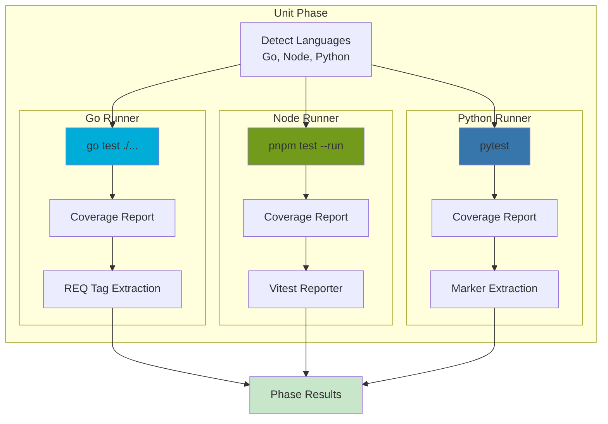

# Unit Phase

**ID**: `unit`
**Timeout**: 60 seconds (configurable)
**Optional**: No
**Requires Runtime**: No

The unit phase executes unit tests for all detected languages (Go, Node.js, Python) and collects coverage metrics. Tests run in isolation without external dependencies.

## What Gets Tested



## Language Detection

| Language | Detection | Directory |
|----------|-----------|-----------|
| Go | `go.mod` exists | `api/` |
| Node.js | `package.json` exists | `ui/` |
| Python | `pytest.ini` or `test_*.py` | `scripts/` or root |

## Coverage Thresholds

| Level | Default | Behavior |
|-------|---------|----------|
| Pass | ≥80% | Phase passes |
| Warning | 70-80% | Phase passes with warning |
| Error | <70% | Phase fails |

## Requirement Tagging

Tag tests with `[REQ:ID]` to track requirement coverage:

### Go
```go
func TestCreateProject(t *testing.T) {
    t.Run("creates project [REQ:MY-PROJECT-CREATE]", func(t *testing.T) {
        // Test implementation
    })
}
```

### TypeScript (Vitest)
```typescript
describe('projectStore [REQ:MY-PROJECT-CRUD]', () => {
    it('creates project', () => { /* ... */ });
});
```

### Python
```python
@pytest.mark.requirement("MY-PROJECT-CREATE")
def test_create_project():
    pass
```

## Exit Codes

| Code | Meaning |
|------|---------|
| 0 | All tests pass, coverage met |
| 1 | Test failures or coverage below error threshold |

## Configuration

```json
{
  "phases": {
    "unit": {
      "timeout": 120,
      "coverageWarn": 85,
      "coverageError": 75,
      "go": {
        "race": true,
        "packages": ["./..."]
      },
      "node": {
        "framework": "vitest"
      }
    }
  }
}
```

## Related Documentation

- [Scenario Unit Testing](scenario-unit-testing.md) - Writing effective unit tests
- [Test Runners](test-runners.md) - Language-specific runner details

## See Also

- [Phases Overview](../README.md) - All phases
- [Dependencies Phase](../dependencies/README.md) - Previous phase
- [Integration Phase](../integration/README.md) - Next phase
