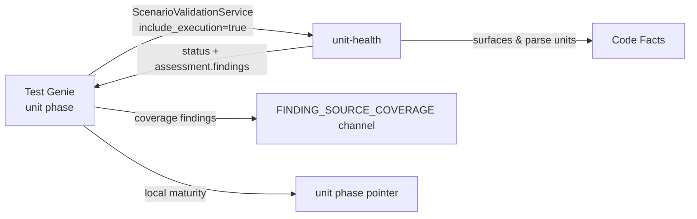

# Unit Phase

**ID**: `unit`
**Timeout**: 15 minutes (configurable)
**Optional**: No
**Requires Runtime**: No

The unit phase delegates test execution, coverage analysis, test architecture,
test quality, and flake/runtime diagnostics to the **unit-health** scenario.
After the unit-health hard cutover, Test Genie no longer embeds a native
Go/Node/Python test runner or a separate `coverage` phase — `unit-health` owns
test discovery (via Code Facts), bounded execution, coverage parsing, and
provider-local test maturity, and Test Genie normalizes its findings into the
shared maturity assessment contract.

This phase declares a [Phase Capability Contract](../../concepts/phase-capability-contract.md); the sections below follow the required remediation-doc skeleton.

## North Star

Every testable surface is **discovered, executed, and trusted**: workspaces are enumerable with unsupported parse units explicit, tests run to completion without failures, hangs, or misconfiguration, frameworks are canonical and coverage-capable, and the test architecture is clean — tests are co-located, share utilities, never leak production helpers, and exercise injectable seams. At maximum maturity unit-health reports each capability at its top rung: discovery, execution, framework config, test architecture, coverage/quality depth, and stability/traceability are all clean, so the suite is a durable, requirement-linked safety net rather than a fragile checkbox.

## The rungs and their gates

unit-health reports a monotone ladder per capability (each rung implies the one below).

| Capability | Ceiling | L1 → next unlock | Top-rung ("clean") aspiration |
|---|---|---|---|
| Surface Discovery | L2 | Surfaces discovered, unsupported units explicit → discovery clean | Test surface discovery is clean. |
| Execution Readiness | L2 | Commands runnable → complete without failures/hangs/misconfig | Test execution is clean. |
| Framework Config | L3 | Framework configured → canonical + coverage-capable → package-manager/config aligned | Framework configuration is clean. |
| Test Architecture | L3 | Architecture comparable → co-location + shared utils → clean helper boundaries + seams | Test architecture is clean. |
| Coverage Quality | L2 | Coverage measured → coverage/assertion/quality findings addressed | Coverage and test-quality depth are clean. |
| Stability Traceability | L2 | History measured → flake/runtime-growth/requirement-linkage addressed | Test stability and requirement traceability are clean. |

## What each finding means

Each finding caps its capability at a rung; only `ERROR`/`BLOCKER` severities fail the phase (`WARNING`/`INFO` are honest, non-failing debt or advisories).

| Code(s) | Capability | Caps at | Severity | Fails phase? |
|---|---|---|---|---|
| `TEST_SURFACE_ABSENT` / `UNIT_REQUIRED_ROLE_MISSING` | surface_discovery | L0 | ERROR | Yes |
| `UNIT_SURFACE_UNGOVERNED` / `UNSUPPORTED_PARSE_UNIT` | surface_discovery | L1 | WARNING / INFO | No |
| `TEST_DEPENDENCY_MISSING` / `TEST_EXECUTION_FAILURE` / `TEST_TIMEOUT_HANG` | execution_readiness | L0–L2 | ERROR | Yes |
| `TEST_MISCONFIGURATION` | execution_readiness | L1 | WARNING | No |
| `TEST_FRAMEWORK_MISSING` / `UNIT_POLICY_PROFILE_INVALID` / `TEST_FRAMEWORK_NONCANONICAL` / `UNIT_POLICY_WEAKENED` / `UNIT_POLICY_WAIVER_INVALID` / `UNIT_POLICY_PROJECTION_DRIFT` / `COVERAGE_CONFIG_MISSING` | framework_config | L0–L2 | ERROR | Yes |
| `PACKAGE_MANAGER_MISMATCH` | framework_config | L3 | WARNING | No |
| `TEST_HELPER_FROM_PRODUCTION` | test_architecture | L3 | ERROR | Yes |
| `TEST_NOT_COLOCATED` / `TEST_UTIL_MISSING` / `MISSING_INJECTABLE_SEAM` | test_architecture | L2–L3 | WARNING | No |
| `LOW_COVERAGE` / `COVERAGE_ABSENT` / `TEST_SKIPPED_OR_ONLY` / `TEST_NO_ASSERTION` / `TEST_RENDER_ONLY` / `TEST_MISSING_EDGE_CASES` | coverage_quality | L0–L2 | WARNING / INFO | No |
| `TEST_FLAKE_SUSPECTED` / `TEST_RUNTIME_GROWTH` / `TEST_UNTAGGED_REQUIREMENT` | stability_traceability | L2 | WARNING / INFO | No |

## The canonical fix

- **Surface-discovery findings** → add a test surface / required-role tests where absent; govern discovered surfaces so nothing is silently untested (skills: `test`, `unit-testing-architecture-steer`).
- **Execution-readiness findings** → install missing test dependencies, fix the failing tests, and eliminate hangs (bound or remove the deadlocking test); repair local execution misconfiguration (skills: `test`, `scientific-debugging`).
- **Framework-config findings** → configure a canonical framework (Go `go test`, React/Vite `vitest`, Python `pytest`) with coverage-capable config, a valid policy profile, and aligned package manager; never weaken policy or file an invalid waiver (skill: `unit-testing-architecture-steer`).
- **Test-architecture findings** → co-locate tests with source, add the shared test util, and stop importing production helpers from tests; add injectable seams so behavior is testable (skills: `unit-testing-architecture-steer`, `seam-discovery-and-enforcement`).
- **Coverage-quality findings** → raise per-file coverage, strengthen assertions, un-skip tests, replace render-only/snapshot-heavy tests with behavioral ones, and cover edge cases (skill: `test`).
- **Stability/traceability findings** → de-flake suspected tests, investigate runtime growth, and add `[REQ:ID]` tags so requirement coverage stays traceable (skills: `scientific-debugging`, `requirements-traceability-steer`).

## How to verify

```bash
# Current rung, gaps, and next move for every capability:
unit-health validate scenario <scenario>

# Or drive it through Test Genie and read the per-phase scorecard:
test-genie execute <scenario> --phases unit
test-genie runs findings --scenario <scenario>
```

## How It Works


```mermaid
graph LR
    UNIT[Test Genie<br/>unit phase] -->|ScenarioValidationService<br/>include_execution=true| UH[unit-health]
    UH -->|surfaces & parse units| CF[Code Facts]
    UH -->|status + assessment.findings| UNIT
    UNIT -->|coverage findings| COV[FINDING_SOURCE_COVERAGE channel]
    UNIT -->|local maturity| PTR[unit phase pointer]
```

The phase calls:

```text
scenario-validation/v1.ScenarioValidationService.ValidateScenario
include_execution=true
```

and maps the result:

- **Coverage-category findings** are emitted into the `FINDING_SOURCE_COVERAGE`
  channel so they continue to feed the ecosystem-manager `coverage` dimension
  (the retired `coverage` phase's responsibility now lives here).
- **Test execution, architecture, quality, and diagnostics findings** surface as
  observations; the `unit` phase maps to the `tests` dimension.
- The provider's `common.v1.MaturityAssessment` is validated (it must declare
  `provider: unit-health`, `phase: unit`) and its local maturity summary is
  written to the phase pointer.
- Unit Health's native `unit_health.v1.validation.ValidateScenarioResponse` is
  packed into the shared `native_detail` field. Generic Test Genie planning does
  not interpret `unit.policy_profile`, but provider-owned tooling can unpack the
  native detail to inspect evidence, expected/observed values, projections, and
  remediation text for policy-profile findings.

## Failure Behavior

| Condition | Result |
|-----------|--------|
| unit-health API unreachable | Phase fails (`missing_dependency`) — it is a required provider |
| Provider returns error findings / `status: failed` | Phase fails (`test_failure`) |
| Missing/malformed assessment | Phase fails (`maturity_contract`) |
| Warning/info findings only | Phase passes |

Skip the phase locally with `TEST_GENIE_SKIP_UNIT=1` (e.g. in fast inner loops
that don't need the provider).

## Requirement Tagging

Tests still carry `[REQ:ID]` tags; unit-health's quality analyzer reports
untagged requirements. Tag tests so requirement coverage stays traceable:

```go
func TestCreateProject(t *testing.T) {
    t.Run("creates project [REQ:MY-PROJECT-CREATE]", func(t *testing.T) { /* ... */ })
}
```

```typescript
describe('projectStore [REQ:MY-PROJECT-CRUD]', () => {
    it('creates project', () => { /* ... */ });
});
```

## Coverage Thresholds & Canonical Frameworks

Coverage thresholds, canonical test frameworks (Go `go test`, React/Vite
`vitest`, Python `pytest`), and degraded/noncanonical detection are owned by
unit-health and documented there. In `.vrooli/testing.json`, Test Genie reads
`phases`, `presets`, and other orchestration controls; `unit.policy_profile` is
the Unit Health contract for required roles, policy classes, waivers, and native
projection checks. Shell syntax validation is **not** part of the unit phase —
it belongs to static quality (Quality Health).

## See Also

- [Phases Overview](../README.md) — All phases
- [Dependencies Phase](../dependencies/README.md) — Previous phase
- [Storage Phase](../storage/README.md) — Next phase
- `unit-health` scenario — the test-maturity provider this phase delegates to
