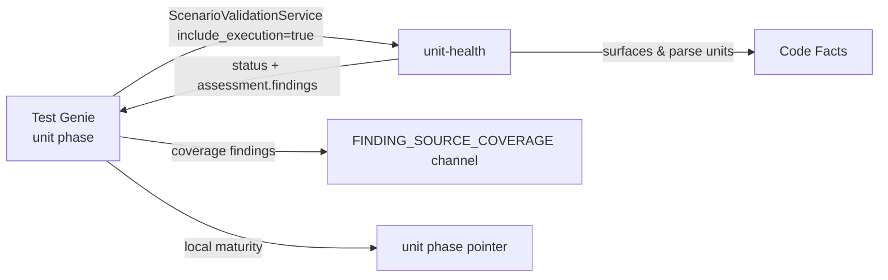

# Unit Phase

**ID**: `unit`
**Timeout**: 15 minutes (configurable)
**Optional**: No
**Requires Runtime**: No

The unit phase delegates test execution, coverage analysis, test architecture,
test quality, and flake/runtime diagnostics to the **unit-health** scenario.
After the unit-health hard cutover, Test Genie no longer embeds a native
Go/Node/Python test runner or a separate `coverage` phase — `unit-health` owns
test discovery (via Code Facts), bounded execution, coverage parsing, and
provider-local test maturity, and Test Genie normalizes its findings into the
shared maturity assessment contract.

## How It Works


```mermaid
graph LR
    UNIT[Test Genie<br/>unit phase] -->|ScenarioValidationService<br/>include_execution=true| UH[unit-health]
    UH -->|surfaces & parse units| CF[Code Facts]
    UH -->|status + assessment.findings| UNIT
    UNIT -->|coverage findings| COV[FINDING_SOURCE_COVERAGE channel]
    UNIT -->|local maturity| PTR[unit phase pointer]
```

The phase calls:

```text
scenario-validation/v1.ScenarioValidationService.ValidateScenario
include_execution=true
```

and maps the result:

- **Coverage-category findings** are emitted into the `FINDING_SOURCE_COVERAGE`
  channel so they continue to feed the ecosystem-manager `coverage` dimension
  (the retired `coverage` phase's responsibility now lives here).
- **Test execution, architecture, quality, and diagnostics findings** surface as
  observations; the `unit` phase maps to the `tests` dimension.
- The provider's `common.v1.MaturityAssessment` is validated (it must declare
  `provider: unit-health`, `phase: unit`) and its local maturity summary is
  written to the phase pointer.
- Unit Health's native `unit_health.v1.validation.ValidateScenarioResponse` is
  packed into the shared `native_detail` field. Generic Test Genie planning does
  not interpret `unit.policy_profile`, but provider-owned tooling can unpack the
  native detail to inspect evidence, expected/observed values, projections, and
  remediation text for policy-profile findings.

## Failure Behavior

| Condition | Result |
|-----------|--------|
| unit-health API unreachable | Phase fails (`missing_dependency`) — it is a required provider |
| Provider returns error findings / `status: failed` | Phase fails (`test_failure`) |
| Missing/malformed assessment | Phase fails (`maturity_contract`) |
| Warning/info findings only | Phase passes |

Skip the phase locally with `TEST_GENIE_SKIP_UNIT=1` (e.g. in fast inner loops
that don't need the provider).

## Requirement Tagging

Tests still carry `[REQ:ID]` tags; unit-health's quality analyzer reports
untagged requirements. Tag tests so requirement coverage stays traceable:

```go
func TestCreateProject(t *testing.T) {
    t.Run("creates project [REQ:MY-PROJECT-CREATE]", func(t *testing.T) { /* ... */ })
}
```

```typescript
describe('projectStore [REQ:MY-PROJECT-CRUD]', () => {
    it('creates project', () => { /* ... */ });
});
```

## Coverage Thresholds & Canonical Frameworks

Coverage thresholds, canonical test frameworks (Go `go test`, React/Vite
`vitest`, Python `pytest`), and degraded/noncanonical detection are owned by
unit-health and documented there. In `.vrooli/testing.json`, Test Genie reads
`phases`, `presets`, and other orchestration controls; `unit.policy_profile` is
the Unit Health contract for required roles, policy classes, waivers, and native
projection checks. Shell syntax validation is **not** part of the unit phase —
it belongs to static quality (Quality Health).

## See Also

- [Phases Overview](../README.md) — All phases
- [Dependencies Phase](../dependencies/README.md) — Previous phase
- [Storage Phase](../storage/README.md) — Next phase
- `unit-health` scenario — the test-maturity provider this phase delegates to
