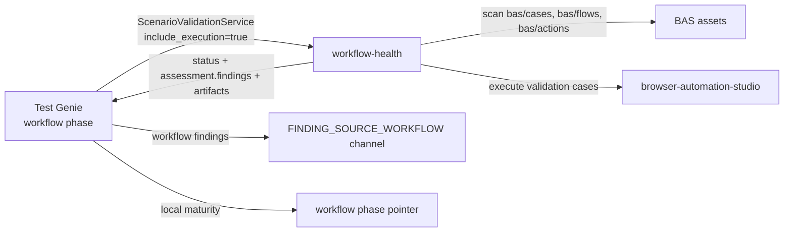

# Workflow Phase

**ID**: `workflow`
**Deprecated aliases**: `playbooks`, `playbook`, `e2e`
**Timeout**: 15 minutes
**Optional**: No
**Requires Runtime**: Yes

The workflow phase delegates BAS workflow catalog validation and safe execution
to the **workflow-health** scenario through the shared
`scenario-validation/v1.ScenarioValidationService` contract.

`playbooks` remains accepted as an input alias during migration, but it is no
longer a catalog phase. New commands and docs should use `workflow`.

## How It Works



The phase calls:

```text
scenario-validation/v1.ScenarioValidationService.ValidateScenario
include_execution=true
```

and maps the result:

- `bas/cases/**` are validation evidence for the Test Genie workflow phase.
- `bas/flows/**` are indexed by workflow-health for agent/operator discovery,
  but are not automatically run as validation cases.
- `bas/actions/**` are reusable fragments and dependency context.
- Mutating workflow execution is refused before BAS is called unless
  workflow-health proves explicit confirmation metadata and routed isolation.
- Provider findings are emitted into the `FINDING_SOURCE_WORKFLOW` channel.

## Compatibility

Existing callers can still request:

```bash
test-genie execute my-scenario --phases playbooks
test-genie execute my-scenario --phases e2e
```

Both normalize to:

```bash
test-genie execute my-scenario --phases workflow
```

Per-phase timeout/skip overrides should use `workflow`:

```json
{
  "phases": {
    "workflow": {
      "timeout_seconds": 900
    }
  }
}
```

Legacy playbooks seed endpoints and CLI commands are still available while seed
lifecycle ownership migrates:

```bash
test-genie playbooks-seed apply --scenario <scenario>
test-genie playbooks-seed cleanup --scenario <scenario> --token <cleanup-token>
```

## Failure Behavior

| Condition | Result |
|-----------|--------|
| workflow-health API unreachable | Phase fails (`missing_dependency`) |
| workflow-health reports failed validation/execution | Phase fails |
| Missing/malformed maturity assessment | Phase fails (`maturity_contract`) |
| Mutating workflows lack routed isolation proof | Phase fails closed before BAS execution |
| No workflow assets exist | Provider reports workflow-health findings |

## See Also

- [Phases Overview](../README.md) — All phases
- [Playbooks Alias](../playbooks/README.md) — Deprecated alias reference
- `workflow-health` scenario — workflow catalog, maturity, search, fixes, and execution provider
- `browser-automation-studio` scenario — browser workflow execution engine
