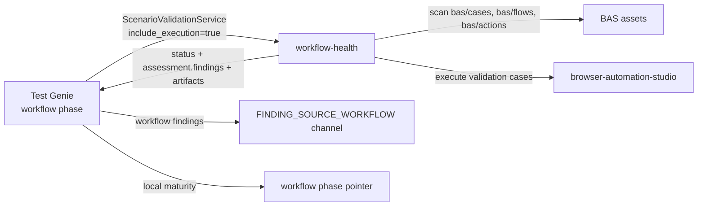

# Workflow Phase

**ID**: `workflow`
**Deprecated aliases**: `playbooks`, `playbook`, `e2e`
**Timeout**: 15 minutes
**Optional**: No
**Requires Runtime**: Yes

The workflow phase delegates BAS workflow catalog validation and safe execution
to the **workflow-health** scenario through the shared
`scenario-validation/v1.ScenarioValidationService` contract.

`playbooks` remains accepted as an input alias during migration, but it is no
longer a catalog phase. New commands and docs should use `workflow`.

This phase declares a [Phase Capability Contract](../../concepts/phase-capability-contract.md); the sections below follow the required remediation-doc skeleton.

## North Star

Workflow Health is a full **operational workflow intelligence provider**: it exposes provider, execution, fix, search, and UI evidence, and its runs, artifacts, fixes, and search leaves are integrated for operators and agents. At maximum maturity (L5) a scenario's BAS workflows are not just discoverable and safe but *executed*, producing rich operational evidence and search leaves that make the scenario's behavior legible end to end. The workflow ladder is a single phase-level ladder (no per-capability split); its top rung is the North Star the phase steers toward.

## The rungs and their gates

The rungs are monotone — each implies the one below. Every non-top rung declares the single next unlock to the rung above.

| Rung | Gate (what it means) | Next unlock |
|---|---|---|
| L0 No workflow surface | No scenario-owned BAS workflow surface can be scanned. | A discoverable BAS workflow catalog. |
| L1 Discoverable catalog | Workflow assets are discovered and parsed into stable catalog records. | Requirement-traceable validation cases. |
| L2 Traceable workflows | Validation cases carry requirement evidence; core metadata is complete. | Safe workflow execution posture. |
| L3 Safe workflows | Mutating workflows fail closed unless reset/confirmation/seed/routed-isolation metadata is declared. | Executable workflow evidence. |
| L4 Executable workflows | Validation cases run through BAS and return artifact evidence. | Operationally rich workflow intelligence. |
| L5 Operational workflow intelligence | Runs, artifacts, fixes, and search leaves are integrated for operators and agents. | Maximum maturity reached. |

## What each finding means

Each finding caps the phase at the rung below its impact; only ERROR/BLOCKER severities fail the phase, so WARNING findings are honest, non-failing debt.

| Code | Caps at | Severity | Fails phase? |
|---|---|---|---|
| `workflow.surface_absent` | L1 | ERROR | Yes |
| `workflow.parse_error` | L1 | ERROR | Yes |
| `workflow.registry_missing` / `workflow.registry_stale` | L1 | WARNING | No |
| `workflow.requirement_unlinked` | L2 | ERROR | Yes |
| `workflow.subflow_unresolved` | L2 | ERROR | Yes |
| `workflow.metadata_incomplete` / `workflow.selector_unregistered` | L2 | WARNING | No |
| `workflow.execution_mode_invalid` / `workflow.mutating_safety_missing` / `workflow.seed_missing` | L3 | ERROR | Yes |
| `workflow.reset_legacy` | L3 | WARNING | No |
| `workflow.execution_refused` / `workflow.execution_failed` | L4 | ERROR | Yes |

## The canonical fix

- **Catalog findings** (`workflow.surface_absent`, `workflow.parse_error`, `workflow.registry_*`) → author at least one BAS case/flow/action, repair malformed workflow JSON at source, and regenerate the registry (registry findings have implemented safe fixers).
- **Traceability findings** (`workflow.requirement_unlinked`, `workflow.metadata_incomplete`, `workflow.subflow_unresolved`, `workflow.selector_unregistered`) → link each validation case to its requirement, complete workflow metadata, resolve broken subflows, and register selectors against the UI component contract.
- **Safety findings** (`workflow.execution_mode_invalid`, `workflow.reset_legacy`, `workflow.mutating_safety_missing`, `workflow.seed_missing`) → declare fail-closed safety metadata on mutating workflows: reset, confirmation, seed design, and routed isolation. Execution stays refused until this is proven.
- **Execution findings** (`workflow.execution_refused`, `workflow.execution_failed`) → supply operator proof or fix the workflow so BAS-backed execution runs cleanly and returns artifact evidence.

## How to verify

```bash
# See the current rung, gaps, and next move for the workflow ladder:
workflow-health validate scenario <scenario>

# Or drive it through Test Genie and read the per-phase scorecard:
test-genie execute <scenario> --phases workflow
test-genie runs findings --scenario <scenario>
```

## How It Works



The phase calls:

```text
scenario-validation/v1.ScenarioValidationService.ValidateScenario
include_execution=true
```

and maps the result:

- `bas/cases/**` are validation evidence for the Test Genie workflow phase.
- `bas/flows/**` are indexed by workflow-health for agent/operator discovery,
  but are not automatically run as validation cases.
- `bas/actions/**` are reusable fragments and dependency context.
- Mutating workflow execution is refused before BAS is called unless
  workflow-health proves explicit confirmation metadata and routed isolation.
- Provider findings are emitted into the `FINDING_SOURCE_WORKFLOW` channel.

## Compatibility

Existing callers can still request:

```bash
test-genie execute my-scenario --phases playbooks
test-genie execute my-scenario --phases e2e
```

Both normalize to:

```bash
test-genie execute my-scenario --phases workflow
```

Per-phase timeout/skip overrides should use `workflow`:

```json
{
  "phases": {
    "workflow": {
      "timeout_seconds": 900
    }
  }
}
```

Legacy playbooks seed endpoints and CLI commands are still available while seed
lifecycle ownership migrates:

```bash
test-genie playbooks-seed apply --scenario <scenario>
test-genie playbooks-seed cleanup --scenario <scenario> --token <cleanup-token>
```

## Failure Behavior

| Condition | Result |
|-----------|--------|
| workflow-health API unreachable | Phase fails (`missing_dependency`) |
| workflow-health reports failed validation/execution | Phase fails |
| Missing/malformed maturity assessment | Phase fails (`maturity_contract`) |
| Mutating workflows lack routed isolation proof | Phase fails closed before BAS execution |
| No workflow assets exist | Provider reports workflow-health findings |

## See Also

- [Phases Overview](../README.md) — All phases
- [Playbooks Alias](../playbooks/README.md) — Deprecated alias reference
- `workflow-health` scenario — workflow catalog, maturity, search, fixes, and execution provider
- `browser-automation-studio` scenario — browser workflow execution engine
